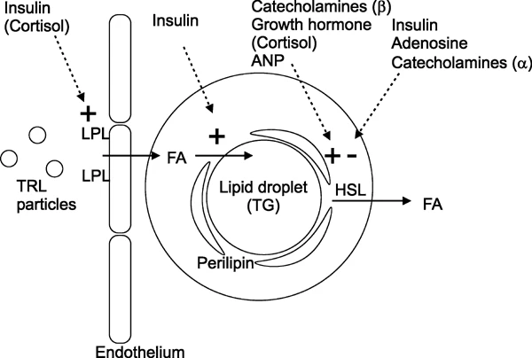

```{r include=FALSE}
# word count = 
doc.type <- knitr::opts_knit$get('rmarkdown.pandoc.to') # this will tell the .Rmd file what output you are knitting to (word, pdf, html) so that you cna use if else statements when making tables - html/pdf output tables do not work well in word. For word we need to use the 'flextable' packaged to make tables.

## packages
setwd(Sys.getenv("main"))
source("index/data/index/packages.R")
load("index/data/introduction/data.RData")
```

# Introduction {#introduction} 

## Chapter summary {-}
This chapter provides the context of the thesis. It presents a summary of the literature relevant to the thesis, where evidence is limited and how this thesis will contribute. Firstly, I give background to the issue of adiposity, describe the biological role of adipose tissue, its genetic components and different measurements. I discuss associations with diseases and outline potential underlying mechanisms. I give focus to metabolites as potential intermediates linking adiposity with diseases and discuss the use of Mendelian randomization to disentangle these associations. \par

\newpage

## Background {#background}
Excess and increased adipose tissue (adiposity) is a global health concern. Globally, the prevalence of overweight (body mass index (BMI) of 25--29.9 kg/m^2^) and obesity (BMI > 30 kg/m^2^) is 39% and 13% respectively[@WorldHealthOrganisation2018; @Ritchie2019] (Figure \@ref(fig:introduction-figure-overweight-obese)). Obesity is estimated to be responsible for 8% of global deaths[@Stanaway2018] and this number is likely to rise as the prevalence of obesity increases[@Ng2014; @NCD-RisC2016; @Abarca-Gomez2017]. Overweight and obesity are categorisations of excess adipose tissue and are associated with numerous diseases[@Kim2016a]. These associations are ultimately a result of the underlying functions adipose tissue exerts within the body, including its distribution. Identifying where these functions link with disease may improve health outcomes. \par

(ref:introduction-figure-overweight-obese-cap) **Proportion of individuals who suffer from overweight or obesity globally and in select locations.** Data from Ritchie and Roser (2019)[@Ritchie2019] for individuals over 18 in the United Kingdom (UK), United States (US), Americas, South-East Asia (Asia (SE)), and the world.

(ref:introduction-figure-overweight-obese-scap) Proportion of individuals who suffer from overweight or obesity globally and in select locations

```{r introduction-figure-overweight-obese, echo=FALSE, out.width='100%', fig.cap='(ref:introduction-figure-overweight-obese-cap)', fig.scap='(ref:introduction-figure-overweight-obese-scap)'}
overweight_obese_plot
```

## Adipose tissue {#adipose-tissue}
Weight is made up of two components, fat free mass and fat mass. Fat free mass encompasses muscle, bone and water mass. Fat mass is an all encompassing term for adipose tissue. Adipose tissue is predominantly made up of adipocytes, with other tissues and cells such as the stromal vascular fraction, preadipocytes and fibroblasts making up smaller proportions[@Frayn2003; @Cohen2016; @Luo2016]. The main function of adipose tissue is energy storage in the form of lipids, with a secondary function to insulate the body and maintain thermoregulation. These two functions can broadly be separated into two types of adipose tissue, white and brown respectively[@Cohen2016]. In addition to energy storage and insulation, adipose tissue is considered an endocrine organ, responsive to afferent signalling as well as being a prolific signaller itself[@Kershaw2004]. Additionally, single nucleotide polymorphisms (SNPs) and genes associated with increased adipose tissue have been identified[@Dahlman2010]. \par

### Energy storage 
Energy storage is determined by energy intake and energy expenditure. An increase or decrease in one leads to a change in energy balance and thus an increase or decrease in total energy storage as $Energy\ balance = energy\ in - energy\ out$. Energy stores are comprised primarily of proteins, carbohydrates, and fats. For protein, there is little change in total energy stores outside of a growth stimulus (i.e. exercise is needed to increase protein stores)[@Galgani2008]. Carbohydrate stores fluctuate markedly throughout the day as a result of limited storage capacity and the fact that they comprise the majority of energy production[@Galgani2008]. Fats are the largest energy store. Daily fat intake is ~1% of the total available fat store[@Galgani2008]. Given the tight controls over protein and limited availability of carbohydrate storage, fat storage is the only expandable reservoir of excess energy intake[@Frayn2003; @Galgani2008]. As a result, an energy imbalance will be reflected in the fat stores and not elsewhere[@Frayn2003; @Galgani2008]. \par

Excess energy is stored in adipocytes in the form of lipid droplets (triglycerides; Figure \@ref(fig:introduction-figure-adipocyte)) via lipogenesis. The release of these fat stores, in the form of fatty acids, occurs through lipolysis. As the main store of excess energy, triglycerides provide an accurate reflection of energy imbalance, while adipocytes reflect the deposition and mobilisation of triglycerides[@Frayn2003]. Deposition and mobilisation of triglycerides are a product of a complex interplay of genetic and hormonal signals with leptin and insulin playing key roles[@Amitani2013]. \par

Insulin stimulates the conversion of acetyl-CoA to triglycerides by encouraging uptake of glucose by adipocytes and promoting production of SREBP1 (sterol regulatory element-binding protein 1), which regulates fatty acid, triglyceride, and cholesterol synthesis[@Frayn2003; @Luo2016]. In addition, lipoprotein lipase plays a key role in hydrolysing circulating triglycerides into fatty acids enabling their uptake by adipocytes[@Frayn2003]. Though they can expand, individual adipocytes have limited storage capacity for triglycerides. Once *full*, adipocytes have the ability to multiply[@Frayn2003]. The amount of expansion adipocytes can achieve is limited[@Frayn2003; @Gray2007] and thought to be influential in the rate of adipogenesis, the rate of fat mobilisation around the body, and the development of disease[@Gray2007]. \par

(ref:introduction-figure-adipocyte-cap) **Adipocyte fat deposition and mobilisation**. Stimuli such as insulin result in positive (+) fat deposition, while other stimuli such as cortisol may result in positive or negative (-) fat deposition depending on the location of the adipocyte within the body. ANP, atrial natriuretic peptide; FA, fatty acids; LPL, lipoprotein lipase; TG, triglyceride; TRL, TG-rich lipoproteins. Reproduced from Frayn et al. (2003)[@Frayn2003].

(ref:introduction-figure-adipocyte-scap) Adipocyte fat deposition and mobilisation 

```{r introduction-figure-adipocyte, echo=FALSE, out.width='100%', fig.cap='(ref:introduction-figure-adipocyte-cap)', fig.scap='(ref:introduction-figure-adipocyte-scap)'}

```

\par

### Insulation
Energy storage of fats is managed predominantly by white adipose tissue. These deposits are located mainly within subcutaneous tissue. During infancy, brown adipose tissue is abundant; however, as humans age, these deposits *whiten* leaving few adult brown fat deposits. The remaining deposits of brown adipose tissue in adults are located around the neck, thoracic section of the spine, aortic body, and adrenal glands; all locations with high blood flow[@Cannon2004; @Luo2016]. Thermogenesis by these tissues is regulated by the hypothalamus and is achieved by uncoupling of the respiratory chain of oxidative phosphorylation via UCP1 (uncoupling protein 1). When this process is active, lipids and glucose are used as fuel[@Cannon2004]. \par

Due to the abundant vascularization of areas where brown adipose tissue are located, the heat generated from this process is quickly distributed via the circulatory system. White adipose tissue can undergo a *beiging* process taking on thermogenic properties of brown adipose tissue. Beige adipose tissue is a half way point between white and brown adipose tissue and is more widely dispersed than brown adipose tissue, being located mainly within subcutaneous white adipose tissue. Beige adipose tissue, much like brown adipose tissue, is cold activated but can be recruited through signalling that mimics the stressed state induced by cold. The *beiging* process is not well characterized but is thought to be a result of signalling changes during differentiation of preadipocytes[@Luo2016]. The *beiging* process is reversible but has been suggested as a therapeutic avenue for weight loss [@Cannon2004]. \par

### Signalling
It is important to consider adipose tissue as an organ in its own right. Not solely comprised of adipocytes, adipose tissue includes a multitude of tissues and cells including connective and nerve tissue as well as immune cells. All respond to, and secrete, signalling molecules locally and systemically. It is thought this signalling is primarily to maintain appropriate energy stores and includes signals influencing deposition and mobilisation of fats and differentiation of new adipocytes[@Frayn2003; @Kershaw2004; @Luo2016]. Functionally, signalling molecules have metabolic effects and/or are involved in steroid hormone production[@Kershaw2004]. \par

Adipogenesis, the process of adipocyte formation, has been well characterized and PPAR$y$ (peroxisome proliferator-activated receptor $y$) is the master regulator[@Frayn2003; @Luo2016]. Over-expression of PPAR$y$ leads to differentiation, and under-expression of PPAR$y$ results in lipodystrophy. Other signalling molecules such as KLFs (Kruppel-like factors) and C/EBPs (CCAAT-enhancer-binding proteins) influence adipogenesis through PPAR$y$[@Luo2016]. Because of the master regulatory function of PPAR$y$, exploring regulatory function and expression has been considered as a potential therapeutic avenue for obesity[@Lee2014; @Luo2016]. Though not well characterized, brown adipocytes are thought be influenced heavily by PRDM16 (PR/SET Domain 16) and PGC1$a$ (peroxisome proliferator-activated receptor-gamma coactivator 1 $a$), with the latter required for thermogenesis and not necessarily adipogenesis[@Luo2016]. \par

The breakdown of stored triglycerides via lipolysis results in the release of fatty acids and glycerol molecules for oxidation and gluconeogenesis respectively. Fatty acids can also be broken down into ketone bodies via ketogenesis. While insulin abundance activates lipogenesis, the relative absence of insulin promotes lipolysis. The lipolytic pathway, which is also activated by cAMP-dependent (cyclic adenosine monophosphate) PKA (protein kinase A), relies on the function of ATGL (adipocyte triglyceride lipase) and HSL (hormone sensitive lipase) to catalyse the hydrolysis of triglycerides to di- and mono-glyceride's respectively. Inhibition of ATGL can result in impaired lipolysis and obesity[@Schreiber2019]. \par

The signalling molecules adipocytes produce, known as adipokines, are numerous and act on the auto- and endo-crine systems[@Lehr2012; @Fasshauer2015]. There are adipose deposit specific effects on expression and secretion of adipokines and the movement these adipokines can be expected to undertake. Subcutaneous adipose tissue adipokines travel through the systemic system while visceral adipose tissue adipokines can travel via the portal system with direct access to the liver. Adipocyte receptors are also expressed differentially based on deposit location[@Kershaw2004]. The main adipokines produced by adipocytes are leptin and adiponectin which function to regulate metabolism and inflammation systemically. Other cells within the adipose tissue, including immune and endothelial cells, produce many of the other adipokines such as TNF$a$ (tumour necrosis factor $a$) and IL6 (interleukin 6)[@Luo2016]. \par

Observational evidence has shown that abnormal levels of adipokines are harmful, as they lead to impaired adipose tissue function and subsequent downstream effects such as insulin resistance[@Bluher2013; @Bluher2015; @Fasshauer2015; @Luo2016]. As adipose tissue abundance increases so too does the likelihood of abnormal levels of adipokines. This is of particular interest as adipokine levels can change as a result of diseases such as obesity, thus introducing feed-back loops which serve to alter normal processes[@Bluher2013; @Fasshauer2015]. However, there are outstanding questions about how functionally abnormal levels of adipokines leads to the development of disease[@Fasshauer2015]. Additionally, recent causal analyses has shown inconsistent and weak evidence for an effect of adipokines on adverse health outcomes[@Yaghootkar2013; @Borges2017]. \par

## Adiposity: genetics {#adiposity-genetics}
Studies have identified numerous genes associated with adipose tissue, including for lipogenesis, storage capacity, lipolysis, mobilisation of fat deposits, and energy expenditure[@Dahlman2010]. This also includes genes for adipose specific proteins such as leptin (*LEP*[@Pan2018; @Ahn2019]), adiponectin (*ADIPOQ*[@Achari2017]), and *PPAR$y$*[@Lefterova2009; @Ahn2019]. Expression of these and other adipose associated genes [@Ahn2019; @Huang2021] is tissue specific (subcutaneous/visceral and adipose/not-adipose)[@Ahn2019]. Differential expression along with the presence of adipose-specific genes is associated with obesity and related diseases[@Ahn2019]. For example, *SLC19A3* is an adipose-specific gene[@Ahn2019] encoding a thiamine transporter; thiamine dependent enzymes have been associated with obesity[@Maguire2018]. Adipose expandability is limited, and given that an excess of fatty acids results in increased adipogenesis[@Frayn2003; @Gray2007], it is possible that expandability is fixed by adipose-specific genes and expression. This may have an impact on the development of diseases such as type-2 diabetes where incidence differs between different ancestral populations with the same BMI[@Ma2013]. \par

In addition to adipose-specific genetics, a wealth of genome-wide association studies (GWAS) have identified numerous genes and SNPs associated with adiposity[@Speliotes2010; @Kilpelainen2011; @Yaghootkar2014; @Locke2015; @Shungin2015; @Sung2016; @Lu2016; @Akiyama2017; @Yengo2018; @Pulit2019; @Hubel2019; @Huang2021]. These studies have focused on large population based studies, predominantly including individuals of European ancestries and using specific measures of adiposity. These studies have also revealed the genetic contribution to adiposity to be relatively high across many measures including BMI (twin-based = 60-75%[@Elks2012; @Silventoinen2017], family-based = 40-45%[@Elks2012], population-based = 20-40%[@Locke2015; @Akiyama2017; @Robinson2017; @Yang2015]) waist hip ratio (WHR; twin-based = 30-60%[@Shungin2015; @Rose1998], family-based = 20-50%[@Shungin2015; @Henneman2008], population-based = 10%[@Shungin2015; @Kutalik2011]) and body fat percentage (BF; family-based = 64%[@Hsu2005]). \par

The first of these GWAS identified the *FTO* locus to be associated with BMI and obesity[@Frayling2007; @Scuteri2007]. Subsequent studies including larger sample sizes have identified over 900 SNPs associated with BMI[@Speliotes2010; @Locke2015; @Yengo2018; @Pulit2019]. This same increase in associated SNPs is true for other measures of adiposity including WHR[@Shungin2015; @Pulit2019], and WHR adjusted for BMI (WHRadjBMI)[@Shungin2015; @Pulit2019]. BF has also been associated with increasing numbers of SNPs[@Lu2016; @Hubel2019], however given BF measures are not as easily obtained as BMI and WHR, sample sizes have been much smaller. Studies are also increasingly focusing on non-European ancestries and identifying ancestry specific genetic associations[@Akiyama2017; @Ng2017; @Loos2018; @Huang2021]. Though allele frequencies and effect sizes are different, on the whole, associations shared across ancestries are directionally consistent. \par

Genetic variants associated with complex traits such as adiposity are spread throughout the genome in coding and non-coding regions[@Liu2019]. Ascribing causal links between variants and genes[@GTEx2013] and between variants and functions[@Loos2018] is challenging. However, functional analyses have revealed different pathways associated with adiposity, as well as measurement specific pathways. Variants associated with BMI have been linked with the central nervous system (hypothalamus, pituitary gland, hippocampus, and limbic system)[@Locke2015; @Ghosh2017] while WHRadjBMI variants show links with adipogenesis and angiogenesis[@Shungin2015; @Ghosh2017]. These differences in genetics highlight the underlying biology of the measurements of adiposity, it suggests that BMI is not a solely physical measurement, but that it also captures a behavioral component of adiposity[@Locke2015]. \par

## Adiposity: measures {#adiposity-measures}
Adiposity is generally measured, and used to categorise individuals, using BMI. Body mass index is a measure of weight given an adjustment of height; $\frac{Weight\ (kg)}{Height^2\ (cm)}$. It thus gives an approximation of body composition. Given this simplicity, BMI is easily and widely used as a measure of adiposity. BMI can be classified into sub-types according to the range of values seen in the general population. Whilst ethnicity, sex, and age specific, the international standards set by the WHO[@WHO1995; @WHO2000] estimate a normal weight classification at a population level to be a BMI of 18.5--24.9 kg/m^2^, with an underweight class below this. Underweight is a specific condition that may be secondary to or symptomatic of an underlying disease and is not within the scope of this thesis. An excess of adipose tissue classified as overweight is given as a BMI of 25-29.9 kg/m^2^. Obesity is classed as a BMI greater than or equal to 30 kg/m^2^ -- additional obesity classifications are sometimes used, e.g. the [NHS]([https://www.nhs.uk/conditions/obesity/) classifies severly obese as a BMI equal to or greater than 40 kg/m^2^. \par

A main driving force behind the use of BMI is its association with many of the most abundant diseases and causes of death worldwide. This includes all cause mortality, hypertension, type 2 diabetes, stroke, respiratory problems, many cancers, and more[@Donato1998; @NIH2013]. The ability of BMI to categorise individuals as at risk in an efficient manner is a major benefit over other more costly and time consuming measures. \par

Though BMI shows similar relationships to other anthropometric measures with disease[@Flegal2009a], a main limitation is its inability to differentiate lean mass and fat mass. One can have a high/low BMI and a low/high total fat mass[@Flegal2009]. This is particularly evident in sex comparisons, where generally men have a higher BMI than women, even though women generally have greater fat mass[@Wells2007]. Differences are not limited to sex, they are also apparent for age[@Wells2007], race[@Wagner2000; @Flegal2010], and ethnicity[@Wang1994; @WHO2004]. \par

The reliability of BMI, the ability to obtain consistent and stable results repeatedly, is affected by numerous factors. These include diurnal variation in height and weight fluctuations due to clothing and food consumption. Though this can be managed relatively well using standard operating procedures, the question of validity remains. Specificity is reported to be high, however sensitivity is much lower, therefore incorrectly classifying individuals with excess body fat mass. Numerous studies have found that BMI lacks the resolution to accurately measure body composition[@Prentice2001; @Pischon2008; @Romero-Corral2008; @Okorodudu2010; @Pasco2012]. There are also questions around the relationship with morbidity and mortality[@Flegal2013; @Lee2015; @Elagizi2018], though these questions are likely a result of confounding and other biases[@Banack2013; @Willett2013; @Khan2018]. \par

Evidence has pointed to a more important role for fat deposition in the relationship with mortality[@Sahakyan2015; @Hamer2017]. WHR is commonly used to measure fat deposition, and is calculated as $\frac{Waist\ (cm)}{Hip\ (cm)}$. A WHR > 0.85 in women and > 0.9 in men is considered equivalent to a BMI of > 30 kg/m^2^ [@WorldHealthOrganisation2008]. Unlike BMI, WHR requires two measurements and is therefore prone to more measurement error; hip measurements are generally harder to perform than waist measures, especially where there is excess adipose tissue. It is estimated that error can be as high as 1.56 cm[@WorldHealthOrganisation2008]. Additionally, interpretation can be difficult given that an increased WHR can be caused by both increased abdominal adiposity and a decrease in lean mass at the hips[@Kim2016a]. WHR is a predictor for many diseases and correlate strongly with direct measures of body fat[@Kim2016a]. \par

Direct measurement of body fat has been argued as key in understanding the development of diseases associated with adiposity[@Prentice2001]. Broadly, the aim of these measures is to quantify BF which provides a more accurate estimation of body composition[@WorldHealthOrganisation2000]. Skinfold callipers can be used to measure subcutaneous fat at various locations around the body. Equations derived from gold standard measurements are used to convert the multiple skinfold measures to BF. In general, skinfold measurement is the cheapest and easiest of direct BF assessments. That being said, measurements are prone to error, especially as many skinfold measures are needed. Additionally, equations are derived in specific populations and do not always translate well[@Kim2016a]. Bioelectrical impedance devices, which send a small electrical current through the body, can be used to estimate BF by measuring the time taken for the current to pass through the body. Fat mass has a greater resistance than lean mass and water. Similar to skinfold callipers, impedance devices are quite easy to use and are portable. However, calibration can be difficult and derived equations may not be well translated to all populations; age, height, weight, sex and more can be used in proprietary equations, which are commercially sensitive and difficult to appraise[@Kim2016a]. Evidence does however show strong correlations for some equations with more accurate measures of BF[@Jebb2000; @Chouinard2007]. It is important to note that although these techniques can be delivered easily, they are not used as widely as BMI and WHR, as such sample sizes are much lower. \par 

Where as previous measurement techniques indirectly measure BF, imaging techniques allow for direct measurement. Dual energy x-ray absorptiometry (DXA) uses X-rays, which pass through body tissues differentially, to image and then quantify using software fat mass, fat free mass, and bone mineral density. As DXA directly measures body tissues it is highly accurate. However, DXA uses X-rays which are harmful to certain individuals, it is expensive, and cant easily be transported. Additionally, it is not possible to distinguish subcutaneous and visceral fat. Computerized tomography (CT) and magnetic resonance imaging (MRI) are considered the gold standard for BF measurement. Both are able to measure specific tissues, however a hard call must still be made as to whether the measured area is coded as fat-free or fat mass. That being said, there is high inter-individual reproducibility of DXA measures[@Tallroth2013]. Imaging techniques are expensive, static, and can not be used with certain individuals much like DXA. As with other BF measures, sample sizes are low given the cost and complexity of using DXA, CT, and MRI devices at scale. For all BF measurements, there is also the potential for measurement error as a result of the fasted status of the individual and whether they had recently performed exercise. \par 

Given the limitations of BMI, WHR, and easily acquired BF measurements, a complimentary assessment of adiposity, using a combination of body composition measures, may be beneficial when investigating associations with disease[@WorldHealthOrganisation2008; @Collaboration2009]. This is pertinent given genetic analyses have also revealed different underlying biological pathways for BMI, WHR, and BF[@Loos2018]. \par

## Adiposity: morbidities {#introduction-morbidities}
```{r include=FALSE}
melodi <- read.table("data/introduction/MELODI/MELODI_intermediates_unique_final_categories.txt", header = T, sep = "\t", stringsAsFactors = T)
```
Body mass index[@Flegal2013; @Lee2015; @Elagizi2018], WHR[@Jenkins2018; @Pischon2008; @Rost2018; @Mørkedal2011; @Dong2018] and BF[@Jenkins2018; @Dong2018; @Lee2018; @Bigaard2004] are associated with increased risk of mortality. Literature mining to identify intermediate diseases linked with BMI and mortality (Appendix \@ref(appendix-introduction)) highlights `r nlevels(melodi$Category)` broad categories: `r levels(melodi$Category)` -- *other* includes diseases like diabetes and the metabolic syndrome. Similar links are identified for WHR and cancer[@Barberio2019], cardiovascular[@Dobbelsteyn2001; @Yusuf2005], kidney[@Elsayed2008], liver[@Sahlman2020], neurological/behavioural[@Wiltink2013; @Dye2017], pregnancy[@Basraon2016], respiratory[@Price2006], and diabetes[@Qiao2010] outcomes. Fewer studies are reported for BF, however there are links with cancer[@Lee2018], cardiovascular[@Romero-Corral2010; @Lee2018], kidney[@Oh2014], respiratory[@Lee2018], and diabetes[@Jo2018] outcomes. \par

#### Cancer {-}
In one of the largest studies of its kind, BMI was found to be associated with overall cancer risk as well as site specific cancers in up to 5.24 million UK adults[@Bhaskaran2014]. For oral, lung, pre-menopausal breast, and prostate cancer BMI was protective. However after exclusion of ever smokers, associations with oral and lung were inconclusive. There was no change with pre-menopausal breast and prostate after ever smoker exclusion. For oesophageal, stomach, and pancreatic cancer associations reach a traditional significance threshold for an increasing effect of BMI after exclusion of ever smokers. For the remaining site specific cancers exclusion of ever smokers did not change the increased risk associated with BMI: colon, rectum, liver, gallbladder, post-menopausal breast, cervix, uterus, ovarian, kidney, and leukaemia. There was weaker evidence of an increased risk for: melanoma, bladder, brain, thyroid, non-Hodgkin lymphoma, and melanoma. \par

The protective effect observed for BMI and some cancers has been challenged more recently, with evidence showing that among Korean populations BMI increases the risk of prostate cancer and this may be linked with abdominal fat deposition[@Choi2020]. Additionally, a systematic review and meta-analysis has highlighted that BMI was associated with an increased risk of advanced prostate cancer but also with a reduced risk of localised prostate cancer[@Kyrgiou2017]. This may be a result of multiple factors, including selection bias, whereby individuals with a higher BMI are diagnosed at a later stage[@Hu2014]. It may also be the case that advanced prostate cancer is more likely in individuals with a higher BMI because of a beneficial environment that promotes cancer development, i.e. increased production of hormones[@Hu2014]. \par

There is an association between breast cancer and adiposity in men[@Hajiebrahimi2013] however this is complicated in women by hormonal status, with pre-menopausal women at reduced risk but post-menopausal women at increased risk[@Bhaskaran2014]. This picture is further complicated by receptor status, with oestrogen (ER) and progesterone receptor (PR) positive post-menopausal breast cancer than for ER- and PR- post-menopausal status[@Munsell2014]. There is also an association with increased post-menopausal breast cancer risk and WHR and waist circumference (WC)[@Suzuki2009]. \par

Though studies have suggested associations with post-menopausal breast cancer and WHR and WC may be a result of overall adiposity as opposed to deposition[@Harvie2003; @Gaudet2014], there is wider evidence for associations between WC, hip circumference (HC), and WHR with multiple cancers[@Lauby-Secretan2016; @Freisling2017]. Similarly, there is evidence for an association with weight gain[@Lauby-Secretan2016] and BF[@Parra-Soto2021], however, limited data has led to some inconsistent results for weight gain[@Lauby-Secretan2016] and few studies using BF. Additional considerations in the association of adiposity and cancer, include age, sex, and ancestry[@Barrington2015; @Lauby-Secretan2016]. Prostate cancer for example is more strongly associated with adiposity in African American ancestries than white ancestries[@Barrington2015]. In regards to age, evidence has highlighted adiposity in childhood and adolescence to be associated with later life cancers[@Lauby-Secretan2016]. For sex, the association with adiposity and caner may be multifactorial, involving hormonal, deposition, and homeostatic differences[@Heo2021]. \par

#### Cardiovascular {-}
Adiposity is associated with many cardiovascular traits[@Paul2006; @Koliaki2019], including risk factors (e.g. hypertension) and diseases (e.g. coronary heart disease). Generally, traits and diseases affecting the cardiovascular system are grouped as cardiovascular disease (CVD) and there is strong evidence for an increasing effect of adiposity[@Eckel1998]. These associations include anaemia[@Cepeda-Lopez2010], thrombosis[@Blokhin2013], myocardial infarction[@Thomsen2014], dyslipidemia[@Klop2013] and more. Importantly, the cardiovascular system undergoes adiposity induced adaptations. This includes increased cardiac output (primarily via stroke volume) to compensate for the increased blood flow required by adipose tissue. Overtime, these adaptations can lead to cardiomyopathy and in some cases adipose infiltration and replacement of cardiac cells[@Mathew2008]. \par

Evidence for an independent effect of adiposity on CVD is strong[@Hubert1983; @Kenchaiah2002]. A number of large studies have identified deposition as a stronger indicator of CVD risk compared to overall adiposity[@Yusuf2004; @Cuilin2008; @Gelber2008; @Litwin2008], strongly suggesting that additional measures of adiposity, including those that can distinguish fat types, can prove beneficial when investigating CVD and CVD risk factors[@Litwin2008]. It has also been argued that other morbidities independently associated with adiposity may be influential in CVD development[@Mathew2008] -- e.g. adiposity increases type 2 diabetes risk which increases hypertension risk independent of adipositys effect on hypertension. 
 \par

Atherosclerosis is a major component of coronary heart disease (CHD; coronary artery disease) and evidence shows atheroma build up is accelerated due to adiposity[@Paul2006]. Both overall and abdominal adiposity are associated with atherosclerosis and associations persist after adjustment for smoking, hypertension, hyperlipidemia, and diabetes[@McGill2002]. Overtime, atherosclerosis can lead to CHD, whereby the supply of blood to the heart muscles is reduced. Adiposity is independently associated with CHD and accelerated progression[@Ades2017]. Alongside CHD, adiposity is associated with heart failure and, in particular, intermediate risk factors such as increased cardiac output and ventricular hypertrophy[@Paul2006; @Mathew2008]. \par

Adiposity is associated with an increased risk of sudden cardiac death, including associated risk factors arrhythmia and atrial fibrillation[@Plourde2014; @Pathak2015; @Lavie2017]. There even appears to be a dose response relationship in the association with atrial fibrillation[@Lavie2017]. There is evidence to suggest that the relationship with atrial fibrillation is as a result of structural changes, namely atrial hypertrophy[@Pathak2015]. Of particular importance in the association with arrhythmia, is increased cardiac adipose tissue which appears more predictive than overall and abdominal adipose tissue[@Wong2016; @Lavie2017]. \par

Adiposity is associated with hypertension primarily through adiposity induced adaptations. For example, increased blood flow to adipose tissue results in increased cardiac output and subsequently the development of hypertension. The increase in overall adipose tissue increases the risk of hypertension further due to adipose tissue increasing systemic and pulmonary vascular resistance[@Mathew2008]. Hypertension itself is associated with down stream diseases such as stroke. Importantly, BMI and WHR are both independently associated with increased risk of stroke (ischemic and haemorrhagic)[@Kurth2002; @Kernan2013]. There has been evidence to suggest that these independent effects are a result of inflammatory markers such as C-reactive protein (CRP)[@Rost2001]. CRP has also been suggested as playing a role in the wider adiposity CVD association. However, (and discussed in detail in section \@ref(mendelian-randomization)) these associations are believed not to be causal and instead limitations of observational studies[@CCGC2011]. \par

#### Metabolic {-}
Metabolic disorders involve the dysfunction of metabolism, including not enough and too many of a particular substance. A well studied, yet complex example of this metabolic dysfunction is metabolic syndrome. A combination of three or more of adiposity, reduced high-density lipoproteins (HDL), increased triglycerides (TG), increased fasting glucose (FG), and hypertension. Metabolic syndrome is directly associated with the development of CVD and type 2 diabetes[@Cornier2008]. A large component of metabolic syndrome is adiposity and insulin resistance. Dyslipidemia[@Klop2013], hyperglycaemia[@Martyn2008], and hypertension[@Mathew2008] are all independently associated with adiposity. While insulin resistance is associated with the development of dyslipidemia[@Cohn2001], evidence points to hyperglycaemia[@Tomas2002] and hypertension[@Ormazabal2018] being associated with the development of insulin resistance. There is also a strong association with adiposity and the development of insulin resistance[@Cornier2008; @Ye2013] and this may be through adipositys contribution to the components of metabolic syndrome[@Cornier2008]. \par

Diabetes is a metabolic dysfunction in which blood glucose regulation is impaired as a result of insufficient insulin. Type 1 diabetes is an autoimmune condition and makes up about ~10% of cases. Type 2 diabetes is much more prevalent (~90%) and is a result of either insufficient insulin production and/or insulin resistance[@RCP2008]. Generally, adiposity is not associated with type 1 diabetes[@Al-Goblan2014]. There is some evidence to support an accelerator hypothesis, whereby adiposity at a young age accelerates the development of type 1 diabetes via insulin resistance[@Wilkin2001; @Corbin2018]. More data is needed however to investigate the factors that impact this relationship[@Wilkin2001; @Corbin2018]. \par

Adiposity is strongly associated with the development of type 2 diabetes[@Al-Goblan2014]. This association is thought to be partly through the association between adiposity and insulin resistance, however not all individuals with adiposity and insulin resistance develop hyperglycaemia[@Al-Goblan2014]. $\beta$-cell dysfunction is an additional component;  $\beta$-cells produce and secrete insulin, dysfunction therefore results in aberrant insulin availability. The function of  $\beta$-cells is altered as a result of adipose tissue requiring more glucose, but also adipose tissue increases the abundance of circulating fatty acids which in turn affects insulin secretion. Adiposity is associated with increased circulating fatty acids. Over time, continual stimulation by fatty acids can reduce insulin production[@Kahn2001]. \par

Alongside dyslipidemia and hyperglycaemia, adiposity is associated with an increase in many other circulating metabolites[@Wurtz2014] as well as the metabolome in general[@Cirulli2019]. Changes in the metabolome appear to track adiposity changes over time[@Cirulli2019]. Global associations, like that with the metabolome, are also found for the gut-microbiome, where adiposity leads to changes in both the abundance of, and types of, species that make up the microbiome[@Turnbaugh2006; @Castaner2018]. The exact relationship between adiposity and the gut microbiome is unclear, but there are association between the microbiome and several diseases, including CVD and type 2 diabetes[@Durack2019]. Additionally, there is evidence for an association between adiposity and the proteome[@Cominetti2018; @Figarska2020] which has been shown to influence CVD risk[@FernandesVileigas2021]. Much of the work investigating the metabolome, microbiome, and proteome has involved limited sample sizes and requires further investigation. \par

#### Immune {-}
Adiposity is associated with a state of overall chronic inflammation which is itself associated with numerous diseases, including CVD and type 2 diabetes[@DeHeredia2012]. This chronic inflammation is indicated by higher circulating levels of inflammatory markers as well as an increased production of markers such as TNF-$\alpha$, interleukin-6 (IL-6), and CRP at adipose tissue deposits[@Festa2001; @Park2005; @Bastard2006]. There is a strong association between BMI and total body fat with these inflammatory markers, however, evidence points to a stronger association with central adiposity (WC and WHR)[@Festa2001; @Park2005; @Lapice2009; @Hermsdorff2011]. These associations are found in children as well as adults [@Warnberg2007; @Quijada2008]. In addition, the function of the immune system is shown to be impaired as a result of adiposity, this includes diminished vaccination response and reduced T and B cell counts, but increased leukocyte counts[@Marti2001]. \par

Adipokine abundance, naturally, increases in parallel with adiposity. Many adipokines have immunomodulatory functions, not least leptin which stimulates lymphocyte activation and subsequent cytokine production[@Marti2001; @Tilg2006]. Adiponectin, unlike leptin, is anti-inflammatory and has a role in the inhibition of TNF-$\alpha$ as well as in the production of anti-inflammatory cytokines such as IL-10[@Tilg2006]. Leptin and adiponectin are the two main adipokines, there are many more with similar immunomodulatory functions. Additionally, fatty acids, which increase with adiposity, influence inflammation. Notably, fatty acids are associated with adiponectin levels[@Fernandez-Real2005] and are thought to be involved in the production of TNF-$\alpha$ and IL-6[@Stryjecki2011]. \par

As discussed previously, there is a strong link between adiposity and type 2 diabetes[@Al-Goblan2014]. This association is thought to be somewhat via insulin resistance. In a large review of the area, adipose tissue resident and infiltrating immune cells were shown to lead to the development of insulin resistance[@Shu2012]. Studies highlighted the change in immune cell recruitment and differentiation as a result of adiposity, particularly the increase in CD8^+^ T-cell recruitment and the differentiation of macrophages from fixed states into mixed pro- and anti-inflammatory states. These changes occurred in parallel with reductions in anti-inflammatory immune cells. The function that these changes have on the development of insulin resistance is unclear[@Shu2012], however studies highlighted the increases in TNF-$\alpha$ and IL-6. These studies were carried out in mice and are therefore not wholly translateable to humans. \par

Adiposity is strongly associated with CVD as discussed previously. This association may be a result of inflammation and changes to immune cell recruitment and differentiation similar to that observed for type 2 diabetes[@Wang2010a]. Chronic inflammation develops as a result of the parallel increase in adipose tissue, adipokine production, immune cell recruitment, and cytokine production. There is evidence that this chronic inflammation results in endothelial dysfunction which is a precursor to atherosclerosis. For example, leptin has been shown to increase atheroma formation via cholesterol uptake by macrophages, while TNF-$\alpha$, IL-6, and IL-1 promote inflammation of blood vessels[@Yudkin2000]. In addition, CRP, which causes cell death through the complement cascade[@Pepys2003], is an immune marker associated with adiposity[@Visser1999] and CVD[@Collaboration2010]. CRP has been directly associated with the development of atherosclerosis[@Momiyama2010]. Numerous other inflammatory markers also show links with CVD, including adiponectin[@Momiyama2010]. \par

Alongside chronic inflammation, type 2 diabetes, and CVD, a number of other immune related conditions have been associated with adiposity. This includes the development of gallstones[@Radmard2015] and pancreatitis[@Khatua2017]. Adiposity may influence gallstone development through diet[@Lee2015a] or through physically impeding detection of gallstones[@Coban2014]. Gallstones are themselves associated with the development of pancreatitis. Additionally, adiposity may result in pancreatitis through increased triglycerides and type 2 diabetes[@Khatua2017], both of which are associated with adiposity. \par

#### Kidney {-}
Adiposity is associated with numerous kidney related disorders[@Kovesdy2017], including risk factors for the development of chronic kidney disease (CKD) such as hypertension and type 2 diabetes. These associations with BMI also include the development of proteinuria[@Foster2008], reduced estimated glomerular filtration rate[@Pinto-Sietsma2003; @Kramer2005; @Lu2015], and end-stage renal failure[@Hsu2006; @Munkhaugen2009]. Similar associations are found for WHR and WC independent of BMI[@Pinto-Sietsma2003; @Thoenes2009; @Kramer2016]. The association between adiposity and CKD remains after adjustment for potential mediators such as type 2 diabetes and hypertension[@Kovesdy2017]. \par

A possible reason for these associations is that hyperfiltration is needed to accommodate the increased metabolic demand of adipose tissue, which over time places a permanent stress on the kidneys[@Kovesdy2017]. However, as a majority of individuals with obesity do not develop CKD[@Kovesdy2017], the effects of adiposity on CKD development may be mediated by other factors such as adiponectin[@Sharma2009] and leptin[@Wolf2006]. The consequences of which include inflammation and insulin resistance as described previously, as well as aberrant lipid metabolism which leads to a toxic renal environment[@Ruan2009]. \par

#### Liver {-}
There are numerous types of liver disease; non-alcoholic fatty liver disease (NAFLD) categorises a number of conditions related to liver disease that includes a build up of adipose cells within the liver but does not involve alcohol. There is a strong association between adiposity and NAFLD which is becoming more common as adiposity increases globally[@Fabbrini2010; @Sarwar2018] -- ancestry influences this association[@Browning2004; @Petersen2006; @Romeo2008]. NAFLD is also associated with other adiposity associated disorders such as type 2 diabetes, hypertension,  dyslipidemia, and insulin resistance[@Cornier2008]. \par

Steatosis, the abnormal retention of lipids within cells/organs, is the main feature of NAFLD. Hepatic steatosis begins when fatty acid uptake and synthesis is greater than oxidation and export; clinically hepatic steatosis is deifned as a fatty acid content > 5% of total liver weight[@Sarwar2018]. This increase in fatty acids has been linked with increased lipolysis as a result of adiposity as well as an increase in *de novo* lipogenesis at the liver[@Donnelly2005]. The increased fatty acid content in the liver is associated with changes in glucose abundance, lipoprotein metabolism, and inflammation, however whether this is a consequence of, a cause of, or concomitant with fatty acid accumulation is unclear[@Fabbrini2010]. \par

#### Neurological/behavioural {-}
There are a number of neurological consequences of adiposity which can broadly be defined as structural, psychological and behavioral, and physiological[@OBrien2017]. There is some conflicting evidence for an association between adiposity and mild cognitive impairment[@Qizilbash2015; @Elias2005]. Mild cognitive impairment is a precursor to Alzheimer's disease which is associated with adiposity[@Anstey2011; @Pedditizi2016]. The adiposity Alzheimer's association includes elevated levels of $\beta$-amyloid compared to normal weight individuals[@Mrak2009]. These associations between adiposity and mild cognitive impairment and Alzheimer's disease may be a result of structural changes. Cerebral atrophy is associated with both mild cognitive impairment and Alzheimer's disease[@Gustafson2004] and there is evidence of reduced hippocampal volume with adiposity[@Jagust2005]. \par

Structurally, evidence suggests that adiposity not only impacts brain volume negatively[@Ward2005; @Taki2008] but also increases the risk of abnormal neuronal activity[@Gazdzinski2008], though the latter may be a result of accelerated aging as a result of adiposity. There are also associations between adiposity associated disorders such as type 2 diabetes with structural changes in the brain[@Raji2010]. These structural changes are present in individuals without cognitive decline[@Raji2010] as well as children[@Yau2012; @Alosco2014]. \par

Animal models have shown that high fat diet induced adiposity is associated with cognitive decline[@Molteni2002; @Ledreux2016]. This cognitive decline may result from inflammation within the hypothalamus, with elevated levels of TNF-$\alpha$ present in high fat diet mice compared with controls[@Thaler2012]. There is evidence to suggest that inflammation in the brain resulting from adiposity goes on to impair the control of satiety[@Thaler2010], with leptin resistance shown to build[@MyersJr2010] -- leptin binds to receptors in the brain to make us feel *full*. \par

In regards to other conditions, there is some evidence for an association between adiposity and migraines[@Gelaye2017] which includes links with adipokines[@Peterlin2016]. Additionally, there is a strong relationship between adiposity and depressive symptoms and depression[@Luppino2010], specifically there appears a *U* shaped distribution with underweight and obese individuals exhibiting depression more often than their normal weight counterparts[@Carey2014]. However, this association appears reciprocal with depression also shown to increase the risk of developing obesity[@Luppino2010]. In addition, the relationship between adiposity and depression/depressive symptoms is complicated due to the stigmatization of adiposity[@Puhl2010] and the detrimental effect adiposity has on an individuals quality of life[@Vallis2016]. \par

#### Respiratory {-}
Adiposity is associated with a number of respiratory disorders[@Zammit2010]. One of the first respiratory consequences of adiposity is dyspnea and wheezing both at rest and during exercise[@Gibson2000]. This may be a result of increased oxygen demand from adipose tissue and the resulting increased respiratory workload[@KRESS1999]. These associations may be further impacted by the association between adiposity and reduced respiratory muscle function, though this association may result from a reduction in fat free mass in parallel to the increase in fat mass[@Laghi2003]. That being said, not all individuals with overweight or obesity develop dyspnea or wheezing[@Gibson2000], potential confounding factors such as smoking may impact on the discussed relationships. \par

Alongside wheezing and dyspnea, asthma is also found to be more frequent among individuals with overwieght or obesity[@Beuther2007]. Asthma severity, as well as use of medication, and hospital admissins are also increased as a result of adiposity[@Rodrigo2007]. The underlying mechanism of the adiposity-asthma relationship is unclear and, increased asthma frequency has not been related to over- or mis-diagnosis[@Aaron2008]. There is some evidence to suggest that systemic inflammation as a result of adiposity is associated with glucocoritcoid insensitivity in asthma[@Sin2008]. \par

Obstructive sleep apnoea is caused by a collapsing of the upper airway and results in oxygen desaturation and poor sleep[@Crummy2008]. There is a strong association between adiposity and obstructive sleep apnoea, with fat deposition around the neck a major factor due to the resulting increased pressure on the airway[@Crummy2008]. This is reflected in neck circumference being strongly associated with obstructive sleep apnoea[@MORTIMORE1998]. \par

Chronic obstructive pulmonary disorder (COPD) is primarly a smoking related disorder characterized by obstructions to ariflow. There is some evidence that adiposity is more prevalent in individuals with early stage COPD. However, at later COPD stages this relationship is reversed[@Eisner2007]. It is likely that this association is confounded and the association between adiposity and COPD is instead related to changes in lung function[@Franssen2008]. \par

The driving force behind the associations between adiposity and many respiratory disorders is adiposities effects on lung volume. Studies have shown that adiposity results in reduced forced expiratory volume, forced vital capacity, functional residual capacity, and expiratory reserve volume[@McClean2008; @Nakajima2008; @Jones2006]. For example, reduced lung volume results in the upper airway being under lower tension and making it more susceptible to collapse[@Peppard2009]. These associations are predominantly found for abdominal adiposity[@Chen2007; @McClean2008; @Zammit2010]. \par

#### Reproductive {-}
There are a number of reproductive outcomes associated with adiposity many of which are specific to women[@Stang2016]. This also includes the developmental origins of health and disease (DOHaD) which states that exposures during formative periods of development and growth may have lasting consequences of health[@Barker2007]. It should also be noted that the prevalence of adiposity among mothers varies by ancestry[@Stang2016]. Reproductive research is primarily on women given it is easier to see the impact their decisions have on the offspring. However, recent work has highlighted paternal effects on offspring health and proposes more should be done in studying paternal effects going forward[@Sharp2019]. \par

Adiposity is negatively associated with fertility, both overall and in women who gain weight in adolescence[@Robker2009]. There is also evidence to suggest that there is a dose response relationship between BMI and infertility[@Wise2010] as well as variations in fertility rates alongside variations in adiposity among ancestries[@Chandra2013]. One of the leading causes of infertility is polycystic ovary syndrome (PCOS) for which there is an increased risk with adiposity[@Alvarez-Blasco2006; @Stang2016]. The severity of PCOS is exacerbated by the effects adiposity has on other factors such as insulin resistance which in turn worsen PCOS symptoms[@BeatrizMotta2012]. There is also overlap between PCOS and metabolic syndrome; many women who have PCOS also have metabolic syndrome[@Ehrmann2006]. This means women with PCOS are at greater risk of developing other adiposity related conditions such as type 2 diabetes[@Ehrmann1999] and CVD[@OrioJr2004]. Adiposity in men is also associated with infertility, with associations found between overall and abdominal adiposity and sperm abnormalities such as motility, morphology, and count[@Hammoud2008]. In men, the metabolic syndrome is associated with hypogonadism[@Chen2006] and erectile dysfunction[@Heidler2007]. \par

The effect of adiposity on maternal and foetal outcomes includes increased risk of hypertension, pre-eclampsia, gestational diabetes, preterm birth, macrosomia, still birth, and miscarriage[@Schummers2015; @Bautista-Castano2013; @Lo2013; @Gaillard2013]. One way women are at increased risk of hypertensive disorders of pregnancy is via pre-pregnancy hypertension[@Lo2013]. Hypertension is strongly linked with adiposity as discussed previously[@Mathew2008] and increases in maternal hypertension are associated with the rise in pre-pregnancy adiposity[@Bautista-Castano2013]. There is also an association between hypertension and pre-eclampsia during pregnancy and insulin resistance independent of current diabetes status. Additionally, hypertension and pre-eclampsia during pregnancy are strongly associated with the development of maternal type 2 diabetes later on. This association persists after accounting for gestational diabetes[@Feig2013]. \par 

Type 2 diabetes is strongly associated with adiposity as discussed previously[@Al-Goblan2014]. Women entering pregnancy with pre-existing type 2 diabetes are at risk of birth complications associated with gestational diabetes such as large for gestational age[@Stang2016]. There is also evidence for an increased risk of gestational diabetes in women entering pregnancy with overweight or obesity absent pre-existing type 2 diabetes[@Bautista-Castano2013]. There is a dose response relationship between adiposity and risk of gestational diabetes[@Schummers2015]. This has long term health consequences, including subsequent development of type 2 diabetes[@Feig2013]. \par

Foetal outcomes are directly impacted by maternal exposures. This includes preterm complications, birth weight, congenital anomalies, and mortality[@Stang2016]. Maternal adiposity is associated with preterm birth[@Gaillard2013] with increasing adiposity associated with increased risk of preterm birth[@Schummers2015]. Birth weight is also strongly associated with maternal adiposity in a dose dependent manner[@Schummers2015; @Athukorala2010]. Extreme birth weight, macrosomia, and large for gestational age are much more prevalent for women with obesity[@Schummers2015; @Gaillard2013]. Low birth weight and small for gestational age are also associated with maternal adiposity[@Shin2015; @Li2013a]. In a large umbrella review, birth weight was shown to be associated with later life adiposity and there was suggestive evidence for an association with a number of later life health outcomes including type 2 diabetes and CVD[@Belbasis2016]. \par

Maternal adiposity is associated with a number of congenital anomalies including spinabifida and cleft lip and palate[@Stothard2009; @Carmichael2010]. Additionally, maternal adiposity is associated with neonatal and infant mortality, with increasing adiposity associated with increasing risk of mortality[@Schummers2015; @Aune2014a]. A similar association is found for stillbirth[@Aune2014a]. \par

#### Underlying aetiology {- #chapter1-underlying-aetiology}
One of the key points from the literature is the broad array of outcomes adiposity is associated with, or has an effect on. However, the underlying aetiology of these relationships is not always clear. In some instances, associations between adiposity and disease are explained by other factors. For example, associations with reduced quality of life is mostly explained by the presence of co-morbidities which increases the likelihood of poor outcomes, including stigmatisation[@Bray2004; @Haslam2005]. Similarly, the relationship with many sleep complications is likely a result of chronic pulmonary diseases[@Bray2004; @Haslam2005; @Poulain2006]. \par

Type 2 diabete development is likely to follow a process of impaired glucose clearance as a result of adiposity, which leads to increased insulin resistance. There are likely wider metabolic changes that influence this process which are also a consequence of adiposity[@Bray2004; @Haslam2005; @Collaboration2009]. Respiratory diseases are likely a result of reductions in forced expiratory volume, forced vital capacity, lung and residual capacity, and expiratory reserve. Each of these is a consequence of weakened muscles and reduced compliance of the chest which can be caused by the physical burden of adiposity around the chest and lungs[@Haslam2005; @Poulain2006]. With respiratory disease there is also the prospect of confounding as a result of smoking status, which is associated with adiposity[@Carreras-Torres2018]. \par

In the case of CVD, hypertension may be related to changes in sympathetic activity, blood flow and viscosity, and dietary intake as a result of adiposity[@Bray2004; @Haslam2005; @Jayedi2018]. Some of these changes might similarly be a result of metabolic, inflammatory, and/or hormonal changes. Both dyslipidemia and reductions in HDL result from adiposity and these changes may be important in the development of heart disease. Adiposity induced adaptations, including structural, functional, and hormonal changes may influence CVD development by altering homeostasis and inducing, for example, inflammatory responses. Additionally, co-morbidities which are also associated with adiposity (e.g., type 2 diabetes) may have concomitant effects on CVD development[@Mathew2008]. There is also evidence of altered myocardial metabolism as a result of adiposity, this includes increased fatty acid oxidation and decreased glucose oxidation[@Piche2021]. \par

Unlike diabetes and respiratory diseases, many other diseases have a less well understood process of development as a result of adiposity. For cancer, hypotheses for development differs based on the type of cancer. Metabolic, inflammatory, and hormonal changes as a result of adiposity are proposed as leading to the development of a number of different cancers[@Bray2004; @Haslam2005; @Collaboration2009; @Bhaskaran2014]. The protective effect of adiposity on pre-menopausal breast cancer status is thought to be a result of oestrogen production. Oestrogen is upregulated in individuals with overweight or obesity; in pre-menopausal women oestrogen is primarily produced at the ovaries, while in post-menopausal women oestrogen is produced via androgen conversion and aromatase. Aromatase can be produced by adipose tissue and is upregulared in breast tissue of women with adiposity[@Bulun2012; @Maccio2010; @Rose2010]. Additionally, the association between adiposity and breast cancer is strongest for ER+ cases compared with ER- cases[@Kerlikowske2008; @Gaudet2014]. Evidence also shows that hormone therapy reduces the risk of post-menopausal breast cancer[@Lahmann2004] and that adiposity associated factors such as leptin[@Maccio2010] may also be involved in breast cancer development. \par 

The location of fat deposits may also be important; deposition of adipose tissue around the heart may result in inflammation of the myocardium, but this might also be subsequent to dyslipidemia and reduction in HDL[@Bray2004; @Haslam2005; @Collaboration2009; @Dagfinn2016]. Similarly, distribution of fat mass around the neck has been associated with sleep complications[@Bray2004; @Haslam2005; @Poulain2006]. Osteoarthritis, though likely a result of the physical burden of adiposity, may also be a product of changes to cartilage and bone metabolism[@Bray2004; @Haslam2005]. Similar metabolic changes may play a role in a number of other diseases. An increased risk of gallstones is associated with increased cholesterol[@Bray2004], and increased salt intake has been suggested as a potential link between adiposity and stroke[@Haslam2005; @Collaboration2009]. \par

## Adiposity: summary {#introduction-summary}
The body of work discussed here highlights the wide array of effects that adiposity has on health and disease. Many proposed mechanisms of disease development involve the physical burden of fat mass and/or changes to different pathways, particularly the roles of adipokines and metabolic changes. A key point that many studies surmised was that losing weight would be beneficial in reducing the burden of adiposity. \par

There is evidence to show that weight loss interventions reduce the risk of mortality[@Ma2017; @Force2018] as well as the risk of developing conditions such as CVD and cancer[@Ma2017; @Force2018; @Arnold2019; @Luo2017; @Clifton2018; @Brown2016; @Cercato2019]. There are however many barriers to behavioral weight loss interventions[@McVay2018] and their long term effectiveness is unclear given many studies do not follow-up for longer than two years. As such, bariatric surgery[@Picot2012] is thought to be an effective long term intervention[@Madura2nd2012; @Corbin2016]. This type of surgery has a number of disadvantages[@Madura2nd2012], not least the fact it is invasive. Additionally, and true for all interventions, identifying individuals who will benefit most from a specific intervention strategy is challenging. \par

Identifying mechanisms by which adiposity exerts its effect on the development of diseases may help to prioritise interventions. It may also help to identify targets for interventions. Studies focusing on targeting adiposity driven pathways have been successful. In humans, pharmacological interventions have been effective in aiding weight loss[@Gray2012], while acting on the leptin pathway reduces adiposity in individuals with obesity[@Farr2015] and reduces the effects of lipodystrophy[@Farr2015]. In mice, Withaferin A, a leptin sensitizing agent, has shown promise in aiding weight loss and improving glucose metabolism independent of the leptin pathway[@Lee2016]. Similarly, agents that target the adiponectin pathway in mice have been effective in improving insulin resistance and thus diabetic outcomes[@Okada-Iwabu2019]. \par

The studies discussed in the previous section focused primarily on observational methodologies using varying sized samples. Observational analyses are subject to a number of limitations which must be considered when investigating mechanisms of disease development. This includes confounding, reverse causation, and various forms of bias[@Batty1999; @DaveySmith2014c], which, even with careful study design, can not all wholly be addressed. Importantly, observational studies struggle to identify causality. \par

Studies aim to assess the association between an exposure and an outcome. Measured or unmeasured factors that are associated with the exposure and/or the outcome, confounders, can bias results. In order to account for confounding bias, studies can include measured confounders within their models or stratify analyses based on the confounder, for example sex. If confounders are poorly measured, or not measured at all, this can introduce residual confounding bias. If a measured factor is a mediator of the exposure outcome effect instead of a confounder this can introduce collider bias if subsequent confounders of the association are not properly adjusted for[@Schisterman2009; @Richiardi2013]. An additional limitation of observational studies is the difficulty in obtaining the causal direction of effect. A central tenet of causality is temporality, the exposure must come before the outcome. When the temporal sequence is unknown the outcome may come before the exposure. It is difficult to obtain this information in observational settings[@Batty1999]. \par

Observational studies can be ranked based on their design and the evidence they provide for causality. Ecological studies are ranked at the bottom given the data they utilise is aggregate and is particularly subject to the ecological fallacy[@Batty1999]. Cross-sectional and longitudinal studies are ranked above ecological studies, with case control and cohort studies ranked above these. Randomised control trials (RCT) sit at the top of the hierarchy as they experimentally control for, and test, the effects of an exposure on an outcome whereas the other designs only look for the presence of an outcome. Many of the studies discussed in this section are not RCTs and are therefore unable to provide direct causal evidence. Understanding what the causal literature says about the effects of adiposity on diseases will be important for this thesis. As will the use of causal methodology, discussed in detail in Section \@ref(mendelian-randomization). \par

## Metabolites {#metabolites}
Many of the diseases discussed have hypothesised development processes involving metabolic, inflammatory and hormonal changes. As a complex signalling organ, with both local and systemic effects, adipose tissue is likely to influence all three of these processes at both local and systemic levels. These pathways and processes can be targeted in order to reduce the burden of adiposity[@Prabhu2021; @Vangaveti2010; @Achari2017a]. It is not within the scope of this thesis to investigate all three, but recent advances in measurement methodologies and the availability of large, and deeply phenotyped population based studies may now provide the data necessary to investigate metabolic effects. \par

The metabolome, the total abundance of small-molecules, is a reflection of genetic and non-genetic factors and sits between the proteome and the phenotype[@Griffin2006; @Su2014; @Chu2019; @Wishart2019]. The metabolome can be separated into endogenous (internally produced) and exogenous (externally produced) metabolites, whereby the majority of metabolites are the result of cellular processes, with multiple functions including as energy, signalling, transportation, and structural components. Metabolic effects can be far reaching and also include post-translational modifications[@Johnson2016; @Wishart2019]. During homeostasis metabolic effects are tightly controlled, however the many functions they play mean that imbalances can be detrimental[@Griffin2006; @Johnson2016; @Wishart2019]. \par

Measurement of individual metabolites, at scale, is achieved predominantly through mass spectrometry (MS) and nuclear magnetic resonance (NMR). Both MS and NMR have differing limitations with full coverage of the metabolome not achieved by either. Complimentary usage of the two methods is desirable[@Fearnley2016]; however, as MS is destructive and both methods are costly this is not always possible. Many population-based studies have metabolomics data from only one measurement method limiting the number of metabolites available for analysis. \par

The number, and type, of metabolites identified by MS and NMR methods is dependent upon whether a targeted, semi-targeted, or un-targeted approach is taken. Targeted metabolomics analysis uses an internal standard to characterize individual metabolites[@Roberts2012; @Liu2017a] whereas un-targeted metabolomics analysis measures all metabolites within a specified range[@Vinayavekhin2010; @Liu2017a]. Semi-targeted approaches use internal standards to quantify groups of metabolites with similar chemical structure[@Liu2017a]. Targeted studies are able to identify a handful of metabolites where as semi-targeted and un-targeted can identify hundreds to thousands. As targeted and semi-targeted methods use internal standards absolute quantification of metabolite abundance is possible. In un-targeted methods only relative quantification, the peak area of each metabolite in comparison to other samples, is possible[@Liu2017a]. \par

The availability of well powered population studies with metabolomics data from targeted, semi-targeted, and un-targeted methods as well as matched genome-wide data has enabled a growth in metabolite GWAS[@Fearnley2016; @Chu2019]. These studies have revealed large variations in the heritability of metabolites and numerous loci associated with their abundances[@Shin2014; @Kettunen2016; @Long2017; @Gallois2019; @Lotta2021]. The public availability of these GWAS provides a unique opportunity to perform genetic epidemiology studies which can compliment the existing literature from observational association studies. \par

Metabolites reflect the current condition and activity of an organism and vary in abundance depending on the state of the individual, this includes age and sex[@Bell2021]. This is particularly evident in fasted and non-fasted measurements[@Carayol2015; @Sedlmeier2018; @Teruya2019] but also in case control studies such as those focusing on diabetes[@Guasch-Ferre2016] and cancer[@Liesenfeld2013; @Johnson2016]. Differences are also apparent when studying complex traits such as BMI[@Moore2014; @Cirulli2019] as well as many more[@Wishart2018]. \par

These studies provide an overall assessment of the changes metabolites undergo as a result of different conditions but the relationship is not clear. Whether metabolites change as a result of a condition or lead to its development is an important question with potential clinical importance. Mutable, both from a genetic and non-genetic perspective, the metabolome can, with caution, be used to investigate the development of diseases[@Su2014; @Fearnley2016; @Chu2019]. Particular consideration should be given to the metabolomics approach (targeted, semi-targeted, un-targeted) and whether individuals were fasted. Consideration should also be given to the fact that metabolomics analysis provides a snapshot of an individuals current state. Though few studies have investigated metabolomic stability in large populations, variability in metabolite measures is apparent[@Sampson2013; @Carayol2015; @Darst2019]. \par

A key aspect of future work investigating relationships between metabolites and diseases are the interactions metabolites have with one another. The metabolome is a complex system involving feedback and feed-forward loops, this complexity means many metabolites are intercorrelated[@Rosato2018], have high genetic correlation[@Gallois2019], and share a common genetic architecture[@Shin2014; @Kettunen2016; @Long2017; @Gallois2019; @Lotta2021]. As such, a perturbation in a single metabolite rarely occurs in isolation. Investigating metabolites as grouped entities that represent the underlying complexity, rather than individual metabolites, may help to elucidate relationships with disease. \par

## Mendelian randomization {#mendelian-randomization}
Studies investigating the associations between adiposity and metabolites and metabolites and disease are important and, when conducted in optimal conditions, provide information on the potential causes and consequences of altered metabolic states. Even with optimal conditions observational studies hold a number of limitations that can not easily be overcome. These limitations, such as confounding and reverse causation, can lead to biased results[@DaveySmith2014; @Timpson2005; @CCGC2011; @Yarmolinsky2018]. Simply put, though a study may identify an association between two traits does not mean that one causes the other; they may be correlated because of shared causes for instance. \par

In observational epidemiology, ideally we want to compare individuals based on the exposure and so attempt to control the experiment by accounting for confounders. In this regard we attempt to replicate an RCT, which is the gold standard for testing causality. However, the large costs and time required to develop, implement, and analyse results limits their use. More importantly, randomizing individuals to conditions known to be associated with harmful outcomes is ethically wrong. An alternative approach is to utilise the large amounts of data that are publicly available or that can be accessed through institutions. Causal inference methodologies have been established to exploit the availability of these data sets. \par

Mendelian randomization (MR), described[@DaveySmith2003; @Smith2004; @Davies2018] and reviewed[@Burgess2015; @Bowden2019] elsewhere, and accompanied by a [dictionary](https://doi.org/10.31219/osf.io/6yzs7) of terms[@Lawlor2019], is a statistical methodology that uses genetic variants as IVs to investigate the causal relationship between an exposure and outcome[@DaveySmith2003; @Smith2004]. The reassessment of many observational associations has provided strong evidence for the relationships between risk factors and diseases, but has also highlighted the biases and limitations of observational research[@Timpson2005; @CCGC2011; @Yarmolinsky2018]. \par

Briefly, individuals inherit alleles largely at random from their mother and father. Across a large population this leads to the even distribution of confounders between the effect and non-effect alleles. As such, individuals differ because of the expressed allele rather than their environmental circumstances. This random allocation of genetic variants, which may ultimately be related to a health outcome, is analogous to an RCT where genotype groups act as the intervention and non-intervention arms of the trial. \par

There are two main approaches to MR: one-sample and two-sample. In a one-sample MR, data on the exposure and data on the outcome are obtained from the same population sample. One-sample MR requires individual level data, however instruments and weights can be obtained externally. In a two-sample MR, summary level data is used[@Pierce2013]. Summary statistics for the exposure instruments are obtained from one population sample and those same instruments are obtained from a GWAS of the outcome conducted in a second population sample. There are a number of considerations with one- and two-sample MR such as overfitting, weak instrument bias, and the underlying population differing across the two samples in two-sample. \par

Inference derived from MR analyses relies up-on three assumptions (Figure \@ref(fig:introduction-figure-mr-dag)): (i) the instrumental variable ($Z$) is robustly associated with the exposure ($X$), (ii) there is no independent association of the instrumental variable with the outcome ($Y$) other than through the exposure, (iii) the instrumental variable is independent of measured or un-measured confounders ($U$). \par

(ref:introduction-figure-mr-dag-cap) **Directed acyclic graph of the Mendelian randomization principle**. Z = instrumental variable; X = exposure; Y = outcome; U = confounders.

(ref:introduction-figure-mr-dag-scap) Directed acyclic graph of the Mendelian randomization principle

```{r introduction-figure-mr-dag, echo=FALSE, out.width='100%', fig.cap='(ref:introduction-figure-mr-dag-cap)', fig.scap='(ref:introduction-figure-mr-dag-scap)'}
knitr::include_graphics("data/introduction/figures/mrdag1.pdf")
```

Additional assumptions based on homogeneity, monotonicity, and effect modification are also present. The homogeneity assumption assumes the association between the instrumental variable (IV) and exposure or the effect of the exposure on the outcome is homogeneous. That is, the association or the effect is the same for all individuals in the population. Monotonicity can be deterministic or stochastic. Deterministic monotonicity assumes that the effect of the IV is consistent in all individuals of the population. That is, the effect of the IV does not increase the exposure in one group and decrease it in another. Stochastic monotonicity assumes deterministic monotonicity conditional on confounders. \par

Based up-on Mendel's laws of inheritance, MR relies on the assumption that genetic variants are unlikely to be associated with one another (outside of linkage disequilibrium (LD)) or with environmental factors. Deviation from which would mean an uneven distribution of alleles across a population. Consideration in MR analyses should therefore also be given to dynastic effects, population structure, and assortative mating. Within family MR can be used to obtain the true causal effect in these situations[@Hartwig2018; @Brumpton2019]. \par

Dynastic effects, a form of confounding, are a consequence of traits transmitted across generations which then influence the causal effect estimate[@Sanderson2019; @Brumpton2019]. That is, the parental genotype directly effects the offspring phenotype. For example, the effect of BMI on CVD may be biased by the IVs for BMI being correlated across parent and offspring and the effect of maternal BMI on offspring development, which has an effect on future CVD. In this instance, the second MR assumption would be violated. Within family studies are proposed, and simulations have shown, to overcome some of the consequences of dynastic effects[@Sanderson2019; @Brumpton2019]. \par

Population structure is a result of allele frequencies differing across geographic regions. This would violate the assumption that IVs are independent of confounding factors. In MR analyses it is assumed that latent structure is accounted for in the GWAS in which the IVs are discovered[@Haworth2019]. As the sample sizes of GWAS has increased the potential for subtle effects of population structure have been observed[@Haworth2019; @Berg2019]. \par 

Assortative mating is the principle by which partners select one another based on a particular phenotype. This is either cross-trait (one trait selecting for another trait) or single-trait (one trait selecting for the same trait). MR results can be biased by both types of assortative mating, even when the phenotypes of interest are not those which influenced the mating[@Hartwig2018]. \par

Canalization, whereby what would otherwise be developmentally deleterious genetic effects are nullified by compensatory mechanisms, is broadly equivalent to non-adherence in an RCT. Any effects of canalization would attenuate effect sizes[@Smith2004], however there are currently no methods to detect its presence in an MR context. The effects of canalization are unlikely to be present in MR studies which utilise maternal genotypes for environmental exposures of the offspring such as during gestation[@Smith2010]. For complex traits it is possible that canalization occurs at the level of the system rather than at the gene level[@Geiler-Samerotte2019]. As such, any outcome of a genetic mutation in regards to its role in the canal would likely be unpredictable. \par

In both one-sample and two-sample MR, IVs are often obtained from external GWAS. Increasingly, these are large and well powered GWAS able to identify ever increasing numbers of SNPs associated with complex traits such as with BMI[@Speliotes2010; @Shungin2015; @Locke2015; @Pulit2019; @Yengo2018]. As power has increased, the ability to detect SNPs with smaller effects which explain ever smaller proportions of variance in BMI has increased[@Yengo2018]. This holds potential considerations in regards to population structure and the effects of an omnigenic model[@Boyle2017]. As discussed, population structure was thought to have been an issue in smaller studies and could be accounted for by adjustment. However, well powered studies have shown both latent structure[@Haworth2019; @Berg2019] and an inability to perform adequate adjustment[@Sohail2019]. This has potential implications, not only for the effect sizes of associated SNPs but also for the identification of SNPs associated with the trait[@Sohail2019]. For example, a poorly or un-adjusted GWAS could identify SNPs associated with population differences rather than the trait of interest. \par

In an omnigenic model, variance in a trait of interest is not solely a result of directly related genes (core-genes). Rather, all genes expressed in relevant cell types have an effect, however small, on the trait of interest[@Boyle2017]. These peripheral-genes, which have no obvious direct link to the trait of interest, are mostly in non-coding regions with regulatory functions[@Liu2019]. Given that variants associated with complex traits are dispersed widely across the genome[@Liu2019] and that assigning a link between any particular SNP and an individual gene is difficult[@GTEx2013], variants associated with complex traits likely implicate many genes with the trait. Because many of these will be peripheral-genes they will ultimately have functions on other traits, which in an MR context may include the outcome and thus violate the exclusion restriction assumption. \par

Additional considerations include random measurement error (random measurement in the exposure will bias towards the null, and increase the standard error if in the outcome), Winners curse (whereby discovery studies identify larger effects than those in replication studies), collider bias (conditioning on a variable by adjustment, restriction, or sampling can induce an association between $X$ and $Y$ biasing the estimate both away and towards the null), non-overlapping samples (specific to two-sample MR, where the exposure and outcome data are obtained from samples with shared individuals), horizontal pleiotropy (the IV has an affect on the outcome independent of the exposure), and vertical pleiotropy (the IV does not have an effect on the exposure directly but on traits that have an effect on the exposure). \par

Among the considerations and limitations of MR, population stratification, horizontal pleiotropy and canalization are the most challenging to account for. Though one can restrict analyses to homogeneous groups, use principal components, and perform within family studies to examine and mitigate the effects of population stratification, biases (e.g. sampling bias) may still remain. Additionally, methods for assessing potential horizontal pleiotropy exist but formal assessment of the exclusion restriction assumption is not possible. Accounting for canalization is much harder and, though being aware of the underlying biology can inform analyses, methods for assessment do not exist. Unlike the other considerations, vertical pleiotropy does not necessarily bias MR results rather it highlights potential intermediates. \par

Both one-sample and two-sample MR can be extended to investigate intermediates that sit on the causal pathway. Mediation analysis in MR is discussed in detail elsewhere[@Carter2020] and can be achieved using two-step[@Relton2012]/network MR[@Burgess2015] and multivariable MR[@Sanderson2018] (MVMR). Briefly, mediation analysis is interested in identifying the total effect, the direct effect, and the indirect effect; where all act in the same direction the proportion of the total effect explained by the mediator (proportion mediated) can be calculated[@VanderWeele2016]. The total effect is the effect of the exposure on the outcome through all mediated pathways, the direct effect is the effect of the exposure on the outcome through all mediated pathways that are not the pathway of interest, the indirect effect is the effect of the exposure on the outcome through the mediator of interest. These analyses are predicated on the following assumptions: (i) that there is a causal effect of the exposure on the outcome and mediator and of the mediator on the outcome; (ii) that there is no confounding between exposure, mediator, and outcome; (iii) that there are no intermediate confounders; (iv) that there is no interaction between the exposure and mediator[@VanderWeele2016]. \par

In two-step MR (Figure \@ref(fig:introduction-figure-mr-dag2)), the indirect effect is calculated by multiplying the effect of the exposure on the intermediate and the effect of the intermediate on the outcome. The three core MR assumptions (and all previous considerations) must still be met and also extended: (i) the IV ($Z$ & $Z2$) must be robustly associated with the exposure or intermediate only ($X$ and $M$), (ii) the IV for the exposure ($Z$) must not be associated with the intermediate ($M$) or the outcome ($Z$) other than through the exposure ($X$), and the intermediate IV ($Z2$) must not be associated with the exposure, and only with the outcome ($Y$) through the intermediate, (iii) the IV for the exposure and intermediate must not be associated with measured or unmeasured confounders. No interaction between exposure and intermediate is also assumed. Two-step MR has been used[@Varbo2015; @Xu2017; @Marouli2019] and combined with MVMR[@Carter2019] to gain better insight into disease aetiology, but is not strictly speaking mediation analysis. \par

(ref:introduction-figure-mr-dag2-cap) **Directed acyclic graph of the two-step Mendelian randomization principle**. Z = instrumental variable; X = exposure; M = intermediate; U = confounders; Z2 = instrumental variable for M; Y = outcome

(ref:introduction-figure-mr-dag2-scap) Directed acyclic graph of the two-step Mendelian randomization principle

```{r introduction-figure-mr-dag2, echo=FALSE, out.width='100%', fig.cap='(ref:introduction-figure-mr-dag2-cap)', fig.scap='(ref:introduction-figure-mr-dag2-scap)'}
knitr::include_graphics("data/introduction/figures/mrdag2.pdf")
```

Multivariable MR is a form of mediation analysis which allows for the causal effects of multiple exposures on an outcome to be estimated[@Sanderson2018] (Figure \@ref(fig:introduction-figure-mr-dag3)). The effect of each exposure is estimated conditional on the other exposures and thus provides a direct estimate of the effect. Figure \@ref(fig:introduction-figure-mr-dag3) shows a simplified MVMR model with two exposures ($X$ and $X2$); the bidirectional line between exposure one and exposure two does not make an assumption about the exposure relationships. The indirect effect is estimated by subtraction of the direct effect from the total effect. The total effect is calculated using univariable MR. As with two-step MR, no interaction between exposure and intermediate is assumed. Though a new approach, and still subject to the same assumptions as with two-step and univariable MR, MVMR has shown promise in elucidating underlying aetiology of complex traits[@Davies2019; @Carter2019; @Richardson2019; @Johnson2019]. \par

(ref:introduction-figure-mr-dag3-cap) **Directed acyclic graph of the multivariable Mendelian randomization principle using two exposures**. Z = instrumental variables associated with one or more of the exposures; X = exposure; X2 = second exposure; Y = outcome

(ref:introduction-figure-mr-dag3-scap) Directed acyclic graph of the multivariable Mendelian randomization principle using two exposures

```{r introduction-figure-mr-dag3, echo=FALSE, out.width='100%', fig.cap='(ref:introduction-figure-mr-dag3-cap)', fig.scap='(ref:introduction-figure-mr-dag3-scap)'}
knitr::include_graphics("data/introduction/figures/mrdag3.pdf")
```

Though two-step MR was devised with epigenetic mechanisms in mind[@Relton2012] and MVMR has shown promise investigating metabolic intermediates[@Richardson2019], their application to large omic data sets is yet to be shown. An alternative approach, which instead of estimating mediated effects, is to look for overlapping signals[XXX: INSERT REF TO RCC PAPER]. In this regard, the effect of the exposure on the candidate intermediate and the effect of candidate intermediate on the outcome are ranked in terms of their effects. A candidate intermediate is considered if it ranks highly in both analyses. \par

## Previous work {#previous-work}
Metabolites have been a focus of research for some time, with many population based studies collecting data on traditional biomarkers (e.g., glucose and cholesterol). As technologies such as MS and NMR have progressed, the number of metabolites studied at scale has increased. There is broad evidence for an association between adiposity and metabolites[@Wurtz2014; @Moore2014; @SantosFerreira2017; @Cirulli2019; @Lau2020; @Brachem2020; @Stevens2020; @OKeeffe2020; @Wulaningsih2019; @Frigerio2021; @Neeland2019; @Bachlechner2016; @Rangel-Huerta2019]. These studies show associations between BMI and metabolites varies between sexes and over time[@Wurtz2014; @OKeeffe2020]; associations are stronger[@Wurtz2014; @OKeeffe2020] and appear earlier in men[@OKeeffe2020]. There is also evidence for associations with metabolites and BF[@OKeeffe2020], WC[@Stevens2020; @Bachlechner2016]; WHR[@Wulaningsih2019], and visceral adipose tissue[@Neeland2019; @Boone2019]. These large scale metabolomics studies have also highlighted numerous associations between metabolites and other outcomes, from type 2 diabetes[@Ahola-Olli2019] and CHD[@Cavus2019], to depression[@Bot2020], hypertension[@Onuh2020], and more[@Gowda2008; @Beger2013; @Verma2015; @Cruickshank-Quinn2018; @SantosFerreira2019; @Hartley2019; @Chi2021; @Bos2021; @Volani2021]. Evidence also shows that metabolites can distinguish between cancers and adenomas[@Kovesdy2017]. \par

Few studies have investigated the explicit link between adiposity, metabolites, and disease outcomes[@Ho2016; @Newgard2009; @Cheng2012; @Cirulli2019]. Evidence shows that BMI is linked to changes in specific metabolites and metabolite classes, and that several of these are subsequently associated with, or predictors of, later health outcomes such as insulin resistance[@Newgard2009]. However, these studies have three main limitations: (i) they involved a small number of individuals (N = 140-1,761), (ii) used a single measure of adiposity (BMI), and  (iii) used methods that are unable to establish causality. \par

Evidence from MR analyses shows numerous associations between adiposity and metabolites[@Fall2013; @Holmes2014; @Wurtz2014; @Liu2017c; @Bull2020]. Although many studies have focused on curated lists of metabolites, in larger analyses fewer associations are found than with observational analyses[@Wurtz2014; @Hsu2020; @Liu2017c]. MR studies have revealed this relationship to be a complex network of cause and effect, with metabolites being causes of, or effects of, adiposity[@Hsu2020]. Work by Hsu et al. (2020)[@Hsu2020] found that associations with adiposity were mechanistically different based on whether a metabolite was identified as a cause or as an effect of adiposity. The causal relationship between metabolites and outcomes is much less well studied, likely due to instrumentation -- few metabolites have been associated with robust and strong instruments. Associations between some metabolites have been identified for several outcomes, including type 2 diabetes[@Liu2017c; @Porcu2021], fasting glucose[@Liu2017c; @Porcu2021], colorectal cancer[@Bull2020], CHD[@Burgess2016a], and more[@Lord2021; @Moayyeri2018; @Qian2021; @Qin2020]. \par

Few studies have looked causally at the adiposity-metabolites-outcome pathway as a whole. Xu et al. (2017)[@Xu2017] performed a two-step two-sample MR of BMI and HDL, LDL, and triacylglycerides on CHD, but did not find evidence for a pathway effect. Recently, Bull et al. (2020)[@Bull2020] used MR to investigate the effects of BMI and WHR with 123 metabolites on colorectal cancer. Metabolites associated with BMI and/or WHR (N = 104) were used in univariable and MVMR to establish associations with colorectal cancer. BMI and WHR were associated with colorectal cancer risk, but many metabolite associations were inconsistent with this. For example, most lipids were decreased by an increase in BMI/WHR, but increased lipids increased CRC risk. Intermediate density lipoproteins and very large density lipoproteins however showed consistent directions, both increased by BMI/WHR and increasing CRC (distal colon cancer) risk. In MVMR analysis, associations for BMI and WHR were not attenuated after adjusting for intermediate density lipoproteins and very large density lipoproteins, suggesting these metabolites do not play an intermediate role in the relationship between adiposity and colorectal cancer.  \par

There is evidence of causal associations between adiposity and metabolites, between metabolites and diseases, and between adiposity and diseases. However, only the study by Bull et al[@Bull2020] has investigated a combined adiposity-metabolite-disease pathway causally. Their analyses were likely subject to weak instrument bias however. Future analyses require more detailed metabolomic measures, with large sample sizes able to identify strong and robust instruments in order to fully address this question. \par 

## Aims and objectives {#aims}
Adiposity is a global health concern. Many of the consequence of adiposity are known but the underlying aetiology is not well understood. Adipose tissue is a prolific signalling organ with systemic effects some of which are likely to affect the metabolome. Individual metabolites have been associated with many diseases but the complexity of the network makes these analyses difficult. MR studies provide an opportunity to investigate and disentangle the complex relationship between exposure, intermediate, and outcome. These studies must be approached carefully given the interrelatedness of metabolites. In light of these considerations this thesis aims to: \par

***Identify metabolites that sit on the causal pathway from adiposity to disease*** \par

In order to achieve this aim, this thesis will investigate the following objectives:

1. Perform a systematic review and meta-analysis (Chapter \@ref(systematic-review)) of all MR studies in which a measure of adiposity was used as an exposure. Identified diseases will guide later analyses (Chapter \@ref(mediation)). \par

2. Produce a visualisation tool that enables global overview of metabolite analyses (Chapter \@ref(visualisation)). \par

3. Identify metabolites associated with adiposity using individual level data (Chapter \@ref(observational)). \par

4. Identify metabolites associated with adiposity using MR (Chapter \@ref(MR)). \par

5. Describe current and appropriate instrumentation in MR analyses (Chapter \@ref(instrumentation)) using data from Chapter \@ref(systematic-review) and \@ref(MR)

6. Identify associations between adiposity associated metabolites (Chapter \@ref(observational) and \@ref(observational)) and outcomes (Chapter \@ref(systematic-review)) using multivariable MR (Chapter \@ref(mediation))

\newpage
