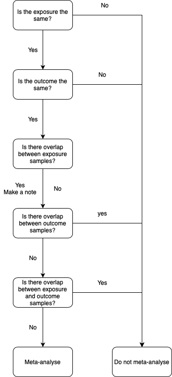

```{r include=FALSE}
# word count = 
doc.type <- knitr::opts_knit$get('rmarkdown.pandoc.to') # this will tell the .Rmd file what output you are knitting to (word, pdf, html) so that you cna use if else statements when making tables - html/pdf output tables do not work well in word. For word we need to use the 'flextable' packaged to make tables.
setwd(Sys.getenv("main"))
## packages
library(dplyr)
library(kableExtra)
library(flextable)
library(data.table)
library(ggplot2)
library(cowplot)
options(tinytex.verbose = TRUE)
load("../005_systematic_review/analysis/data_extraction.RData")
```

# Systematic review: What has the application of Mendelian randomization informed us about the causal relevance of adiposity and health outcomes? {#systematic-review}

<style>
body {
text-align: justify}
</style>

## Chapter Summary {-}

This chapter details a systematic review and meta-analysis of 173 studies investigating the effects of adiposity on over 300 different outcomes. In Chapter \@ref(introduction), focus was given to the underlying literature around adiposity, what adipose tissue is, why in excess this can be detrimental to health, what observational studies have taught us about adiposity, and potential mechanisms for adiposity-disease relationships. Here, the focus is on the causal effects of adiposity and what Mendelian randomization studies have informed us about adiposity-disease relationships. Results reveal the broad effect of adiposity on many health outcomes, with meta-analyses highlighting a number of outcomes (e.g., endometrial cancer, colorectal cancer, cardiovascular disease) for follow-up analysis in Chapter \@ref(mediation). This work was pre-registered on [PROSPERO](https://www.crd.york.ac.uk/prospero/display_record.php?ID=CRD42018096684). \par 

\newpage

## Introduction {#SR-intro}
Observational studies have indicated that adiposity is strongly associated with all-cause and cause specific mortality[@Flegal2013; @Lee2015; @Elagizi2018; @Jenkins2018; @Pischon2008; @Rost2018; @Mørkedal2011; @Dong2018; @Lee2018; @Bigaard2004], and numerous risk factors and diseases[@Bhaskaran2014; @Choi2020; @Kyrgiou2017; @Hu2014; @Hajiebrahimi2013; @Munsell2014; @Harvie2003; @Gaudet2014; @Barrington2015; @Heo2021; @Lauby-Secretan2016; @Barberio2019; @Suzuki2009; @Freisling2017; @Parra-Soto2021; @Dobbelsteyn2001; @Yusuf2005; @Paul2006; @Koliaki2019; @Eckel1998; @Cepeda-Lopez2010; @Blokhin2013; @Thomsen2014; @McGill2002; @Ades2017; @Mathew2008; @Plourde2014; @Pathak2015; @Lavie2017; @Kurth2002; @Kernan2013; @Rost2001; @Romero-Corral2010;  @Elsayed2008; @Oh2014;  @Sahlman2020; @Wiltink2013; @Dye2017; @Basraon2016; @Price2006; @Lee2018; @Klop2013; @Martyn2008; @Ye2013; @Wilkin2001; @Corbin2018; @Al-Goblan2014; @Kahn2001; @Wurtz2014; @Cirulli2019; @Turnbaugh2006; @Castaner2018; @Durack2019; @Cominetti2018; @Figarska2020; @Qiao2010; @Jo2018; @Festa2001; @Park2005; @Bastard2006; @Lapice2009; @Hermsdorff2011; @Warnberg2007; @Quijada2008; @Marti2001; @Tilg2006; @Fernandez-Real2005; @Stryjecki2011; @Kovesdy2017; @Foster2008; @Pinto-Sietsma2003; @Kramer2005; @Lu2015; @Hsu2006; @Munkhaugen2009; @Thoenes2009; @Kramer2016; @Sarwar2018; @Browning2004; @Petersen2006; @Romeo2008; @Cornier2008; @Donnelly2005; @Fabbrini2010; @OBrien2017; @Qizilbash2015; @Elias2005; @Anstey2011; @Pedditizi2016; @Mrak2009; @Gustafson2004; @Jagust2005; @Ward2005; @Taki2008; @Gazdzinski2008; @Raji2010; @Yau2012; @Alosco2014; @Thaler2010; @MyersJr2010; @Zammit2010; @Gibson2000; @KRESS1999; @Laghi2003; @Beuther2007; @Rodrigo2007; @Aaron2008; @Sin2008; @Crummy2008; @MORTIMORE1998; @Eisner2007; @Franssen2008; @McClean2008; @Nakajima2008; @Jones2006; @Peppard2009; @Chen2007; @Stang2016; @Sharp2019; @Robker2009; @Wise2010; @Chandra2013; @Alvarez-Blasco2006; @BeatrizMotta2012; @Ehrmann2006; @OrioJr2004; @Hammoud2008; @Chen2006; @Heidler2007; @Schummers2015; @Bautista-Castano2013; @Lo2013; @Gaillard2013; @Feig2013; @Athukorala2010; @Belbasis2016; @Stothard2009; @Carmichael2010; @Aune2014a]. This includes the most common diseases, such as cardiovascular disease[@Hubert1983; @Kenchaiah2002; @Yusuf2004; @Cuilin2008; @Gelber2008; @Litwin2008; @Dobbelsteyn2001; @Yusuf2005; @Paul2006; @Koliaki2019; @Eckel1998; @Cepeda-Lopez2010; @Blokhin2013; @Thomsen2014; @Klop2013; @McGill2002; @Ades2017; @Mathew2008; @Plourde2014; @Pathak2015; @Lavie2017; @Kurth2002; @Kernan2013; @Rost2001; @Romero-Corral2010; @Lee2018] and many cancers[@Bhaskaran2014; @Choi2020; @Kyrgiou2017; @Hu2014; @Hajiebrahimi2013; @Munsell2014; @Harvie2003; @Gaudet2014; @Barrington2015; @Heo2021; @Lauby-Secretan2016; @Barberio2019; @Suzuki2009; @Freisling2017; @Lee2018; @Parra-Soto2021], along with common risk factors such as hypertension[@Mathew2008; @Wurtz2014]. See Chapter \@ref(introduction) Section \@ref(introduction-morbidities) for more detail. \par

As discussed in Chapter \@ref(introduction) Section \@ref(mendelian-randomization), observational studies hold a number of limitations that can not easily be overcome, e.g., confounding and reverse causation. These limitations can lead to biased results[@Batty1999; @DaveySmith2014c; @DaveySmith2014; @Timpson2005; @CCGC2011; @Yarmolinsky2018] and, although an observational study may identify an association between two traits, this does not mean that one trait causes the other; they may be correlated because of shared causes, for instance. Furthermore, in observational studies, it is difficult to obtain the causal direction of effect as the temporal sequence is generally unknown[@Batty1999]. Ideally randomised controlled trials would be conducted to aid our understanding and identify causal effects, however these are costly, time consuming, and can be unethical given the assumption that adiposity is detrimental to health. \par

Mendelian randomization (MR) analyses provide a method of obtaining causal effects outside of randomised controlled trials[@DaveySmith2003]. By using genetic variants, which are randomly assigned and fixed at conception, the randomization and temporality analogous of a randomized controlled trial can be achieved (See Chapter \@ref(introduction) Section \@ref(mendelian-randomization)). There has been a rise in MR studies published in the years since it was first widely reported on in 2003[@DaveySmith2003]. Systematic reviews enable global overview of the literature and provide avenues for hypothesis generation. In combination with meta-analyses, systematic reviews can be used as a method for improved causal inference as pooled estimates can be more precise than estimates from individual studies[@Deeks2019]. \par

The MR literature has not been systematically appraised in regards to the causal relevance of adipositys effects on health outcomes. Here, a systematic review and meta-analysis are presented and will be used to inform downstream analyses within this thesis, namely selecting outcomes for which adiposity is relevant and to test associations with adiposity-related metabolic intermediates (Chapter \@ref(mediation)). \par

## Methods {#SR-methods}
### Data sources and search strategy
EMBASE and MEDLINE were searched from inception (EMBASE = 1974; MEDLINE = 1946) until February 18th 2019 using detailed search strategies including free text and controlled vocabulary terms ([GitHub](https://github.com/mattlee821/000_thesis/blob/master/index/data/SR/data/search_strategy.pdf)). The pre-print service bioRxiv was searched from inception (November 2013) until February 18th 2019. However, due to the limited search functionality and inability to include Boolean operators (‘AND’, ‘OR’, ‘NOT’) in bioRxiv searches, a restricted search strategy using four free text terms in four independent searches was used: ‘Mendelian randomization’, ‘Mendelian randomisation’, ‘causal inference’, and ‘causal analysis’. \par

The search strategy included synonyms for both adiposity and MR terms. For adiposity measures, this was to ensure searches returned all possible instances in which a measure of adiposity was used. For MR, synonyms were used as the term ‘Mendelian randomization’ has only been formalised recently and many early studies would have either been unaware they were performing an instrumental variable analysis or would have called the method something else. The search strategy is available on [GitHub](https://github.com/mattlee821/000_thesis/blob/master/index/data/SR/data/search_strategy.pdf). \par

### Study selection
Articles returned through the searches of EMBASE and MEDLINE were downloaded as `.ris` files and imported into EndNote (version X8.2; Clarivate Analytics). De-duplication of articles identified in the EMBASE and MEDLINE searches was based on pagination identifiers described in detail elsewhere[@Bramer2016]. Articles returned from bioRxiv were imported into Mendeley using the Mendeley Google Chrome extension and de-duplication performed using the Mendeley de-duplication function. After de-duplication, the titles and abstracts of all remaining articles from EMBASE, MEDLINE, and bioRxiv had their titles and abstracts screened by two independent reviewers (Matthew A Lee and Luke A Mcguinness) using Rayyan[@Ouzzani2016]. Each reviewer screened all articles and discrepancies at this stage were resolved through discussion between the two reviewers. Studies from EMBASE, MEDLINE, and bioRxiv meeting the pre-defined inclusion criteria (see below) were combined and, in instances where the bioRxiv study had been published and this was identified in either the EMBASE or MEDLINE search, the bioRxiv version of the study was excluded. The full texts of the combined study dataset had their full text screened by the two reviewers. \par

For title and abstract screeening and for full text screening, articles must have met the following pre-defined inclusion criteria:

1.	Be written in English
2.	Be available in full text (or in the case of conference abstracts, the authors must be contactable to obtain the relevant data)
3.	Be published in a peer-reviewed journal or bioRxiv
4.	Use MR methodology to investigate the causal effect of adiposity on any outcome
    a.	Adiposity was considered to be any measure which aimed to assess the amount of adipose tissue an individual possessed
    b.	If a study focused on adiposity alongside other exposures, the effect of each adiposity measure will be reported separately, if available, and report the joint effect with these other exposures, if not available. 
    c.	articles in which an MR approach is used but not explicitly called ‘Mendelian randomization’ will be included. More specifically, any study in which genetic variants are used as instrumental variables or the direct association between a genetic variant and outcome is employed will be eligible, provided it meets the other inclusion criteria.

### Data extraction
In the first instance, data extraction was performed by nine reviewers (See \@ref(contributions)), with articles split evenly between them, using a data extracton form ([GitHub](https://github.com/mattlee821/000_thesis/blob/master/index/data/SR/data/data_extraction.xlsx)) and data extraction manual ([GitHub](https://github.com/mattlee821/000_thesis/blob/master/index/data/SR/data/data_extraction_manual.docx)). Once all articles had been reviewed, two reviewers (See \@ref(contributions)) extracted data on all articles they did not review in the first instance. The same two reviewers then checked all extracted data for discrepancies which were resolved through a third review of individual articles. \par

Articles included in data extraction may contain more than one relevant MR analysis. As such, study/studies refers to the MR analysis/analyses within an article. The following data were extracted from each articles studies: exposure(s), outcome(s), study design and sample characteristics, genetic variant and instrumental variable selection, MR methodology, sensitivity analysis, and causal estimates. Where relevant data was not reported by the article, “Not discussed” was entered into the data extraction form. \par

Once data extraction was completed, three additional columns were added to summarise the type of outcome being studied: column 1 ("outcome") was used as a general categorisation of all outcomes across articles (e.g., the outcome "ER- breast cancer" would have the value "breast cancer"); column 2 ("outcome info") reported the outcome-specific information that distinguished outcomes within categories defined in column 1 (e.g., column 2 would contain the value "ER-" for the same breast cancer example); and column 3 ("outcome group") categorised outcomes more generally than values defined in column 1 (e.g., the breast cancer example would be categorised as "cancer"). Outcome categories were assigned based on prior biological knowledge and aimed to collapse the large number of outcomes. This could be achieved differently for some outcomes, for example smoking could go in a *respiratory* category or a *behavioural* category. Where there were few outcomes to make a category, they were grouped into an *other* category. This will include outcomes such as mortality, disease counts, epigenetic marker etc. \par

### Quality assessment
There is currently no risk of bias tool to assess the quality of MR articles. Because of this, some reviews have not reported on the quality of MR studies[@Pingault2016; @Storm2020]. However, more recent studies have begun to investigate quality, either by using pre-existing risk of bias tools specific to other areas or by creating their own assessment tool[@Kuzma2018; @Mamluk2020; @Riaz2018; @Li2017; @Zhang2020; @Markozannes2021; @Kohler2018; @Kim2020; @Diemer2021; @Cheng2020; @Abbasi2016; @Grau-Perez2019]. Some of these tools have been influenced by the recent publication of MR reporting guidelines[@DaveySmith2019] (STROBE-MR). The STROBE-MR guidelines allow readers to evaluate the quality of the presented evidence. \par

For this systematic review, the tool used by Mamluk et al (2020)[@Mamluk2020] was adapted and used for quality assessment of studies included in the meta-analyses. Study quality was assessed on a 3-point scale (low = 3, medium = 2, high = 1; Appenidx Table \@ref(tab:appendix-SR-table-rob)) across 12 questions. These 12 questions included the five used by Mamluk et al., (2020)[@Mamluk2020]. One of these five questions, relating to bias due to selection of participants, was split into two questions for exposures and outcomes to accommodate two-sample MR analyses. In addition, questions for instrumental variable (IV) association, sample overlap, whether the study performed sensitivity analyses and whether these were biased, descriptive data, data availability (data missingness), and statistical parameters were included. Given no formal risk of bias tool exists, quality assessment here was not used as a prerequisite for inclusion/exclusion in the meta-analyses. Rather, it was used to supplement the meta-analyses and aid interpretation. \par

### Meta-analysis {#SR-methods-meta-analysis}
To identify studies which could be meta-analysed, a set of rules were used (Figure \@ref(fig:SR-figure-meta-analysis-flowchart)). These rules ensured that the exposure and outcome were consistent across studies, but also that there was no population overlap between the outcomes of different studies or between the outcomes and exposure of different studies. Sample overlap can induce bias in in MR studies[@Burgess2016]. Where there was overlap between the outcome of one study and the ouctome of another study, or where there was overlap between the exposure of one study and the outcome of another study, the study with the larger sample size was retained. Excluding studies with overlapping outcomes or overlapping exposures and outcomes would involve including non-independent data and result in overly precise estimates[@Burgess2016]. Finally, studies were excluded based on whether the MR method was comparable and then on whether the units where compatible with one another (e.g., where both studies reported a standard deviation increase in BMI). Studies which had overlapping exposure populations were included as the risk of bias is low[@Burgess2016]. For completeness, studies were not excluded based on the quality assessment score, but are discussed later in this chapter when interpreting the meta-analysis findings. \par

Meta-analysis was performed using the `meta`[@Balduzzi2019] package in `R` and the function `metagen()`. In an inverse variance weighted fixed-effects model, a weighted average is calculated as:

\begin{equation}
  weighted\ average = \frac{\sum Y_i (1/SE_i^2)}{\sum(1/SE_i^2)}
  (\#eq:meta-analysis-fixed)
\end{equation}

Where, $Y_i$ is the intervention effect estimates in the $i$^th^ study, $SE_i$ is the standard error of that estimate, and the summation ($\sum$) is across all studies. The assumption here is that all effect estimates estimate the same effect; in MR analyses, we assume that studies using the same exposure and outcome will be estimating the same effect, but that the exposure and outcome is subtly different among different populations given instrumentation and measurement error and therefore consider these to be related effects. In a random-effects model the assumption is that the studies estimate related effects[@Higgins2009; @Borenstein2010]. In a random effects model, $SE_i$ is adjusted to incorporate heterogeneity among study effects, $\tau^2$. In this, a random-effects model will weight smaller studies more than a fixed-effects model would, as they provide more information on the distribution of effects as opposed to more information on the overall effect. This does not mean that random-effects models account for heterogeneity; random- and fixed-effects models will give identical results when there is no heterogeneity. \par

Following this and considerations in the [Cochrane handbook](https://training.cochrane.org/handbook/current/chapter-10#section-10-10-4-1), an inverse variance weighted random-effects model using estimates and standard errors was used. Where standard errors and effect estimates were not available for a study (e.g., confidence intervals and odds ratios were available), these were back calculated manually. For binary outcomes, the relevant summary method was used for odds ratios, risk ratios, and hazard ratios etc. For continuous outcomes, the mean difference was used for the underlying summary method. For completeness, and given this is a hypothesis-generating process, a multiple testing threshold was not used. For both binary and continuous outcomes, the Hartung and Knapp method to adjust confidence intervals to reflect uncertainty in the estimation of between-study heterogeneity[@Hartung2001; @Hartung2001a], which is recommended for random effects models[@IntHout2014; @Langan2019], was used where $\geq$ 5 studies were included in the meta-analysis[@IntHout2014]. Between study variance was estimated for all meta-analyses using the Paule-Mandel estimator[@RC1982], for which simulation studies have shown good performance compared to other estimators[@Veroniki2016]. \par

(ref:SR-figure-meta-analysis-flowchart-cap) **Inclusion criteria for meta-analysis: flowchart**. Mendelian randomization (MR) analyses were included in meta-analyses if they met the conditions set out in the flowchart and in Section \@ref(SR-methods-meta-analysis). * = MR analyses had to use the same exposure and the same outcome to be compatible, e.g. for the exposure, body mass index could not be meta-analysed with any other exposure that was not body mass index. This also applies to outcomes, e.g., the ouctome oestrogen negative breast cancer could not be meta-analysed with breast cancer, it could only be meta-analysed with oestrogen negative breast cancer.

(ref:SR-figure-meta-analysis-flowchart-scap) Inclusion criteria for meta-analysis: flowchart

```{r SR-figure-meta-analysis-flowchart, echo=FALSE, out.width='50%', fig.cap='(ref:SR-figure-meta-analysis-flowchart-cap)', fig.scap='(ref:SR-figure-meta-analysis-flowchart-scap)'}

```

### Narrative synthesis
In order to gain a global picture of reported causal effects, a narrative synthesis was performed. All articles that were not included in the meta-analyses were included in the narrative synthesis where individual studies were summarised. Due to his latter point, the narrative synthesis therefore will have included non-independent estimates but is there to give a global synthesis of the causal relevance of adiposity on health outcomes. The outcome categories were used to guide the synthesis. MR analyses that were included in the meta-analyses were not included in the narrative synthesis. The direction of effect estimates across outcome categories were summarised across the exposures used for these analyses. Given that studies may not report p-values these were not the focus here. The synthesis is presented in alphabetical order of the outcome categories. \par

## Results {#SR-results}
### Literature search
In total, 8,377 articles were returned from the combined search of EMBASE (N = 3,772), MEDLINE (N = 3,638), and bioRxiv (N = 966). After combining the articles from EMBASE and MEDLINE, de-duplication resulted in the removal of 1,500 articles (N = 5,910). De-duplication of bioRxiv search results removed an 293 articles (N = 673). Published bioRxiv articles were dealt with at the data extraction stage. The 5,910 articles from EMBASE and MEDLINE were combined with the 673 articles from bioRxiv and titles and abstracts were screened. A total of `r full_text_screen` articles were retained after title and abstract screening (data available on [GitHub](https://github.com/mattlee821/000_thesis/tree/master/index/data/SR/data/full_text_screening_277.xml)). \par

Of the `r full_text_screen` articles included in the full text screening, a total of `r removed` articles were removed for the following reasons (with number of articles removed indicated in brackets): a conference abstract with no response within 6 months from the author or there was no data available from the authors (`r removed_unavailable`), conference abstracts with the full paper included in the search (`r removed_conference_abstract_full_available`), duplicates not excluded by the de-duplication process (`r removed_duplicates`), not using a measure of adiposity as the exposure (`r removed_incorrect_exposure`), a commentary (`r remvoed_commentary`), erratum (`r removed_erratum`, the corrected papers were identified in the search), not MR (i.e., regression of SNP on trait; `r removed_not_MR`), a conference proceeding (`r removed_conference_proceeding`), not available in English (`r remvoed_language`), and preprint paper in which the published paper did not include an MR of an adiposity measure (`r preprint_published_not_MR`). After full text screening, `r full_text_screen - removed` articles were included in the analysis (data available on [GitHub](https://github.com/mattlee821/000_thesis/tree/master/index/data/SR/data/qualitative_synthesis.xml). \par

(ref:SR-prisma-cap) **PRISMA flowchart**. $k$ gives the number of articles at each stage

(ref:SR-prisma-scap) PRISMA flowchart

```{r SR-prisma, echo=FALSE, out.width='100%', fig.cap='(ref:SR-prisma-cap)', fig.scap='(ref:SR-prisma-scap)'}
knitr::include_graphics("../../005_systematic_review/figures/PRISMA_flowchart.pdf")
```

### Data extraction
Articles from bioRxiv included in data extraction were replaced with their published version if available. Of the 23 included bioRxiv articles, 18 were published once data extraction began and were included instead of the bioRxiv article. One bioRxiv article was excluded as the published version did not include the MR analysis. The remaining 4 bioRxiv artilces were included. The majority of articles were published in the past 5 years (Figure \@ref(fig:SR-figure-published-year)) and one-sample MR was the predominant analysis performed across the `r full_text_screen - removed` studies (Figure \@ref(fig:SR-figure-mr-design)). \par

(ref:SR-figure-published-year-cap) **Distribution of publication year per article and average exposure and outcome sample sizes across included studies up to February 2019**. The number of articles included per year is given on the left Y axis; the right Y axis gives the average sample size for exposure (grey) and outcome (red) for each year. Ouctome cases and controls were summed within analyses.

(ref:SR-figure-published-year-scap) Distribution of publication year per article and average exposure and outcome sample sizes across included studies up to February 2019

```{r SR-figure-published-year, eval=TRUE, include=TRUE, echo=FALSE, error=FALSE, message=FALSE, warning=FALSE, fig.align='center', out.width='100%', fig.cap='(ref:SR-figure-published-year-cap)', fig.scap='(ref:SR-figure-published-year-scap)'}
year <- data[!duplicated(data$ID),]
year <- year[,c("ID", "year", "outcome_n_case_current", "outcome_n_control_current", "exposure_n_current")]
year$exposure_n_current <- as.numeric(year$exposure_n_current)
year$outcome_n_case_current <- as.numeric(year$outcome_n_case_current)
year$outcome_n_control_current <- as.numeric(year$outcome_n_control_current)

a <- year[,c("year", "exposure_n_current")]
a <- a[complete.cases(a), ]
exposure <- a %>% 
  group_by(year) %>% 
  summarise(exposure_average = mean(exposure_n_current))

a <- year[,c("year", "outcome_n_case_current", "outcome_n_control_current")]
a[is.na(a)] <- 0
a$outcome <- a$outcome_n_case_current + a$outcome_n_control_current
a <- subset(a, outcome > 0)
a <- a[,c("year", "outcome")]
a <- a[complete.cases(a), ]
outcome <- a %>% 
  group_by(year) %>% 
  summarise(outcome_average = mean(outcome))

a <- year[,c("year")]
a <- a[complete.cases(a), ]
year <- a %>% 
  group_by(year) %>%
  summarise(year_count = length(year))

plot_data <- left_join(year, exposure, by = "year")
plot_data <- left_join(plot_data, outcome, by = "year")

#
source("data/index/colour_palette.R")
plot_data$`N studies` <- plot_data$year_count
ggplot(plot_data) +
  geom_col(aes(x = year, y = `N studies`)) +
  geom_point(aes(x = year, y = exposure_average/5000, group = 1), size = 2, colour = discrete_wes_pal[1]) +
  geom_point(aes(x = year, y = outcome_average/5000, group = 1), size = 2, colour = discrete_wes_pal[2]) +
  geom_line(aes(x = year, y = exposure_average/5000, group = 1), size = 3, colour = discrete_wes_pal[1]) +
  geom_line(aes(x = year, y = outcome_average/5000, group = 1), size = 3, colour = discrete_wes_pal[2]) +
  scale_y_continuous(sec.axis = sec_axis(~.*5000, breaks = c(250000,200000,150000,100000,50000,0), name = "N exposure/outcome")) +
  theme_cowplot() +
  theme(axis.text.x = element_text(angle = 90, vjust = 0.5, hjust=1))

```

(ref:SR-figure-mr-design-cap) **Distribution of study design across 173 included articles**. The majority of the 173 included articles reported more than one Mendelian randomization (MR) analysis. Where a study performed a bi-directional MR analysis and adiposity was the secondary analysis (i.e., to check for reverse causation), this was recorded as a bi-directional MR analysis. One-sample and two-sample meta-analysis indicates the meta-analysis included MR analyses that were both one- and two-sample designs.

(ref:SR-figure-mr-design-scap) Distribution of study design across 173 included articles

```{r SR-figure-mr-design, eval=TRUE, include=TRUE, echo=FALSE, error=FALSE, message=FALSE, warning=FALSE, fig.align='center', out.width='100%', fig.cap='(ref:SR-figure-mr-design-cap)', fig.scap='(ref:SR-figure-mr-design-scap)'}
design <- select(data, ID, MR_design)
design <- as.data.table(design)
design <- dcast(design, MR_design ~ ., fun.agg = function(x) sum(!is.na(x)), 
            value.var = "ID")
colnames(design)[2] <- "N"
design$MR_design <- gsub("one-sample and two-sample meta-analysis", "One-sample and two-sample meta-analysis", design$MR_design)
design$MR_design <- gsub("one-sample meta-analysis", "One-sample meta-analysis", design$MR_design)
design$MR_design <- gsub("two-sample meta-analysis", "Two-sample meta-analysis", design$MR_design)
ggplot(data.frame(design), aes(x=reorder(MR_design, N), y=N)) +
  geom_bar(stat='identity') +
  theme_cowplot() +
  theme(axis.text.x = element_text(angle = 90, vjust = 0.5, hjust=1),
        axis.text.y = element_text(size = 8),
        axis.title.y = element_blank(), axis.title.x = element_blank()) +
  coord_cartesian(xlim=c(0,2000), ylim=c(0,2000)) +
  # geom_text(aes(label=N), position=position_dodge(width=0.9), vjust=0.5, hjust=-0.5) +
  coord_flip()
```

A total of `r results_rows` MR analyses were performed across the `r full_text_screen - removed` studies (i.e., many studies conducted multiple MR analyses). This included `r nlevels(data$exposure)` exposures and `r nlevels(data$outcome_info)` outcomes. The majority of the `r results_rows` MR analyses used BMI as the exposure (Table \@ref(tab:SR-table-exposure-percentages)). After formatting the outcome data into three columns of (column 1) general outcome (e.g., breast cancer), (column 2), analysis specific outcome (eg., ER-), and outcome category (e.g., cancer), a total of `r nlevels(data$outcome)` general outcomes were available and grouped into `r nlevels(data$outcome_group)` outcome categories. Of the `r nlevels(data$outcome)` outcomes, smoking was used in the most MR analyses followed by asthma and DNA methylation (Table \@ref(tab:SR-table-outcome-percentages-10)). The largest proportion of outcomes were grouped into the metabolic and cancer categories (Table \@ref(tab:SR-table-outcome-group-percentages)). The other category included 118 methylation outcomes, 68 mortality outcomes, and a handful of the following outcomes: age related macular degeneration, cataract, disease count, hernia, sleep, and physical activity. Categories, as discussed in the methods, were assigned based on prior biological knowledge. \par

```{r SR-table-exposure-percentages, echo=FALSE}
exposure_percentages$freq <- exposure_percentages$freq * 100

knitr::kable(
    (exposure_percentages[order(-exposure_percentages$n),]),
    longtable = F, booktabs = T,
    caption = 'Number and frequency of exposures used across all 2214 MR analyses', row.names = F,
    digits = 2, format = "latex",
    col.names = c("Exposure", "N", "%")) %>%
  kable_styling(latex_options = c("striped", "HOLD_position", "repeat_header"), position = "center") %>%
  kableExtra::footnote(general = "BMI = body mass index; WHR = waist hip ratio; WHRadjBMI = WHR adjusted for BMI; WC = waist circumference; WCadjBMI = WC adjusted for BMI; HC = hip circumference; HCadjBMI = HC adjusted for BMI.",
                         threeparttable = T, general_title = "", footnote_as_chunk = T)

```

```{r SR-table-outcome-percentages-10, echo=FALSE}
outcome_percentages$freq <- outcome_percentages$freq * 100

knitr::kable(
    head(outcome_percentages[order(-outcome_percentages$n),], 10),
    longtable = F, booktabs = T,
    caption = 'Number and frequency of 10 most used outcomes across all 2214 MR analyses', row.names = F,
    digits = 2, format = "latex",
    col.names = c("Outcome", "N", "%")) %>%
  kable_styling(latex_options = c("striped", "HOLD_position", "repeat_header"), position = "center")
```

```{r SR-table-outcome-group-percentages, echo=FALSE}
outcome_percentages_group$freq <- outcome_percentages_group$freq * 100

knitr::kable(
    (outcome_percentages_group[order(-outcome_percentages_group$n),]),
    longtable = F, booktabs = T,
    caption = 'Number and frequency of outcomes within each outcome category across all 2214 MR analyses', row.names = F,
    digits = 2, format = "latex",
    col.names = c("Group", "N", "%")) %>%
  kable_styling(latex_options = c("striped", "HOLD_position", "repeat_header"), position = "center")
```

### Quality assessment
```{r echo=FALSE}
rob_data <- read.table("../../005_systematic_review/analysis/quality_assessment/QA_results.txt", header = T, sep = "\t")
```

Studies that contributed to the meta-analyses were assessed for quality using a modified version of the assessment criteria devised by Mamluk et al. (2020)[@Mamluk2020]. Studies were assessed on a 3-point scale across 12 questions, with values ranging from 12-36. Analyses with lower scores (12-19) were considered to be of higher quality, with high scoring (28-36) studies considered lower quality. Scores inbetween were of medium quality. The average assessment was `r round(mean(rob_data$Total),0)` (Figure \@ref(fig:SR-figure-rob-distribution)). Individual studies were assessed as opposed to the article, as most articles conducted multiple studies. Only the study of the effect of body mass index (BMI) on hemorrhagic stroke by Dale et al (2017)[@Dale2017] was ranked as high quality. The majority of studies (24) were assigned a medium quality score. All of the six low scoring studies showed consistent directions of effect with the other studies they were meta-analysed with. Quality scores are presented alongside the meta-analysis results (Figures \@ref(fig:SR-figure-forestplot-meta-analysis-binary) and \@ref(fig:SR-figure-forestplot-meta-analysis-continuous)). \par

(ref:SR-figure-rob-distribution-cap) **Quality assessment: distribution of quality assessment scores for studies included in the meta-analyses**. High indicates a study scored highly; low indicates a study scored poorly. QA = quality assessment score.

(ref:SR-figure-rob-distribution-scap) Quality assessment: distribution of quality assessment scores for studies included in the meta-analyses

```{r SR-figure-rob-distribution, eval=TRUE, include=TRUE, echo=FALSE, error=FALSE, message=FALSE, warning=FALSE,  fig.align='center', fig.cap='(ref:SR-figure-rob-distribution-cap)', fig.scap='(ref:SR-figure-rob-distribution-scap)'}
rob_data <- read.table("../../005_systematic_review/analysis/quality_assessment/QA_results.txt", header = T, sep = "\t")
rob_data$QA[rob_data$Total <= 19] <- "High"
rob_data$QA[rob_data$Total >= 20 ] <- "Medium"
rob_data$QA[rob_data$Total >= 28] <- "Low"
rob_data$QA <- factor(rob_data$QA, levels = c("High", "Medium", "Low"))

ggplot(data = rob_data,
       aes(Total, fill = QA)) +
  geom_histogram(binwidth = 1, alpha = 0.8) +
  theme_cowplot()
```

<!-- SEE WHAT NICs COMMENT IS ABOUT THIS BIT
Of the remaining MR analyses six were ranked as low quality (BMI on alzheimers (Nordestgaard et al (2017)[@Nordestgaard2017]), BMI on venous thromboembolism (Klarin et al (2017)[@Klarin2017]), BMI on type 2 diabetes (Shu et al (2018)[@Shu2019]), WHRadjBMI on type 2 diabetes (Shu et al (2018)[@Shu2019]), BMI on SBP (Shapland et al (2019)[@Shapland2019]), BMI on HOMA IR (Wang et al (2018)[@Wang2018])). The remaining 24 were classed as medium quality.
-->

### Meta-analysis
```{r echo=FALSE}
studies <- read.table("../../005_systematic_review/analysis/meta_analysis/results/study_freq.txt", header = T, sep = "\t")
results <- read.csv("../../005_systematic_review/analysis/meta_analysis/results/meta_analysis_results.csv")
```

In total, `r nrow(results)` meta-analyses were conducted using data from `r nrow(studies)` studies. A majority of MR analyses were excluded due to a lack of meta-analysable data (i.e. only one MR analysis looked at an exposure-outcome pair). Additional reasons for exclusion were: population overlap, incompatible units, and incompatible MR model. A majority of the `r nrow(studies)` studies contributed to just one meta-analysis. A number of studies contributed multiple MR analyses which were included in meta-analyses: four studies contributed to two meta-analyses, three studies to three meta-analyses, two studies to four meta-analyses, two studies to seven meta-analyses, and one study to eight meta-analyses (Table \@ref(tab:SR-table-studies-N)). \par

```{r SR-table-studies-N, echo=FALSE, error=FALSE, message=FALSE, warning=FALSE}
knitr::kable(
    (studies[order(-studies$freq),]),
    longtable = F, booktabs = T,
    caption = 'Number of times a study was used in meta-analyses', row.names = F,
    digits = 2, format = "markdown",
    col.names = c("Study", "N")) %>%
  kable_styling(latex_options = c("striped", "HOLD_position", "repeat_header"), position = "center", font_size = 8)

```

```{r echo=FALSE}
results <- read.csv("../../005_systematic_review/analysis/meta_analysis/results/meta_analysis_results_formatted.csv")
binary <- results[c(1:22),]
continuous <- results[c(23:31),]

binary_pos <- subset(binary, effect_estimate > 1)
binary_pos_ci <- subset(binary_pos, CI_lower > 1)
binary_pos_ci_sig <- subset(binary_pos_ci, p < 0.05)
binary_neg <- subset(binary, effect_estimate < 1)
binary_neg_ci <- subset(binary_neg, CI_upper < 1)
binary_neg_ci_sig <- subset(binary_neg_ci, p < 0.05)

continuous_pos <- subset(continuous, effect_estimate > 0)
continuous_pos_ci <- subset(continuous_pos, CI_lower > 0)
continuous_pos_ci_sig <- subset(continuous_pos_ci, p < 0.05)

continuous_neg <- subset(continuous, effect_estimate < 0)
continuous_neg_ci <- subset(continuous_neg, CI_upper < 0)
continuous_neg_ci_sig <- subset(continuous_neg_ci, p < 0.05)
```

For all binary outcomes, results are given per standard deviation (SD) unit increase, such that an odds ratio (OR) is the change in the outcome per SD unit increase in the exposure. Studies which used risk ratios and hazard ratios were excluded from the meta-analysis following the rules set out in Figure \@ref(fig:SR-figure-meta-analysis-flowchart), e.g., sample overlap. For continuous outcomes, results are given as the mean difference (MD) and reflect a change in the outcome unit per SD unit increase in the exposure - effect estimate is used throughout. \par 

In the meta-analyses, there were 22 binary outcomes and 9 continuous outcomes. For the `r nrow(binary)` binary outcomes, `r nrow(binary_neg)` tests (birthweight on ER- breast cancer and CAD) had negative effect estimates. Both tests had confidence intervals which spanned the null. The remaining `r nrow(binary_pos)` tests had positive effect estimates, `r nrow(binary_pos_ci)` of which had confidence intervals that did not span the null. All of these reached the nominal p-value threshold (Figure \@ref(fig:SR-figure-forestplot-meta-analysis-binary)). The majority of MR analyses included in these meta-analyses had a medium quality assessment score. The MR analysis by Dale et al., (2017)[@Dale2017] of BMI on hemorrhagic stroke was the only analysis to score highly. The four studies which had a low quality assessment score did not have weights that were drastically different compared to the other MR analyses in those meta-analyses; all but one had tight confidence intervals which did not cross the null. \par

For the `r nrow(continuous)` continuous outcomes, `r nrow(continuous_neg)` tests (BMI on high density lipoprotein (HDL; SD and mmol/L) and low density liporpotein (LDL; mmol/L)), had negative effect estimates with confidence intervals which spanned the null. The remaining `r nrow(continuous_pos)` tests had positive effect estimates, `r nrow(continuous_pos_ci)` (BMI on systtolic blood pressure (SBP; mmHg) and fasting glucose (mmol/L)) of which had confidence intervals that did not span the null. Both reached the nominal p-value threshold (Figure \@ref(fig:SR-figure-forestplot-meta-analysis-continuous)). Two included MR analyses ranked low for quality assessment; the study by Shapland et al., (2018)[@Shapland2019] had comparable weight to the other two studies investigating BMI on SBP. The study by Wang et al., (2018)[@Wang2018a] investigating HOMA IR (Homeostatic Model Assessment for Insulin Resistance) had a much larger weight than the study by Kivimaki et al., (2008)[@Kivimaki2008], a result of a larger population. The remaining studies had a medium quality assessment score, none of which showed estimates that deviated strongly from the effects of the other MR analyses in those meta-analyses. \par

```{r echo=FALSE, out.width='70%', fig.align='center'}
knitr::include_graphics("../../005_systematic_review/figures/meta_analysis_results_figures/binary_outcomes1.pdf")
```

(ref:SR-figure-forestplot-meta-analysis-binary-cap) **Meta-analysis: effect estimates and 95% confidence intervals for binary outcomes**. Forestplot shows effect estimates and 95% confidence intervals from a meta-analysis of 22 different exposure-outcome pairs. MR analyses included based on criteria in Figure \@ref(fig:SR-figure-meta-analysis-flowchart). QA = quality assessment score; OR = odds ratio; CI = confidence interval. 

(ref:SR-figure-forestplot-meta-analysis-binary-scap) Meta-analysis: effect estimates and 95% confidence intervals for binary outcomes

```{r SR-figure-forestplot-meta-analysis-binary, echo=FALSE, out.width='70%', fig.align='center', fig.cap='(ref:SR-figure-forestplot-meta-analysis-binary-cap)', fig.scap='(ref:SR-figure-forestplot-meta-analysis-binary-scap)'}
knitr::include_graphics("../../005_systematic_review/figures/meta_analysis_results_figures/binary_outcomes2.pdf")
```

(ref:SR-figure-forestplot-meta-analysis-continuous-cap) **Meta-analysis: effect estimates and 95% confidence intervals for continuous outcomes**. Forestplot shows effect estimates and 95% confidence intervals from a meta-analysis of 9 different exposure-outcome pairs. MR analyses included based on criteria in Figure \@ref(fig:SR-figure-meta-analysis-flowchart). QA = quality assessment score; MD = mean difference; CI = confidence interval.

(ref:SR-figure-forestplot-meta-analysis-continuous-scap) Meta-analysis: effect estimates and 95% confidence intervals for continuous outcomes

```{r SR-figure-forestplot-meta-analysis-continuous, echo=FALSE, out.width='80%', fig.align='center',  fig.cap='(ref:SR-figure-forestplot-meta-analysis-continuous-cap)', fig.scap='(ref:SR-figure-forestplot-meta-analysis-continuous-scap)'}
knitr::include_graphics("../../005_systematic_review/figures/meta_analysis_results_figures/continuous_outcomes.pdf")
```

Three outcomes were investigated using more than one exposure, coronary artery disease with waist hip ratio (WHR) and waist hip ratio adjusted for body mass index (WHRadjBMI), colorectal cancer with BMI and WHR, and type 2 diabetes with BMI and WHRadjBMI. There was strong evidence for an effect of WHR (OR in the outcome per SD unit increase in the exposure = `r round(results[13,3],2)`; 95% confidence interval (CI) = `r round(results[13,4],2)` -- `r round(results[13,5],2)`) and WHRadjBMI (OR = `r round(results[14,3],2)`; 95% CI = `r round(results[14,4],2)` -- `r round(results[14,5],2)`) on coronary artery disease. When looking at colorectal cancer, WHR (OR = `r round(results[8,3],2)`; 95% CI = `r round(results[8,4],2)` -- `r round(results[8,5],2)`) and BMI (OR = `r round(results[7,3],2)`; 95% CI = `r round(results[7,4],2)` -- `r round(results[7,5],2)`) showed similar effects with overlapping confidence intervals. For type 2 diabetes, BMI (OR = `r round(results[18,3],2)`; 95% CI = `r round(results[18,4],2)` -- `r round(results[18,5],2)`) and WHRadjBMI (OR = `r round(results[19,3],2)`; 95% CI = `r round(results[19,4],2)` -- `r round(results[19,5],2)`) both show strong estimates with overlapping confidence intervals. \par 

All remaining tests were conducted with BMI as the exposure. Except for the negative effect on breast cancer, BMI was found to be associated with an increases with all cancers tested (colorectal, endometrial, lung, ovarian, and prostate), confidence intervals crossed the null only for prostate cancer (OR = `r round(results[12,3],2)`; 95% CI = `r round(results[12,4],2)` -- `r round(results[12,5],2)`). The strongest evidence for an effect was found for venous thromboembolism (OR = `r round(results[16,3],2)`; 95% CI = `r round(results[16,4],2)` -- `r round(results[16,5],2)`) and type 2 diabetes (OR = `r round(results[18,3],2)`; 95% CI = `r round(results[18,4],2)` -- `r round(results[18,5],2)`) - asthma also showed strong evidence but with a small effect size (OR = `r round(results[21,3],2)`; 95% CI = `r round(results[21,4],2)` -- `r round(results[21,5],2)`). There was weak evidence for an effect of BMI on ischemic and hemorrhagic stroke, hypertension, arthritis, and Alzheimer's disease, with effect estimates close to the null and confidence intervals spanning the null. \par

The weights for each study included in the individual meta-analyses were broadly even (e.g., in a meta-analysis of three studies each study had a weighting of roughly 33%). The exceptions, where one study had a much larger or much smaller weight than the other(s) was for: BMI and asthma, BMI and polycsystic ovary syndrome (PCOS), BMI and hemorrhagic stroke, BMI and total cholesterol, BMI and HOMA IR, and BMI and LDL. There is evidence of heterogeneity within the included studies, 8 of 22 binary outcomes and 5 of 9 continuous outcomes had heterogeneity statistics with p-values < 0.05, e.g., BMI on endometrial cancer *I^2^* = 92% (p-value < 0.01; Table \@ref(tab:appendix-SR-table-meta-analyses-results)). However, given no meta-analysis met the requirements for heterogeneity statistics (> 5 studies; See [Cochrane Handbook](https://training.cochrane.org/handbook/current/chapter-10#section-10-10-2))[@VonHippel2015], these results should be used with caution. Heterogeneity statistics and weights are presented in Figures \@ref(fig:SR-figure-forestplot-meta-analysis-binary) and \@ref(fig:SR-figure-forestplot-meta-analysis-continuous), as well as Appendix Table \@ref(tab:appendix-SR-table-meta-analyses-results). \par

### Narrative synthesis
```{r include=FALSE}
load("../../005_systematic_review/analysis/narrative_synthesis.RData")
```
A total of `r 2214-70` studies where not included in the meta-analyses. Though many of these could not be included because they did not meet certain requirements for inclusion (e.g., overlapping populations), they still provide information on the potential effects of adiposity. Using the 16 categories used to group outcomes, these effects are summarised here, in alphabetical order with the other category at the end. Where there are a large number of studies a summary of the directions of effect are given. Given that studies use a variety of transformations, units, and models, comparison of the magnitude of effect is not appropriate. Instead, the focus here is on directions of effect estimates and whether evidence is consistent across studies. \par

#### Anthropometric
A total of `r nrow(anthropometric)` studies were reported across `r nlevels(as.factor(anthropometric$doi))` articles for anthropometric outcomes. This included analyses of birthweight, BMI, hip circumference adjusted for BMI (HCadjBMI), waist circumference adjusted for BMI (WCadjBMI), and WHRadjBMI on similar anthropometric traits such as adipose tissue volume, birth length, body fat, head circumferece, leg fat, and trunk fat. The majority of effect estimates were positive (N = `r nrow(anthropometric_pos_b)`; negative = `r nrow(anthropometric_neg_b)`). A single MR analysis (BMI on offspring BMI) had an effect estimate of $0$. A number of other analyses focussed on offspring traits as the outcome with both positive and negative effect estimates. The study by Winkler et al. (2018)[@Winkler2018] used a unique instrumentation method, using a composite measure of BMI, WHR, and WHRadjBMI, for example BMI increasing and WHR increasing SNPs were used as a genetic instrument. Generally, the effect of adiposity on anthropmetric traits is to increase them, but this is likely a reciprocal relationship, i.e., increased BMI leads to increased WHR and increased WHR leads to increased BMI. \par 

#### Neurological/behavioural
A total of `r nrow(brain)` studies were reported across `r nlevels(as.factor(brain$doi))` articles for brain related outcomes. This included analyses of Alzheimer's disease, amyotrophic lateral sclerosis (ALS), dementia, multiple sclerosis (MS), Parkinson's, and stroke. Bipolar disorder, schizophrenia, cognitive ability, grey matter volume, and migraine were also present. Exposures included birth weight, BMI, WHR, and WHRadjBMI - BMI was used in the majority of analyses. For WHR on grey matter volume and BMI on cognitive ability, effect estimates were negative. The majority of effect estimates were positive (N = `r nrow(brain_pos_b)`; negative = `r nrow(brain_neg_b)`). Two analyses (BMI on stroke (ischemic small vessel) and dementia) had an OR of $1$. Effect estimates appeared larger on the whole when in the positive direction, however in many cases across both the positive and negative estimates, confidence intervals spanned the null. On balance, results suggest an increased adiposity increases the risk of all types of stroke. However for all other outcomes there appears conflicting or weak evidence for an effect. \par

#### Cancer
A total of `r nrow(cancer)` studies were reported across `r nlevels(as.factor(cancer$doi))` articles for cancer related outcomes. This included analyses of all cancers, cancer mortality, cancer types such as breast and prostate, and subtypes such as ER- and ER+ breast cancer. A majority of effect estimates were positive (N = `r nrow(cancer_pos_b)+13`; negative = `r nrow(cancer_neg_b)+7`), while six studies of breast, kidney, lung, and prostate cancer showed effect estimates approximately equal to 1. A majority of analyses with positive effect estimates had confidence intervals which spanned the null. The same was true for negative effect estimates. \par

Of the `r nlevels(as.factor(cancer$outcome))` cancer outcomes, three showed negative effect estimates -- cervical (with BMI and WHRadjBMI), clear cell (BMI), gastric (BMI) -- while fourteen showed only positive effect estimates. This included overall cancer mortality (with BMI) and cancer risk (with BMI), as well as an "other cancer" category with two measures: not including lung, breast, colorectal, skin, prostate, and cervical; and not including any non-skin cancer, non-melanoma skin cancer, lung cancer, other smoking related cancers, colon, kidney, breast, and prostate. The remaining cancer types with positive effect estimates included Barrett's esophagus (with BMI), colon (with BMI), esophageal (with BMI), lymphoid (with BMI), meningioma (with BMI, WC, and body fat percentage (BF)), rectal (with BMI), renal (with BMI, WHR, and BF), skin (including melanoma; with BMI), and stomach and esophageal (with BMI). Low malignant potential tumors also showed a positive effect estimate with BMI. The remaining 13 cancer types had positive and negative effect estimates. This included any cancer, breast, colorectal, endometrial, glioma, kidney, lung, multiple myeloma, ovarian, pancreatic, prostate, testicular, and upper aerodigetive. \par

Results suggest increased adiposity increases the risk of overall cancer risk and mortality. However, this risk is modulated by cancer type and subtype. In the case of cancers with only negative effect estimates, these cancers were only analysed once, where as cancers like breast and lung, which where measured multiple times, showed both positive and negative effect estimates. \par

#### Cardiovascular
A total of `r nrow(cardiovascular)` studies were reported across `r nlevels(as.factor(cardiovascular$doi))` articles for cardiovascular related outcomes. This included analyses of `r nlevels(droplevels(cardiovascular_continuous$outcome))` continuous traits and 19 binary outcomes. Exposures included birth weight, BMI, body fat mass measures, HC, WC, WCadjBMI, weight, WHR, and WHRadjBMI. \par

In total, `r nrow(cardiovascular_continuous)` studies investigating the effect of adiposity with continuous traits were reported across `r nlevels(droplevels(cardiovascular_continuous$doi))` articles. The majority of these studies reported positive effect estimates (N = `r nrow(cardiovascular_continuous_pos_b)`; negative = `r nrow(cardiovascular_continuous_neg_b)`). Of the `r nlevels(droplevels(cardiovascular_continuous$outcome))` traits, four had a single reported MR result (left ventricular mass, mean arterial pressure, pulse pressure, and pulse wave velocity) -- all had positive effect estimates except pulse wave velocity. Of the seven remaining traits, five had both positive and negative effect estimates. Effects on heart rate were negative with wide confidence intervals, while effects on carotid intermedia thickness (IMT) were positive with some studies reporting effects estimates with confidence intervals that did not overlap the null for BMI and WHRadjBMI. \par

Of the five traits with positive and negative effect estimates, diastolic blood pressure (DBP) showed a negative effect estimate solely in relation to the effect of birthweight, and SBP showed weak evidence for a decreasing effect of BMI and birthweight. There was much stronger evidence for an increasing effect on SBP and DBP across BMI, WHR, and WHRadjBMI. The positive and negative effect estimates associated with heart beat are associated with confidence intervals which span the null for both BMI and WHRadjBMI. For carotid IMT, evidence appears stronger, narrower confidence intervals which do not span the null, for an increasing effect of BMI. Evidence for an effect of BMI and WHRadjBMi on left ventricular hypertrophy was weak and dependent upon the method used to assess hypertrophy. \par

In total, `r nrow(cardiovascular_binary)` studies investigating the effect of adiposity with binary outcomes were reported across `r nlevels(droplevels(cardiovascular_binary$doi))` articles. Nine of these studies were from a single article which only reported p-values for the effect of BMI on coronary artery disease (CAD). Of the remaining 182 studies, the majority reported positive effect estimates (N = 139; negative = 43). There was strong evidence across multiple studies for the effect of BMI on CAD and CVD and results also support an effect of WHRadjBMI, WCadjBMI, and WHR. Though there was evidence for an effect of BMI on heart failure, there was weak evidence for a similar effect of WHRadjBMI on the same outcome. There was strong evidence for an effect of fat mass and fat free mass on increased risk of arrythmia, but only weak evidence for a similar effect from WHRadjBMI and birthweight. There was conflicting evidence for an effect of increased BMI on MI. When using BMI increasing and WHR decreasing instruments myocardial infarction (MI) risk decreased while when using BMI and WHR increasing instruments MI risk increased. There was also weak evidence of increased birthweight reducing MI risk. There was strong evidence across many different adiposity measures for an increased risk of deep vein thrombosis (DVT). \par

Though there were some conflicting results, BMI and MI for example, and some analyses reported both positive and negeative effect estimates for the same exposure-outcome pairs, BMI and SBP for example, on balance reported results support an increasing effect of adiposity on cardiovascular traits. Evidence was strongest for the effect of adiposity on CAD, CVD, and DVT. \par

#### Gastrointestinal
A total of `r nrow(gastrointestinal)` studies were reported across `r nlevels(as.factor(gastrointestinal$doi))` articles for gastrointestinal related outcomes. This included analyses of inflammatory bowel disorders, *Helicobacter pylori* infection measures, gallstone disease, and peptic ulcers. There was evidence for an effect of birthweight on inflammatory bowel disease and some evidence for an effect of BMI on peptic ulcers, however weak evidence for an effect of WHRadjBMI on peptic ulcers. All other analyses showed weak evidence of effect. As no exposure-outcome pairs were analysed by more than one study it is hard to draw conclusions from the available evidence, however effect estimates were mostly positive across studies. \par

#### Hepatic
A total of `r nrow(hepatic)` studies were reported across `r nlevels(as.factor(hepatic$doi))` articles for hepatic related outcomes. In total, `r nlevels(as.factor(hepatic$outcome))` outcomes were reported, of which the majority of analyses (N = `r nrow(hepatic_markers)`) were for three liver markers: alanine transaminase (ALT), aspartate transaminase (AST), and gamma-glutamyl Transferase (GGT). AST was reported once with strong evidence of a reducing effect of BMI. Analyses of ALT and GGT used multiple measures across multiple studies, for example adjusting for alcohol consumption. Results support an increasing effect of increased BMI on ALT and GGT, which persisted after adjustment for alcohol consumption. The remaining 8 outcomes where only investigated by a single article. Evidence was found for BMI and WHR on chronic liver disease and BMI, WHR, and WHRadjBMI on NAFLD. There was strong evidence for an effect of adiposity on all hepatic traits. \par

#### Immune
A total of `r nrow(immune)` studies were reported across `r nlevels(as.factor(immune$doi))` artciles for immune related outcomes. In total, `r nlevels(as.factor(immune$outcome))` outcomes were reported. There was weak evidence for an effect of adiposity on all outcomes, except for birthweight on celiac disease, BMI on dermatophytosis (though weak evidence for an effect of WHRadjBMI), and BMI on psoriasis. \par

#### Mental health
A total of `r nrow(mental_health)` studies were reported across `r nlevels(as.factor(mental_health$doi))` articles for mental health related outcomes. In total, `r nlevels(as.factor(mental_health$outcome))` outcomes were reported, though 16 of these were reported only once - all showed weak evidence of an effect (e.g., attention deficeit hyperactivity disorder, anorexia nervosa, being a worrier/nervous person, body dissatisfaction (evidence from weight and shape concern analyses showed a negative effect of BMI), and happiness). Of the remaining 11 outcomes, the majority of analyses focused on depression. Across the `r nlevels(droplevels(mental_health_depression$doi))` articles which looked at depression, there was strong evidence for an effect of adiposity increasing depression. When excluding non-neuronal SNPs (which will influence adiposity at a cellular as opposed to behavioural level), the effect of BMI was reduced and confidence intervals crossed the null[@Tyrrell2019]. This woudl suggest that the association with depression is not a result of behavioural changes associated with adiposity. Rather, the association is likely due to the physicality of adiposity and probably the stigmatization associated with that. There was weak evidence for an effect of BMI on anxiety. There was weak evidence for an effect of increased BMI on increased loneliness. Similarly, there was weak evidence for a decreasing effect of BMI, WHR, WC, and BF on subjective wellbeing. There was some evidence for a decreasing effect of BMI and WHR on stress/nervous feelings, however weak evidence was found for replications and for all other psychological distress traits. Binge eating and overeating increased as a result of increased BMI. On balance, there appears to be an association between adiposity and mental health traits, particularly body image related traits. However, this association is likely not a direct result of adipose tissue, but is perhaps a result of sociological factors. \par

#### Metabolic
A total of `r nrow(metabolic)` studies were reported across `r nlevels(as.factor(metabolic$doi))` articles for metabolic related outcomes. In total, `r nlevels(as.factor(mental_health$outcome))` outcomes were reported. A majority of these were metabolites, many of which were reported once. Although the majority of metabolite effect estimates were positive, confidence intervals for many spanned the null. There was, for example, weak evidence for an increasing effect of BMI on cholesterol, however strong evidence for an effect of WHRadjBMI. C-reactive protein (CRP) was investigated with BMI across 9 studies with all but two reporting strong evidence for an increasing effect of BMI on CRP levels. BMI was found to decrease levels of apolipoprotein A-I  and increase apolipoprotein B levels; there was weak evidence for an increasing effect of BMI and WHRadjBMI on apolipoprotein A-IV. There was strong evidence for a decreasing effect of BMI, WHRadjBMI, and birthweight on HDL levels; there was weaker evidence for an overall effect of adiposity on LDL -- WHRadjBMI was strongly associated with a increase in LDL, while birthweight showed a decreasing effect on LDL. BMI showed weak evidence of both increasing and decreasing effects on LDL. There was also strong evidence for an increasing effect of BMI, WHR, and WHRadjBMi on triglycerides. \par

There was strong evidence for an effect of increased BMI, WHR, WHRadjBMI on fasting glucose; there was weaker evidence for an effect of childhood BMI and birthweight on fasting glucose. There was weak evidence for an effect of BMI (adult and childhood) on two hour glucose test (there was evidence for a decreasing effect of birth weight), and weak evidence for an increasing effect of BMI on non-fasting glucose. There was strong evidence for an effect of BMI on hyperuricaemia as well as uric acid. Weaker evidence was reported for an effect of BMI (adult and childhood) and WHRadjBMI on glomerelar filtration rate, creatine, and creatinine. There was strong evidence for an increasing effect of BMI, WHR, and WHRadjBMI on fasting insulin. There was however weak evidence for an increasing effect of BMI on insulin secretion. Binary outcomes reported broadly increasing effects of adiposity. For example, there was strong evidence for an effect of increased BMI on increased diabetes (type1, type2, all). Similarly strong evidence was reported when using birthweight, childhood BMI, WHR, WHRadjBMI, and WC. Strong evidence for an effect of BMI and WHRadjBMI on increased dyslipidemia and metabolic syndrome was reported, but there was weak evidence for an effect of BMI and WHRadjBMI on hyper- and hypo-thyroidism and iron deficiency. The effect of adiposity appears far reaching in regards to metabolic traits. This effect is generally to increase levels of traits that are themselves associated with poor health outcomes. \par

#### Renal
A total of `r nrow(renal)` studies were reported across `r nlevels(as.factor(renal$doi))` articles for renal related outcomes. A majority of analyses looked at renal failure (N = 20) which showed strong evidence for an increasing effect of BMI, WHR, and WHRadjBMI. These analyses were however from a single study[@Censin2019]. A similar picture is present for BMI and renal disease which was investigated by a single study[@Todd2015], as well as macroalbuminuria and BMI[@Todd2015]. There was weak evidence for an increasing effect of childhood BMI and birth weight on chronic kidney disease. As few articles looked at renal related outcomes it is difficult to draw conclusions given a lack of replication. However, the general trend is for an increasing effect of adiposity on the risk of renal related traits and renal diseases. \par

#### Reproductive
A total of `r nrow(reproductive)` studies were reported across `r nlevels(as.factor(reproductive$doi))` articles for primarily menarche (age at and early onset). One study reported evidence of an increasing effect of BMI on PCOS[@Day2018], while another reported weak evidence for an increasing effect of WHRadjBMI on uterine fibroids[@Emdin2017]. The two studies reporting on age at menarche and BMI and childhood BMI found strong evidence that adiposity decreased age at menarche [@Millard2015; @Mumby2011], which is associated with poor helath outcomes in later life. The remaining 15 analyses on early menarche were reported by one study[@Fan2018] and showed evidence that BMI, total body fat, fat free mass, sum of skinfolds, HC, and WHR all lead to an earlier menarche. There is clear evidence that adiposity increases the likelihood of early menarche. There is also compelling evidence that adiposity is detrimental in regards to all reproductive traits. \par

#### Respiratory
A total of `r nrow(respiratory)` MR analyses were reported across `r nlevels(as.factor(respiratory$doi))` studies for respiratory related outcomes. A majority of these analyses were for smoking outcomes (N = `r nrow(respiratory_smoking)`) such as age at initiation, status, number of cigarettes per day, as well as comparisons between smoking status (e.g., ever vs never). There was strong evidence for an effect of BMI, WHR, and WHRadjBMI on current smoking status. There was also evidence for a positive effect of BMI on lifetime smoking. There was weak evidence for an effect of BMI on former vs current and experimental vs never smoking. There was some evidence for an effect of BMI on ever vs never smoking, increasing the odds of being an ever smoker. There was similarly an increasing effect on ever being a smoker for BMI, WC, and BF -- this effect modulated when including/excluding neuronal/deprivation related SNPs. The majority of the remaining MR analyses were for asthma and asthma subtypes. There was broadly weak evidence for an increasing effect of BMI on asthma. Strong evidence for an increasing effect of BMI on chronic obstructive pulmonary disorder. There was also evidence for an effect of BMI on wheezing, and lung volume measures (forced vital capacity and forced expiratory volume). \par

#### Skeletal
A total of `r nrow(skeletal)` studies were reported across `r nlevels(as.factor(skeletal$doi))` articles for skeletal related outcomes. A majority of these where arthritic outcomes (arthritis and osteoarthritis), though evidence was conflicting. There was some evidence for an increasing effect of BMI on rheumatoid arthritis and gout, however weak evidence for an effect of WHRadjBMI. Strong evidence was reported for an increasing effect of BMI, WC, and HC on osteoarthritis (self report, hospital diagnosed: hip, knee), however weak evidence for an effect of WHR and birth weight. One study reported an effect of BMI on osteoporosis, there was evidence of an increasing effect. There was strong evidence for an increasing effect of BMI and fat mass on bone mineral density (including site specific bone mineral density), and some evidence for an increasing effect of trunk fat mass on bone mineral content. On balance, the effect of adiposity is detrimental to skeletal traits. This is especially true for arthritic traits, where body composition as opposed to deposition appears to be more important. \par

#### Skin
A total of `r nrow(skin)` studies were reported across `r nlevels(as.factor(skin$doi))` article[@Budu-Aggrey2019]. Budu-Aggrey et al., (2019) investigated the effect of BMI on psoriasis using one-sample and two-sample MR analyses. To strengthen evidence for a causal effect, they meta-analysed one- and two-sample MR results and performed the reverse MR investigating the effect of psoriasis on BMI. There was strong evidence for an increasing effect of BMI on psoriasis and weak evidence for an effect of psoriasis on BMI. \par

#### Social
A total of `r nrow(social)` studies were reported across `r nlevels(as.factor(social$doi))` articles for social related traits such as income, education, and employment. Overall there was evidence across `r nlevels(as.factor(social$doi))` studies for a decreasing effect of increased BMI on income. There was weak evidence for an effect of BMI on cohabitation and for an increasing effect on socioeconomic status. Evidence was conflicting for an effect of BMI on education traits such as years in education and degree status. There was weak evidence for a decreasing effect of BMI on employment traits such as years employed, employment status, and job class. Data on physical activity was not well reported. There was weak evidence for a decreasing effect of BMI on risk taking behavior, satisfaction with family, friends, finances and work. However there was evidence for a decreasing effect on health satisfaction. On balance, the effect of adiposity was detrimental for social related traits. Similar to the evidence for mental health traits, these results are unlikely to be a consequence of adipose tissue and are instead likely consequences of sociological factors such as stigmatization. \par

#### Other
Where outcomes could not easily be grouped into one of the previous categories there were grouped into the other category. A total of `r nrow(other)` studies were reported across `r nlevels(as.factor(other$doi))` articles for outcomes that could not easily be grouped into one of the previous categories. A majority (N = 118) of these MR analyses were a hypothesis free invetsigation of the effect of BMI on DNA methylation. Few of these analyses reported an effect estimate (N = 34), those that did showed there was weak evidence for an effect of BMI. Of the remaining 117 MR analyses, 68 looked at the effect of BMI on mortality and cause specific mortality. There was weak evidence for an effect of BMI on cause specific mortality across the board, including for all cancer, all cardiovascular, cancer specific, respiratory, and stroke. There was also weak evidence for an effect on all cause mortality. \par

Of the remaining 49 MR analyses, there was weak evidence for an effect of increased BMI on multiple sleep traits (over-/under-sleeper, hours selpt, chronotype etc.). There was however evidence for an increasing effect of BMI on daytime sleepiness. There was some evidence for a decreasing effect of BMI on physical activity, including moderate to vigorous physical activity. Fat mass index showed similar effects, however childhood BMI did not appear to show a similar effect on physical activity. There was weak evidence for an effect of BMI on cataract and macular degeneration. \par

## Discussion {#SR-discussion}
### Summary of the evidence
Observational studies have highlighted numerous risk factors and diseases associated with adiposity. However, observational studies are limited, for example by confounding and reverse causation, and can lead to biased results[@Batty1999; @DaveySmith2014c; @DaveySmith2014; @Timpson2005; @CCGC2011; @Yarmolinsky2018]. Many MR analyses have been conducted which add to the body of evidence in a way that is analogous to RCTs. Here, 173 articles and over 2,000 MR analyses were reviewed. Meta-analyses and narrative synthesis of the MR analyses provide an overview of the causal landscape of adiposity, revealing adiposity to increase the risk of many cancers as well as cardiovascular traits, type 2 diabetes, and depression. Results are broadly consistent with the observational literature (See Chapter \@ref(introduction)). \par

The meta-analyses included 70 studies from 31 articles investigating the effect of adiposity on 34 outcomes. A majority of the 31 articles contributed to just one meta-analysis of a particular outcome. Where articles contributed to more than one meta-analysis, these were related meta-analyses i.e., an article contributing to a meta-analysis of colorectal cancer also contributes to a meta-analysis of endometrial cancer. There was strong evidence that adiposity increased many cancer types (e.g., colorectal, endometrial, lung, and ovarian cancers), cardiovascular disease (e.g., ischemic stroke, CAD, and hypertension), metabolic factors (e.g., type 2 diabetes) and neurological disorders (e.g., depression). There was weaker evidence for an effect of adiposity on breast and prostate cancer, haemorrhagic stroke, arthritis, asthma, HDL, and LDL. \par

There was general consistency between results from the meta-analyses and the narrative synthesis. However, given there were many more studies included in the narrative synthesis their was variability within outcomes. For example, there was strong evidence for an increasing effect of adiposity on endometrial and colorectal cancer, but within the narrative synthesis there were studies which reported evidence of an increasing, protective, and null effect of adiposity on both cancers. For colon cancer there was weak evidence for an effect of adiposity, while the narrative synthesis suggested there was evidence for an increasing effect of adiposity. In the narrative synthesis, effect estimates crossed the null in many analyses of the effect of adiposity on cancers, whereas in the meta-analyses this occurred less frequently. Broadly, the narrative synthesis highlighted that associations varied depending on the type and subtype of the cancer. This is reflected in the observational literature, for example increased BMI is associated with a reduced risk of prostate cancer[@Bhaskaran2014], but also with an increased risk of advanced prostate cancer[@Kyrgiou2017]. \par

Differences in the effect of adiposity on cancers across meta-analyses and the narrative synthesis are observed for many other traits. For example, the narrative synthesis suggested evidence for an increasing effect of adiposity on haemorrhagic and ischemic stroke, while meta-analyses suggest this association is present for ischemic stroke only. For the majority of cardiovascular traits however there was broad consistency across the meta-analyses and narrative synthesis for a broad effect of adiposity, including effects on SBP, CAD, and atherosclerosis. These findings are consistent with those from observational studies, with evidence suggesting adiposity increases risk of CVD[@@Paul2006; @Koliaki2019], as well as thrombosis[@Blokhin2013], atherosclerosis[@McGill2002], hypertension[@Mathew2008], and ischemic stroke[@Kurth2002; @Kernan2013]. There are some inconsistencies with the observational literature however, notably for the effect of adiposity on haemorrhagic stroke, where evidence for an effect of adiposity was weak in meta-analysis but is strong in observational analyses[@Kurth2002; @Kernan2013]. \par

Broadly speaking, there was greater similarity between results from the meta-analyses and evidence from the narrative synthesis with the observational literature than there were differences. For instance, there is a large body of evidence for an increasing effect of adiposity on type 2 diabetes and fasting glucose[@Al-Goblan2014] in the observational literature which was evident from the narrative synthesis and meta-analyses. There was also evidence in the narrative synthesis for an effect of adiposity on a broad number of metabolites which is also found in the observational literature[@Wurtz2014; @Cirulli2019]. However, evidence for an effect of BMI on HDL (decrease) and LDL (increase), which is repeatedly found in observational studies[@Wurtz2014; @Cirulli2019], was weak in the meta-analysis. These inconsistencies may be a result of the unbiased estimates that MR analyses are able to obtain in comparison to observational studies. \par

Of particular note are the effects of adiposity on depression. In meta-analysis, there was evidence for an increasing effect of BMI on depression. In the narrative synthesis there was also strong evidence for an increasing effect of BMI. In observational studies there is also strong evidence for an increasing effect of BMI on depression[@Luppino2010]. However, when excluding SNPs that are associated with the physicality of BMI (i.e., SNPs associated with adipose tissue and not behavioural change), the effect of BMI on depression was attenuated, and confidence intervals spanned the null[@Tyrrell2019]. This would suggest the effect of BMI on depression is not a result of behavioural characteristics associated with BMI, and is instead a consequence of physical changes and thus sociological factors. This example highlights the strength, and importance, of using multiple methods to obtain evidence for an effect. Of particular importance with these analyses is the prior knowledge of the genetics of BMI and the understanding that SNPs identified in GWAS do not associate with the phenotype through the same pathways, rather, these associations can be both biological and sociological. \par

### Quality
Although not included in the meta-analyses due to sample overlap, the study by Tyrrell et al., (2019)[@Tyrrell2019] would likely have received a high quality score due to the detailed investigation of the three MR assumptions and potential biases associated with their analysis of the effect of BMI on depression. The majority of studies included in the meta-analyses did not rank highly; one analysis was ranked as high quality and the majority were ranked as medium. The study by Dale et al., (2017)[@Dale2017] of the effect of BMI on hemorrhagic stroke only just received a high score, scoring 19 (12-19 = high quality); seven studies scored 20. The areas in which studies could have improved in their scoring was in relation to the selection of exposure and outcome samples, data availability, and statistical paramaters. Specifically, few studies provided full and accurate information on the data they used, this included not-providing a list of exposure instruments. There were also studies which did not fully or accurately report on the statistical methods and paramaters used, for example, studies employing two-sample MR rarely reported whether they allowed for the use of proxy SNPs. In addition, some studies did not report how they had identified SNPs as being independent of one another. These examples are unlikely to affect the results of an analysis, but they do call into question the reliability of results and whether they can be replicated. \par

The analyses that ranked low did not appear to have undue influence on the resulting meta-analyses. Quality assessment focussed solely on the MR analyses and the information reported by the studies. As such, missing or incomplete information resulted in analyses scoring poorly. Complete data extraction was not possible for any MR analysis. Given that data extraction was based upon the STROBE-MR guidelines, this suggests important information was missing from all analyses. Most commonly data was not extracted because the authors did not report it. As the STROBE-MR guidelines have now been published[@DaveySmith2019] it is expected that the reporting quality of studies will improve, especially if journals and reviewers require a STROBE-MR checklist be reported. \par

Many of the MR analyses included in the meta-analyses used summary statistics from publicly available GWAS. Those that did not, performed their own GWAS. The quality assessment did not however include evaluation of these GWAS. Given, MR analyses rely upon GWAS to identify instruments the quality of the identifying GWAS is of importance. It is clear from the reporting of the MR studies included here, especially those performing two-sample MR, that there is some confusion around GWAS papers; GWAS papers are not necessarily written with epidemiologists in mind. A number of the MR analyses incorrectly reported information. This was primarily found in the reporting of instruments. For example stating the use of BMI in European ancestries from Locke et al (2015)[@Locke2015] but reporting data on BMI in All ancestries from Locke et al (2015). As no study provided the code, and not all studies provided detailed information on instruments (i.e. a table of SNPs), it was not possible to check whether studies incorrectly reporting instrument details also reported different instruments to those they used in their analyses. For example, some studies stated the use of instruments from Locke et al (2015) but included information from other BMI GWAS which identify different numbers of SNPs. \par

### Limitations
This systematic review and meta-analysis is the first to investigate the causal effect of adiposity across all outcomes. In total, 173 articles performed 2,214 MR analyses, of which 70 studies form 34 articles were included in meta-analyses of 31 outcomes. Although a majority of the 31 meta-analyses included just two studies, this work is the largest assessment of adipositys effects to date. \par

Meta-analysis was only possible for 31 exposure-outcome pairs, the majority of which included just two MR analyses. This was primarily a result of overlapping outcome samples across studies which would ultimately bias results towards the observational confounded estimate. This is reflective of replication but primarily the use of meta-GWAS which incorporate prior GWAS and meta-analysis results into ever larger GWAS, for example the GWAS of BMI by Yengo et al., (2018)[@Yengo2018] is a combination of the previous BMI GWAS by Locke et al., (2015)[@Locke2015] and data from UK Biobank. The limited number of analyses included in each meta-analysis prevents meaningful interpretation of heterogeneity statistics, where > 5 studies are recommended to achieve reliable estimates. As such, when fewer than 5 studies are included, the power to detect effects that are greater than the number of studies that contribute to the meta-analysis is not sufficient[@VonHippel2015; @Jackson2017].\par 

On balance, across the meta-analyses and narrative synthesis, adiposity appeared to have an increasing effect on the majority of outcomes. There were a number of studies which showed conflicting evidence, however as few studies were available for meta-analyses it was not possible to assess publication bias through funnel plots. Additionally, a majority of studies did not perform power calculations prior to or after their analyses. As such, it is difficult to say whether studies were underpowered. In general, two-sample MR studies are well powered given the use of large publicly available summary statistics, however there are instances, for example cancer subtypes, where outcome samples (where the power in an MR analysis is derived) are low. \par

There were some inconsistencies between evidence from the meta-analyses and narrative synthesis. This is expected to some degree due to the fact that in meta-analyses the sample size is taken into account and studies are weighted by this. Whereas, in the narrative synthesis only the direction of effect was used to summarise the effect of adiposity. Additionally, studies included in the meta-analyses were non-overlapping, whereas the narrative synthesis will have included numerous studies of the same exposure-outcome pair with overlapping samples. As a result, effects from the same population are likely repeated in the narrative synthesis and so, if a negative effect of adiposity was found for the same sample over two studies, this will have biased the summation of the overall effect of adiposity. \par

The systematic search used a broad array of adiposity related terms in order to capture all possible adiposity exposures. As there was no restriction on the type of adiposity exposure used, a large body of work was identified. Although 31 adiposity exposures were identified, the majority (68%) of MR analyses used BMI as the exposure. Although BMI shows similar relationships to other anthropometric measures with many diseases[@Flegal2009a], it does not accurately reflect body composition, and observational studies have highlighted the potential role for fat deposition, as well as overall fat mass, in the development of many diseases. Obtaining evidence from multiple measures of adiposity, which capture variation in body composition and fat deposition in different ways, can prove informative in assessing the underlying mechanisms of associations. For instance, in the meta-analyses of type 2 diabetes, colorectal cancer, and coronary artery disease BMI showed similar results to WHR and WHRadjBMI. Where evidence is consistent across adiposity measures, in particular consistency of body composition measures and fat depositions measures as in this example, this is likely to suggest that fat deposition is not as important as overall body composition in the association with disease. If however the effect of WHR was found to be stronger than BMI in the association with colorectal cancer this would suggest that fat deposition plays a potentially more important role in disease development. In the case of type 2 diabetes, colorectal cancer, and coronary artery disease there was little difference in the size of effect estimates, though the effect of BMI resulted in tighter confidence intervals. \par

Although MR studies are robust to confounding and other biases (See \@ref(mendelian-randomization)), they are subject to a number of limitations pertinent to this systematic review. Results of MR studies may represent different underlying processes to that of observational studies, as exposures in MR studies reflect a lifetime exposure. In observational studies, the exposures are determined by genetic and non-genetic factors at that point in time. Additionally, genetic instruments used in MR analyses must be robust and appropriate. Given the incomplete, and often poor reporting of MR analyses, results must be interpreted cautiously. This is especially true in regards to instruments with many hundreds of SNPs, which although are likely to be robust and appropriate, will undoubtedly contain many pleiotropic SNPs. This is because, few studies actively investigated pleiotropy outside of sensitivity models such as MR-Egger. Studies were excluded from meta-analysis if there was overlap between the outcomes of studies or between the exposures and outcomes of studies. However, it is likely this was not completely accurate given not all studies reported the cohorts used in their analyses. Additional limitations of MR analyses, discussed in Chapter \@ref(introduction) (Section \@ref(mendelian-randomization)), including homogeneity and monotonicity may be especially important in these analyses given effects among different populations may not be homogeneous (i.e., the effect of the IV or exposure is not the same for all populations) or monotonic (i.e., the effect of the IV is differential among populations). The main challenge in appraising MR assumptions is the quality (including written quality) of the studies, but with the implementation of the STROBE-MR guidelines it is hoped this will improve. \par

<!--
For example, evidence from a large meta-analysis of 26 observational studies found a relative risk (RR) of endometrial cancer per SD unit increase in BMI of 1.54 (95% CI = 1.47--1.61)[@Aune2015a]. The equivalent RR from the meta-analysis results, under the assumption that the baseline risk of being diagnosed with endometrial cancer is low[@Grant2014] (i.e., 0.1; [~3% of all new cancer cases are endometrial cancer diagnoses](https://www.cancerresearchuk.org/health-professional/cancer-statistics/statistics-by-cancer-type/uterine-cancer/incidence)), would be equivalent to a RR of 1.43 (95% CI = 1.09 -- 1.97). These
-->

### Conclusion 
In this systematic review and meta-analysis, adiposity is shown to exert its effect on numerous outcomes including many cancers, cardiovascular outcomes, and many metabolic traits. Meta-analyses of 31 exposure-outcome pairs highlighted predominantly increasing effects of BMI. Results are broadly consistent with the observational literature and provide corroborative evidence for association with a number of traits including endometrial cancer. Evidence, from meta-analyses and the narrative synthesis, which was corroborated by observational studies, was particularly strong for the effect of BMI on endometrial and colorectal cancer, as well as CAD. There is also evidence that these diseases are associated with metabolic changes (Chapter \@ref(introduction) Section \@ref(previous-work)). The recent availability of a large GWAS for endometrial cancer[@OMara2018] will enable the investigation of the potential intermediary effects of metabolites in the adiposity endometrial cancer relationship in Chapter \@ref(mediation). \par

Even though there were conflicting results in the narrative synthesis for a number of outcomes, these results should be taken with caution as these summations focussed primarily on the direction of effect, unlike the meta-analyses which included weights based on sample size. The lack of high quality studies, and an abundance of missing and incorrect data reported by studies, limits the inferences that can be made from results. In particular, the limited number of studies included in the meta-analyses prohibits meaningful interpretation of heterogeneity statistics. Inclusion of non-independent samples in the narrative synthesis means results must be interpreted cautiously. Taken together, meta-analysis results are useful but only if the studies have been conducted appropriately as to mitigate any bias. As the majority of studies were not of high quality, focus should be given evidence from the meta-analyses and narrative synthesis fits with the wider literature, including observational analyses. Given many MR analyses are replications which use the same data-sets, future meta-analyses will become increasingly difficult without the ability to separate out cohort specific estimates. There is thus a need for future studies to (i) replicate their work in independent sources (ii) or use datasets that are independent of previously published results. \par

\newpage


<!--
### Summary of the evidence
Observational studies have highlighted numerous risk factors and diseases associated with adiposity. However, observational studies are limited, for example by confounding and reverse causation, and can lead to biased results[@Batty1999; @DaveySmith2014c; @DaveySmith2014; @Timpson2005; @CCGC2011; @Yarmolinsky2018]. Many MR analyses have been conducted which add to the body of evidence in a way that is analogous to RCTs. Here, 173 articles and over 2,000 MR analyses were reviewed. Meta-analyses and narrative synthesis of the MR analyses provide an overview of the causal landscape of adiposity, revealing positive associations with many cancers as well as cardiovascular traits, type 2 diabetes, and depression. Results are broadly consistent with observational findings. \par

#### Cancer
A total of 70 MR analyses, from 31 studies, were included in the meta-analyses. The majority of the 31 included studies contributed to just one meta-analysis. Adiposity was associated with an increasing effect on colorectal, endometrial, lung, and ovarian cancers. The narrative synthesis found similar evidence for prostate and breast cancer, but conflicting evidence for colon (meta-analysis = null; narrative = positive), colorectal (meta-analysis = positive; narrative = negative), endometrial (meta-analysis = positive; narrative = negative), lung (meta-analysis = positive; narrative = negative), and ovarian (meta-analysis = positive; narrative = negative). In the narrative synthesis effect estimates crossed the null in the majority of analyses, whereas in the meta-analysis this was only the case for breast, colon, and prostate cancer. Broadly, the narrative synthesis highlighted that associations varied depending on the type and subtype of the cancer. This is reflected in the observational literature, for example increased BMI is associated with a reduced risk of prostate cancer[@Bhaskaran2014], but also with an increased risk of advanced prostate cancer[@Kyrgiou2017].

#### Cardiovascular
Meta-analysis found strong evidence for an increased risk of ischemic stroke, coronary artery disease, venous thromboembolism, and increased SBO with increased BMI. There was weaker evidence for a positive association with haemorrhagic stroke and hypertension. The narrative synthesis supported these findings with strong evidence for an increasing effect of adiposity on SBP (also evidence for association with DBP) and coronary artery disease. There was some conflicting evidence in the narrative synthesis, with both positive and negative effect estimates found for myocardial infarction. However, the reported results support an increasing effect of increased adiposity on cardiovascular traits. Observationally, associations are similar, with evidence suggesting adiposity increases risk of CVD[@@Paul2006; @Koliaki2019], as well as thrombosis[@Blokhin2013], atherosclerosis[@McGill2002], hypertension[@Mathew2008], and ischemic stroke[@Kurth2002; @Kernan2013]. There is also evidence from the observational literature for an increasing effect of adiposity on haemorrhagic stroke[@Kurth2002; @Kernan2013]. \par

#### Metabolic
The largest number of MR analyses were grouped into the metabolic category. In the meta-analyses, there was evidence for an increasing effect of BMI and WHRadjBMI on type 2 diabetes and for BMI on fasting glucose, but inconclusive evidence for associations with BMI and HbA1c, HOMA IR, total cholesterol, HDL, and LDL. In the narrative synthesis there was strong evidence for a decreasing effect of BMI on HDL and an increasing effect on LDL and total cholesterol. Across most metabolites in the narrative synthesis effect estimates were mostly positive but confidence intervals spanned the null. There was strong evidence for association with fasting glucose and type 2 diabetes. Associations with type 2 diabetes and fasting glucose[@Al-Goblan2014], as well as many metabolites[@Wurtz2014; @Cirulli2019], including reductions in HDL and increases in LDL and total cholesterol are found in the observational literature[@Wurtz2014]. \par

#### Mental health/neurological
Only depression and Alzheimers were included in the meta-analyses for mental health and neurological traits. There was evidence for an increasing effect of BMI on depression, though confidence intervals were wide, while the effect of BMI on Alzheimers was null. Depression was strongly associated with BMI in the narrative synthesis, though when excluding non-neuronal SNPs the effect was reduced. There was some evidence for an effect of BMI on similar traits such as anxiety and loneliness, however confidence intervals were wide. For Alzheimer's and dementia there was conflicting evidence in the narrative synthesis. Although a majority of analyses indicated an increasing risk with increased BMI, some studies showed weak evidence, with many presenting wide confidence intervals. Observational studies show similar conflicting evidence, with some studies showing evidence for and some evidence against an increased risk of Alzheimer's disease[@Qizilbash2015; @Elias2005; @Anstey2011; @Pedditizi2016; @Mrak2009]. The association between adiposity and depression is complicated, as although there appears strong observational evidence for an increasing effect of BMI[@Luppino2010], there is also an association between depression and increased risk of developing obesity[@Luppino2010]. \par

#### Other
The three remaining traits assessed in the meta-analyses (PCOS, asthma, arthritis) showed some evidence for an increasing effect of BMI. Only one study in the narrative synthesis investigated PCOS, it found an increasing effect of BMI on PCOS[@Day2018]. Observationally, adiposity is strongly associated with PCOS[@Alvarez-Blasco2006; @Stang2016]. There is also evidence that the severity of PCOS is linked with adiposity related disorders such as insulin resistance[@BeatrizMotta2012]. Additionally, many women with PCOS also exhibit the metabolic[@Ehrmann2006]. This means women with PCOS are at greater risk of developing other adiposity related conditions such as type 2 diabetes[@Ehrmann1999] and CVD[@OrioJr2004]. A handful of studies investigated arthritis with associations found for adiposity on rheumatoid and osteoarthritis arthritis. Observational studies have shown similar results, with evidence of a dose response relationship between BMI and rheumatoid arthritis[@King2013; @Feng2019]. For asthma, there was weak evidence for an increasing effect of BMI, but some evidence for an increasing effect of BMI on wheezing and lung volume measures. Evidence from observational studies points to an increasing effect of BMI on asthma and related respiratory conditions such as wheezing[@Gibson2000; @Beuther2007; @Rodrigo2007]. These associations might be a result of adiposities effects on lung volume; studies have shown that adiposity results in reduced forced expiratory volume, force vital capacity, functional residual capacity, and expiratory reserve volume[@McClean2008; @Nakajima2008; @Jones2006]. \par

#### Quality
There is no risk of bias tool for MR studies. Here, a modified version of the quality assessment criteria used by Mamluk et al. (2020)[@Mamluk2020] was used to rank MR analyses included in the meta-analyses into three categories: low, medium, and high quality. The majority of analyses were ranked as medium quality with just one analysis ranking highly. The analyses that ranked low did not appear to have undue influence on the resulting meta-analyses. Quality assessment focussed solely on the MR analyses and the information reported by the studies. As such, missing or incomplete information resulted in analyses scoring poorly. Complete data extraction was not possible for any MR analysis. Given that data extraction was based upon the STROBE-MR guidelines this suggests important information was missing from all analyses. Most commonly data was not extracted because the authors did not report it. \par

Many of the MR analyses included in the meta-analyses used summary statistics from publicly available GWAS. Those that did not, performed their own GWAS. The quality assessment did not however include evaluation of these GWAS. Given, MR analyses rely upon GWAS to identify instruments the quality of the identifying GWAS is of importance. It is clear from the reporting of the MR studies included here, especially those performing two-sample MR, that there is some confusion around GWAS papers; GWAS papers are not necessarily written with epidemiologists in mind. A number of the MR analyses incorrectly reported information. This was primarily found in the reporting of instruments. For example stating the use of BMI in European ancestries from Locke et al (2015)[@Locke2015] but reporting data on BMI in All ancestries from Locke et al (2015). As no study provided the code, and not all studies provided detailed information on instruments (i.e. a table of SNPs), it was not possible to check whether studies incorrectly reporting instrument details also reported different instruments to those they used in their analyses. For example, some studies stated the use of instruments from Locke et al (2015) but included information from other BMI GWAS which identify different numbers of SNPs. \par
-->