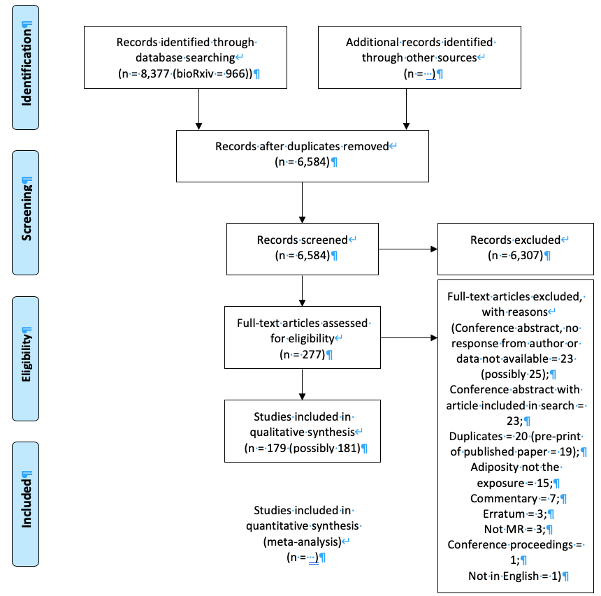
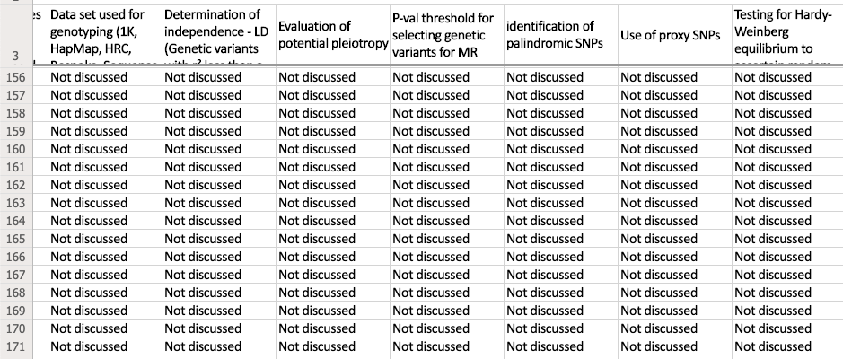
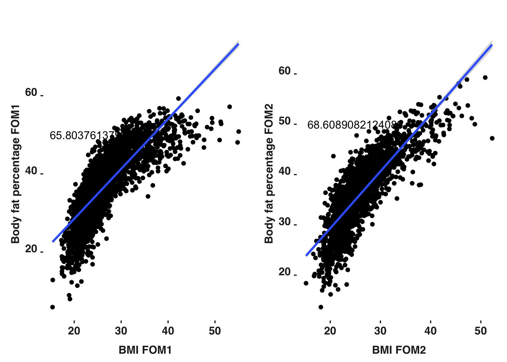
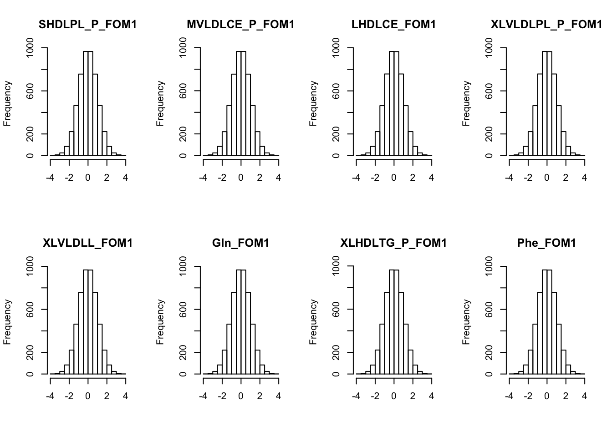
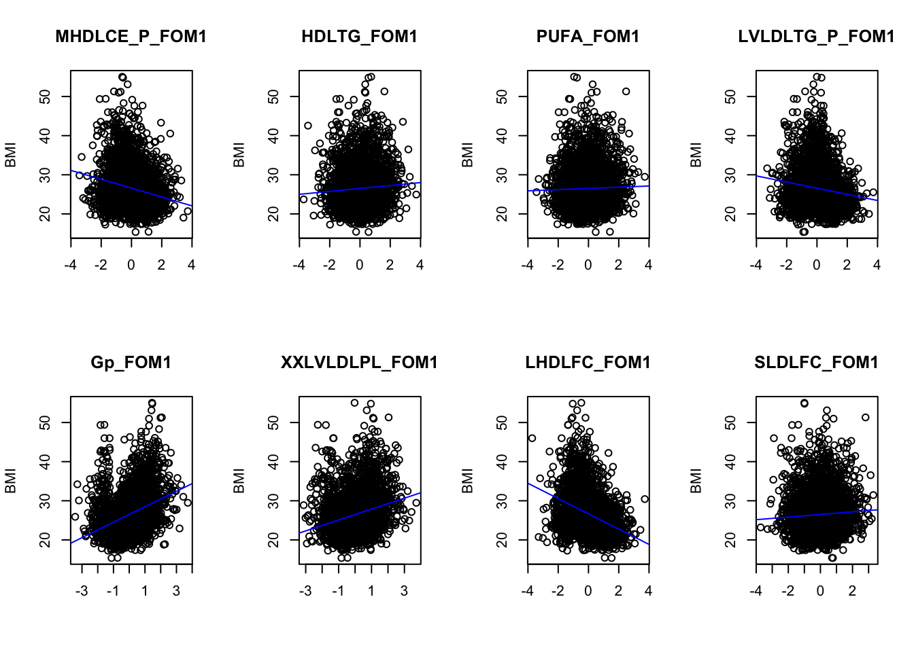
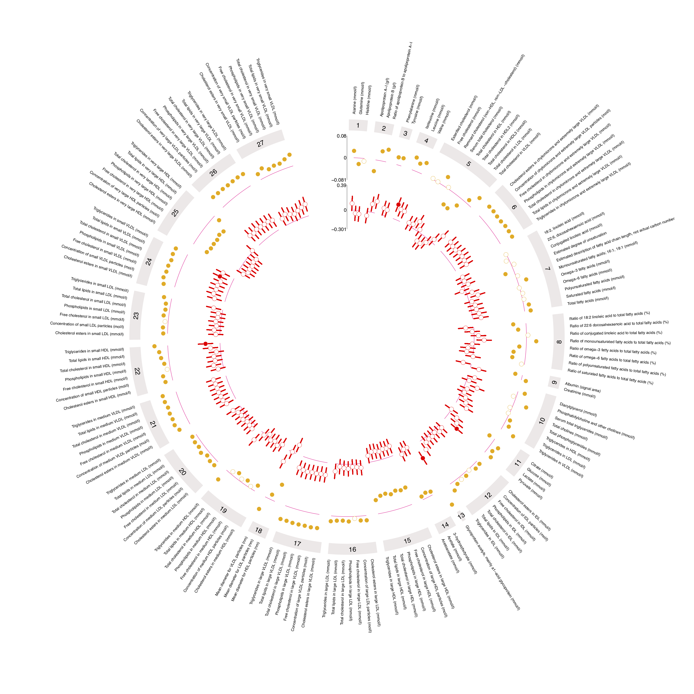

<meta name="duration" content="10" />

<style>
body {
text-align: justify}
</style>


```{r setup, include=FALSE}
knitr::opts_chunk$set(echo = FALSE, cache = TRUE)
library(kableExtra)
```

\  

**Title**: A pipeline for Mendelian randomization studies using large metabolomics data as intermediates.

\ 

**Start date**: 01/10/2017

\ 

**Expected submission date**: 01/04/2021

\  

**Aim**

Identify metabolites that sit on the causal pathway from increased adiposity to disease

\ 

**Objectives**

1. Identify diseases causally associated with increased adiposity
2. Identify and describe appropriate instrumentation of increased adiposity
3. Identify metabolites causally associated with increased adiposity
4. Compare and implement methods and rules to cluster metabolites
5. Identify diseases causally associated with metabolites

```{r echo=FALSE, warning=FALSE, error=FALSE, message=FALSE, fig.align='center'}
# Script to make hive plots in R - modified from http://www.vesnam.com/Rblog/viznets3/ 
set.seed(821)

# packages ====
# install.packages(devtools)
library(devtools)

# devtools::install_github("bryanhanson/HiveR")
library(HiveR)

library(grid)
library(igraph)
library(plyr)
library(RColorBrewer)

# source functions ====
source("../../../EpiViz/scripts/functions/mod.edge2HPD.R") # modified function from http://www.vesnam.com/Rblog/viznets3/
source("../../../EpiViz/scripts/functions/mod.mineHPD.R") # modified function from http://www.vesnam.com/Rblog/viznets3/

# data ====
data <- read.table("../../../EpiViz/data/data.txt", header = FALSE, sep = "\t")

# data formatting ====

## create a graph from your data ====
data_graph <- graph.data.frame(data, directed=FALSE)
# data_graph <- simplify(graph.data.frame(data, directed=FALSE)) # Use simplify to ensure that there are no duplicated edges or self loops

## calculate node properties and similarities ====
### calculate the number of edges each node has
node_edges <- degree(data_graph, v = V(data_graph), mode = "all")

### calculate the betweenness of each node
node_betweenness <- betweenness(data_graph, v = V(data_graph), directed = FALSE) / (((vcount(data_graph) - 1) * (vcount(data_graph)-2)) / 2)
node_betweenness.norm <- (node_betweenness - min(node_betweenness))/(max(node_betweenness) - min(node_betweenness))
data_graph <- set.vertex.attribute(data_graph, "degree", index = V(data_graph), value = node_edges)
data_graph <- set.vertex.attribute(data_graph, "betweenness", index = V(data_graph), value = node_betweenness.norm)

## set edge attributes - MATT: DONT KNOW WHAT THIS DOES
data_graph <- set.edge.attribute(data_graph, "weight", index = E(data_graph), value = 0)
data_graph <- set.edge.attribute(data_graph, "similarity", index = E(data_graph), value = 0)

## calculate Dice similarities between all pairs of nodes
dsAll <- similarity.dice(data_graph, vids = V(data_graph), mode = "all")

### calculate edge weight based on the node similarity
F1 <- function(x) {data.frame(V4 = dsAll[which(V(data_graph)$name == as.character(x$V1)), which(V(data_graph)$name == as.character(x$V2))])}
data.ext <- ddply(data, .variables=c("V1", "V2", "V3"), function(x) data.frame(F1(x)))

for (i in 1:nrow(data.ext))
{
  E(data_graph)[as.character(data.ext$V1) %--% as.character(data.ext$V2)]$weight <- as.numeric(data.ext$V3)
  E(data_graph)[as.character(data.ext$V1) %--% as.character(data.ext$V2)]$similarity <- as.numeric(data.ext$V4)
}

rm(node_edges, node_betweenness, node_betweenness.norm, F1, dsAll, i)
############################################################################################
#Determine node/edge color based on the properties

# Calculate node size
# We'll interpolate node size based on the node betweenness centrality, using the "approx" function
# And we will assign a node size for each node based on its betweenness centrality
approxVals <- approx(c(0.5, 1.5), n = length(unique(V(data_graph)$betweenness)))
nodes_size <- sapply(V(data_graph)$betweenness, function(x) approxVals$y[which(sort(unique(V(data_graph)$betweenness)) == x)])
rm(approxVals)

# Define node color
# We'll interpolate node colors based on the node degree using the "colorRampPalette" function from the "grDevices" library
library("grDevices")
# This function returns a function corresponding to a collor palete of "bias" number of elements
F2 <- colorRampPalette(c("#F5DEB3", "#FF0000"), bias = length(unique(V(data_graph)$degree)), space = "rgb", interpolate = "linear")
# Now we'll create a color for each degree
colCodes <- F2(length(unique(V(data_graph)$degree)))
# And we will assign a color for each node based on its degree
nodes_col <- sapply(V(data_graph)$degree, function(x) colCodes[which(sort(unique(V(data_graph)$degree)) == x)])
rm(F2, colCodes)

# Assign visual attributes to edges using the same approach as we did for nodes
F2 <- colorRampPalette(c("#FFFF00", "#006400"), bias = length(unique(E(data_graph)$similarity)), space = "rgb", interpolate = "linear")
colCodes <- F2(length(unique(E(data_graph)$similarity)))
edges_col <- sapply(E(data_graph)$similarity, function(x) colCodes[which(sort(unique(E(data_graph)$similarity)) == x)])
rm(F2, colCodes)

############################################################################################
# Now the new (HiveR) part

# Create a hive plot from the data frame
hive1 <- mod.edge2HPD(edge_df = data.ext)
#sumHPD(hive1)

# Assign nodes to a radius based on their degree (number of edges they are touching)
hive2 <- mod.mineHPD(hive1, option = "rad <- tot.edge.count")

# Assign nodes to axes based on their position in the edge list 
# (this function assumes direct graphs, so it considers the first column to be a source and second column to be a sink )
hive3 <- mod.mineHPD(hive2, option = "axis <- source.man.sink")

# Removing zero edges for better visualization 
hive4 <- mod.mineHPD(hive3, option = "remove zero edge")

# And finally, plotting our graph (Figure 1)
plotHive(hive4, 
         ch = 1, # size of central hole
         dr.nodes = TRUE,
         method = "abs", # method for displaying nodes on axis
         axLabs = c("Exposure", "Disease", "Metabolite"), # axis labels
         axLab.pos = 2, # position of axis label from the end of the axis
         axLab.gpar = gpar(col = "black", fontsize = 14, lwd = 2), # label charecterisitics
         bkgnd = "white", # background colour of the plot
         # anNodes = , # path to a CSV file with node labelling information
         # anNode.gpar = , # a list of name-value pairs 
)


grid.text("3, 4", x = 0, y = 22, default.units = "native", gp = gpar(fontsize = 18))
grid.text("2", x = -12, y = 10, default.units = "native", gp = gpar(fontsize = 18))
grid.text("5, 6", x = 16, y = 10, default.units = "native", gp = gpar(fontsize = 18))
grid.text("7, 8", x = 18, y = -12, default.units = "native", gp = gpar(fontsize = 18))
grid.text("9", x = 0, y = -20, default.units = "native", gp = gpar(fontsize = 18))

```

```{r echo=FALSE, warning=FALSE, error=FALSE, message=FALSE, fig.align='center'}
# devtools::install_github("malcolmbarrett/ggdag")
library(ggdag)
theme_set(theme_dag())

# set coordinates
coords <- tibble::tribble(~name, ~x, ~y,
                          "G", 0, 0,
                          "Xn", 1, 0,
                          "Yn", 3, 0,
                          "C", 2, 1,
                          
                          "G2", 3, -1,
                          "Zn", 4, 0,
                          "C2", 6, 1
                          )

# make dag ====
mr_dag <- dagify(Yn ~ Xn,
                 Xn ~ G,
                 Xn ~ C,
                 Yn ~ C,
                 C ~ G,
                 Yn ~ G2,
                 Zn ~ Yn,
                 Zn ~ C,

                 labels = c(Xn = "Increased adiposity",
                            Yn = "Metabolites",
                            Zn = "Diseases",
                            G = "Exposure IV",
                            G2 = "Intermediate IV",
                            C = "Confounders"),
                 coords = coords)
ggdag(mr_dag, text = TRUE, edge_type = "link_arc", use_labels = "label", stylized = FALSE)


```
Can we build a flowchart of decisions to achieve this?

# Chapter 1: overview 

**Increased adiposity and associtions with disease**

### Chapter (50%): *writing (50%), analysis (100%)*

\  

Chapter gives backgraound on problem and context of thesis


* What is the problem
    * overweight = ~40% (EU = ~60%)
    * obese = ~13% (EU = ~23%)

* What is adiposity
    * adipose cells - idea of genetics and metabolites introduced
    * different measures

* Broad overview of disease
    * what diseases are asscoiated with increased adiposity
    * semi-systematic way of doing this without performing systematic review(?)

* Application of metabolites
    * adipose tissue is a signalling organ

* Introduce MR

# Chapter 1: identify diseases associated with increased adiposity
```{r echo=FALSE, warning=FALSE, error=FALSE, message=FALSE, fig.align='center'}
# devtools::install_github("malcolmbarrett/ggdag")
library(ggdag)
theme_set(theme_dag())

# set coordinates
coords <- tibble::tribble(~name, ~x, ~y,
                          "X", 0, 0,
                          "Y1", 1, 4,
                          "Y2", 1, 3,
                          "Y3", 1, 2,
                          "Y4", 1, 1,
                          "Y5", 1, -0,
                          "Y6", 1, -1,
                          "Y7", 1, -2,
                          "Y8", 1, -3,
                          "Z", 2, 0
                          )

# make dag ====
mr_dag <- dagify(Y1 ~ X,
                 Y2 ~ X,
                 Y3 ~ X,
                 Y4 ~ X,
                 Y5 ~ X,
                 Y6 ~ X,
                 Y7 ~ X,
                 Y8 ~ X,
                 Z ~ Y1,
                 Z ~ Y2,
                 Z ~ Y3,
                 Z ~ Y4,
                 Z ~ Y5,
                 Z ~ Y6,
                 Z ~ Y7,
                 Z ~ Y8,
                 
                 
                 
                 labels = c(X = "BMI",
                            Y1 = "Cancer",
                            Y2 = "Cardiovascular",
                            Y3 = "Immune",
                            Y4 = "Kidney",
                            Y5 = "Liver",
                            Y6 = "Neurological/behavioural",
                            Y7 = "Pregnancy",
                            Y8 = "Respiratory",
                            Z = "Mortality"),
                 coords = coords)
ggdag(mr_dag, text = FALSE, use_labels = "label", edge_type = "link_arc", stylized = FALSE)


```
MELODI analysis

* 975,402 articles
* 10,828 enriched terms
* Filtering left 77 terms
* 8 categories plus 'Other'

# Chapter 1: MELODI output
```{r echo=FALSE, warning=FALSE, error=FALSE, message=FALSE, fig.align='center'}
data <- read.table("../../index/data/chapter1/MELODI/MELODI_intermediates_unique_final_categories_wideformat.txt", header = T, sep = "\t")
colnames(data)[6] <- "Neuro_behav"
x <- knitr::kable(
  (data), longtable = TRUE, booktabs = TRUE, align = "c",
  row.names = F, format = "html")
x <- kable_styling(x, full_width = F, font_size = 14) 
x
```

# Chapter 2: overview

**Systematic review**

### Chapter (40%): *writing (40%), analysis (40%)*
### Paper (20%): *writing (20%), analysis (40%)*

\  

What has MR told us about the causal relevance of increased adiposity?

```{r echo=FALSE, out.width='70%', fig.align='center'}

```

Inclusion: All MR studies using a measure of increased adiposity as the exposure

* Literature search (100%)
* Screening (100%)
* Data extraction (30%)
    * 60 papers
    * ~800 exposure-outcome analyses
* Writing (40%)

```{r echo=FALSE, out.width='70%', fig.align='center'}

```


\  

* Meta-analysis - may not be possible
    * Lots of differences between studies (e.g. different ancestries, different methods, different SNPs)
* Reporting is poor
    * GWAS reporting is a problem - e.g. multiple GWASs in one paper but only one discussed


# Chapter 3: overview

**Instrumenting measures of increased adiposity for MR analyses**

### Chapter (5%): *writing (5%), analysis (10%)*
### Paper: *form part of systematic review paper*

\  

Chapter presents current practices for instrumenting BMI, WHR and BF% in MR analyses and looks at associations of instruments with potential confounders

* Current instrumentation practices (will get from SR)
    * SNP lists most common etc.
* GWAS descriptions 
    * what GWASs are used - e.g. does everyone use Locke 2015 for BMI
* Instruments 
    * analysis
        * associations with exposures (e.g. BMI SNPs with measured WHR)
        * instrument strength
        * instruments and potential confounders
            * metabolites: age, sex, smoking status 
            * diseases: age, sex, smoking status

```{r fstatistic-plot-for-mr, echo=FALSE, out.width='100%', fig.cap="F statistics for 4 meausres of adiposity (BF%, BMI, WHR, WHRadjBMI) across multiple SNP sets. Mean given as black diamond and blue line indicating an F statistic of 10"}
knitr::include_graphics("../../../002_adiposity_metabolites/analysis/f_statistics.png")
```

# Chapter 4: overview

**Observational analysis: increased adiposity and metabolites**

### Chapter (10%): *writing (5%), analysis (20%)*
### Paper: *combined with chapter 5? / favourable adiposity paper?*

\  

Chapter explores observational associations between measures of increased adiposity and metabolites

* Exposures
    * BMI / BMI GRS
    * BF% / favourable adiposity GRS
* 230 metabolites
* ALSPAC mothers
    * 1 time point / 2 clinics
* ALSPAC kids
    * 3 time points (7, 12, 18)
    * sex combined
    * male / female

* Expand to WHR / WHRadjBMI
* Replication - INTERVAL / FGFP
    
```{r echo=FALSE, out.width='100%', fig.align='center'}

```
    
```{r echo=FALSE, out.width='100%', fig.align='center'}

```
   
```{r echo=FALSE, out.width='100%', fig.align='center'}

```

```{r echo=FALSE, out.width='100%', fig.align='center'}

```


# Chapter 5: overview

**MR analysis: increased adiposity and metabolites**

### Chapter (40%): *writing (50%), analysis (90%)*
### Paper (40%): *writing (50%), analysis (90%)*

\  

* Exposures
    * BMI: Yengo 2018, 941 SNPs (conditional on joint analysis)
    * WHR: Pulit 2018, 316 SNPs
    * BF%: Lu 2016, 7 SNPs
* 3 exposures, 123 metabolites
    * `r 3*123` tests
    * sensitivity analysis = `r 3*123*3` tests
* Additional sensitivity analyses = `r 15*123*4`
    * BMI: Yengo not-COJO 656 SNPs; BMI not biobank 77 SNPs
    * WHR: Shungin 28 SNPs
    * BF%: Lu 5 SNPs, Hubel (biobank) 76 SNPs
    * WHRadjBMI Pulit 346 SNPs
    * Clumped versions of all (exc. Lu)
* Total tests = `r 18*123*4`

\  

* Additional metabolite data
    * Shin metabolites = 452
        * Total tests = `r 18*452*3`
    * Unlikely to include in thesis

# Chapter 5: main figure
```{r echo=FALSE, out.width='100%', fig.align='center'}
knitr::include_graphics("../../../011_MR_Viz/www/gallery/circos_example1.png")
```

# Chapter 5: main figure as forest plot
```{r echo=FALSE, out.width='100%', fig.align='center'}
knitr::include_graphics("../../../002_adiposity_metabolites/analysis/step2/1_forestplots/forestplot_main_analysis_all.png")
```

# Chapter 5: "significant" associations forest plot
```{r echo=FALSE, out.width='100%', fig.align='center'}
knitr::include_graphics("../../../002_adiposity_metabolites/analysis/step2/1_forestplots/forestplot_main_analysis_significant.png")
```

# Chapter 5: consistent directions of effect
```{r, eval=TRUE, include=TRUE, echo=FALSE, error=FALSE, message=FALSE, warning=FALSE, cache=TRUE, fig.align='center', comment=""}
source("../../../002_adiposity_metabolites/scripts/ggplot_my_theme.R")
library(dplyr)
# colours
library(wesanderson)
d1 <- wes_palette("Royal1", type = "discrete")
d2 <- wes_palette("GrandBudapest2", type = "discrete")
d3 <- wes_palette("Cavalcanti1", type = "discrete")
d4 <- wes_palette("Rushmore1", type = "discrete")
discrete_wes_pal <- c(d1, d2, d3, d4)
rm(d1,d2,d3,d4)

# data ====
data <- read.table("../../../002_adiposity_metabolites/analysis/step1/combined/001_combined_mr_results_kettunen.txt", header = T, sep = "\t")
data <- subset(data, method == "Inverse variance weighted (multiplicative random effects)")
data <- data[,c(2,4,7)]
BMI_Yengo_941 <- subset(data, exposure == "BMI_Yengo_941")
BMI_Yengo_941 <- BMI_Yengo_941[,c(1,3)]
WHR_Pulit_316 <- subset(data, exposure == "WHR_Pulit_316")
WHR_Pulit_316 <- WHR_Pulit_316[,c(1,3)]
BF_Lu_5 <- subset(data, exposure == "BF_Lu_5")
BF_Lu_5 <- BF_Lu_5[,c(1,3)]


# combine data for all ====
data <- left_join(BF_Lu_5, BMI_Yengo_941, by = "id.outcome") %>%
  left_join(., WHR_Pulit_316, by = "id.outcome")
data <- data[,c(2:ncol(data))]

## test direction for all
data$direction <- sapply(1:nrow(data), function(x) ifelse(all(sign(data[x,]) > 0), 1, ifelse(all(sign(data[x,]) < 0), 2, 3)))
data <- data %>%
  mutate(direction_group = case_when(direction == 1 ~ "Positive effect",
                                     direction == 2 ~ "Negative effect",
                                     direction == 3 ~ "Opposite effect"))
data$direction_group <- factor(data$direction_group,
                               levels = c("Positive effect", "Negative effect", "Opposite effect"),ordered = TRUE)
data$exposure <- "BMI, WHR and BF%"
data <- data[,c("direction", "direction_group", "exposure")]
BMI_WHR_BF <- data

### combine data for BMI and BF% ====
data1 <- left_join(BMI_Yengo_941, BF_Lu_5, by = "id.outcome") 
labels <- data1[,1]
data1 <- data1[,c(2:ncol(data1))]

#### test direction for all
data1$direction <- sapply(1:nrow(data1), function(x) ifelse(all(sign(data1[x,]) > 0), 1, ifelse(all(sign(data1[x,]) < 0), 2, 3)))
data1 <- data1 %>%
  mutate(direction_group = case_when(direction == 1 ~ "Positive effect",
                                     direction == 2 ~ "Negative effect",
                                     direction == 3 ~ "Opposite effect"))
data1$direction_group <- factor(data1$direction_group,
                                levels = c("Positive effect", "Negative effect", "Opposite effect"),ordered = TRUE)
data1$exposure <- "BMI and BF%"
data1 <- data1[,c("direction", "direction_group", "exposure")]
data <- rbind(data, data1)
BMI_BF <- data1


### combine data for BMI and WHR ====
data1 <- left_join(BMI_Yengo_941, WHR_Pulit_316, by = "id.outcome") 
labels <- data1[,1]
data1 <- data1[,c(2:ncol(data1))]

#### test direction for all
data1$direction <- sapply(1:nrow(data1), function(x) ifelse(all(sign(data1[x,]) > 0), 1, ifelse(all(sign(data1[x,]) < 0), 2, 3)))
data1 <- data1 %>%
  mutate(direction_group = case_when(direction == 1 ~ "Positive effect",
                                     direction == 2 ~ "Negative effect",
                                     direction == 3 ~ "Opposite effect"))
data1$direction_group <- factor(data1$direction_group,
                                levels = c("Positive effect", "Negative effect", "Opposite effect"),ordered = TRUE)
data1$exposure <- "BMI and WHR"
data1 <- data1[,c("direction", "direction_group", "exposure")]
data <- rbind(data, data1)
BMI_WHR <- data1


### combine data for WHR and BF% ====
data1 <- left_join(WHR_Pulit_316, BF_Lu_5, by = "id.outcome") 
labels <- data1[,1]
data1 <- data1[,c(2:ncol(data1))]

#### test direction for all
data1$direction <- sapply(1:nrow(data1), function(x) ifelse(all(sign(data1[x,]) > 0), 1, ifelse(all(sign(data1[x,]) < 0), 2, 3)))
data1 <- data1 %>%
  mutate(direction_group = case_when(direction == 1 ~ "Positive effect",
                                     direction == 2 ~ "Negative effect",
                                     direction == 3 ~ "Opposite effect"))
data1$direction_group <- factor(data1$direction_group,
                                levels = c("Positive effect", "Negative effect", "Opposite effect"),ordered = TRUE)
data1$exposure <- "WHR and BF%"
data1 <- data1[,c("direction", "direction_group", "exposure")]
BMI_WHR_BF_barplot <- rbind(data, data1)
WHR_BF <- data1

### make exposure ====
data <- BMI_WHR_BF_barplot
data$exposure <- factor(data$exposure,
                       levels = c("BMI, WHR and BF%", "BMI and WHR", "BMI and BF%", "WHR and BF%"),ordered = TRUE)

# plot ====
ggplot(data = data,
       aes(x = exposure)) +
  geom_bar(aes(fill = direction_group))  +
  scale_fill_manual(values = discrete_wes_pal) +
  guides(fill = guide_legend(override.aes = list(size = 5),
                             title = "",
                             label.hjust = 0,
                             label.vjust = 0.5)) +
  labs(x = "") +
  my_theme() +
  theme(axis.text.x = element_text(angle = 90),
        axis.ticks.x = element_blank())
```

```{r, eval=TRUE, include=TRUE, echo=FALSE, error=FALSE, message=FALSE, warning=FALSE, cache=TRUE, fig.align='center', comment=""}
data <- data.frame(exposure1 = c(1,-1,1,-1), exposure2 = c(1,-1,-1,1), direction = c("Positive effect", "Negative effect", "Opposite effect", "Opposite effect"))
head(data)
```

# Chapter 5: consistent "significant" associations
```{r echo=FALSE, out.width='100%', fig.align='center'}
knitr::include_graphics("../../../002_adiposity_metabolites/analysis/step2/1_forestplots/forestplot_main_analysis_consistent_significant.png")
```

* Phenylalanine
    * Phenylalanine is an essential amino acid
    * If BMI etc. is higher does this correspond to an increase in consumption of phenylalanine food sources?
* Tyrosine
    * Phenylalanine is converted into tyrosine in the body
    * If increased consumption of phenylalnine (as above) would this lead to a corresponding increase in tyrosine?
* Apolopoprotein A1 (ApoA1)
    * ApoA1 is a major component of HDL particles in  plasma
    * Does an increase in BMI etc. and subsequent increase in LDL particles lead to a reduction in HDL particles and thus a reduction in Apo A1?
    * OR, is the reduction in Apo A1 the cause of the increase in LDL particles?
    


# Chapter 6: overview

**MR Viz / EpiViz / EpiCirocs / Mulit Variable Viz / MAVIS: Multi vAriable VisualISation....**

### Chapter (50%): *writing (50%), analysis (90%)*
### Paper (50%): *writing (50%), analysis (100%)*
### `R` pakcage (90%)
### Web app (90%)

\  

Chapter describes the problem with analyses such as that in chapter 5 and how global overview is required and presents a tool for this

* [Web app](https://mattlee.shinyapps.io/011_mr_viz/) (90%)
    * Streamlines process of making Circos plots
    * No coding skills required - R code is extensive - remvoes barrier
    * Limited customisation
* [`R` package](https://github.com/mattlee821/EpiCircos) (90%)
    * Streamlines process while allowing advanced features
    * Basic coding skills required
    * Extensive customisation 

```{r echo=FALSE, out.width='100%', fig.align='center'}
knitr::include_graphics("../../../011_MR_Viz/www/gallery/circos_example1.png")
```

# Chapter 6: `R` code
```{r eval=TRUE, echo=FALSE}
library(EpiCircos)
circos_plot
```

# Chapter 6: [`R` package](https://github.com/mattlee821/EpiCircos)  code
```{r eval=FALSE, echo=TRUE}
library(EpiCircos)
circos_plot(track_number = 3,
            track1_data = EpiCircos::EpiCircos_data,
            track2_data = EpiCircos::EpiCircos_data,
            track3_data = EpiCircos::EpiCircos_data,
            track1_type = "points", track2_type = "lines", track3_type = "bar",
            label_column = 1, section_column = 2,
            estimate_column = 4, pvalue_column = 5,
            pvalue_adjustment = 1,
            lower_ci = 7, upper_ci = 8,
            lines_column = 10, lines_type = "o",
            bar_column = 9,
            legend = TRUE,
            track1_label = "Track 1",
            track2_label = "Track 2",
            track3_label = "Track 3",
            pvalue_label = "<= 0.05",
            circle_size = 25)
```

___
```{r echo=FALSE, out.width='100%', fig.align='center'}
knitr::include_graphics("../../../EpiCircos/docs/images/legend_example.svg")
```


# Chapter 6: [application](https://mattlee.shinyapps.io/011_mr_viz/)

```{r echo=FALSE, out.width='100%'}
knitr::include_graphics("../../../011_MR_Viz/manuscript_figures/mr_viz_home_tab.png")
```

```{r echo=FALSE, out.width='100%'}
knitr::include_graphics("../../../011_MR_Viz/manuscript_figures/mr_viz_analysis_step1.png")
```

```{r echo=FALSE, out.width='100%'}
knitr::include_graphics("../../../011_MR_Viz/manuscript_figures/mr_viz_analysis_step2.png")
```
\  

# Chapter 7 and 8: overview

**Clustering metabolites / rules for instrumenting clusters**

### Chapter (0%)

\  

Chapters will compare a number of different approaches to metabolite clustering from the literature and set out guidance for instrumenting these clusters

* Priors

class; subclass; biological pathway; size; shared genetic variants

* No priors

PCA; factor analysis; hierarchical clustering; density clustering; self organising map; LDSR; ontology

* Focus
    * SOM: distance between metabolites (k-means clustering) - Mika/Ville
    * Factor analysis: PCA but identify latent variable - Wes/Kate
    * Ontology: vectorise metabolites and identify distances - Ben Elsworth

* Which betas do you use if same SNP multiple times in a cluster?


# Chapter 9

**MR analysis: metabolites to diseases**

### Chapter (5%): *writing (0%), analysis (20%)*
### Paper (0%): *combined with chapter 5 / stand alone paper*

\  

Chapter explores association between metabolites and diseases

* metabolites
    * chapters 5 and 7
* diseases
    * systematic review
* code tested - scaleable
    * 1-2 weeks to complete analysis
* how to present
    * up-to 123 metabolites
    * potentially > 100 diseases
    * database / network graph / subsets...


# Chapter 10

**Discussion/limitations/conclusion**

### Chapter (2%): *writing (0%), analysis (20%)*

\  

Chaper to present:


```{r echo=FALSE, warning=FALSE, error=FALSE, message=FALSE, fig.align='center', fig.cap="Analysis pipeline figure"}
# Script to make hive plots in R - modified from http://www.vesnam.com/Rblog/viznets3/ 
set.seed(821)

# packages ====
# install.packages(devtools)
library(devtools)

# devtools::install_github("bryanhanson/HiveR")
library(HiveR)

library(grid)
library(igraph)
library(plyr)
library(RColorBrewer)

# source functions ====
source("../../../EpiViz/scripts/functions/mod.edge2HPD.R") # modified function from http://www.vesnam.com/Rblog/viznets3/
source("../../../EpiViz/scripts/functions/mod.mineHPD.R") # modified function from http://www.vesnam.com/Rblog/viznets3/

# data ====
data <- read.table("../../../EpiViz/data/data.txt", header = FALSE, sep = "\t")

# data formatting ====

## create a graph from your data ====
data_graph <- graph.data.frame(data, directed=FALSE)
# data_graph <- simplify(graph.data.frame(data, directed=FALSE)) # Use simplify to ensure that there are no duplicated edges or self loops

## calculate node properties and similarities ====
### calculate the number of edges each node has
node_edges <- degree(data_graph, v = V(data_graph), mode = "all")

### calculate the betweenness of each node
node_betweenness <- betweenness(data_graph, v = V(data_graph), directed = FALSE) / (((vcount(data_graph) - 1) * (vcount(data_graph)-2)) / 2)
node_betweenness.norm <- (node_betweenness - min(node_betweenness))/(max(node_betweenness) - min(node_betweenness))
data_graph <- set.vertex.attribute(data_graph, "degree", index = V(data_graph), value = node_edges)
data_graph <- set.vertex.attribute(data_graph, "betweenness", index = V(data_graph), value = node_betweenness.norm)

## set edge attributes - MATT: DONT KNOW WHAT THIS DOES
data_graph <- set.edge.attribute(data_graph, "weight", index = E(data_graph), value = 0)
data_graph <- set.edge.attribute(data_graph, "similarity", index = E(data_graph), value = 0)

## calculate Dice similarities between all pairs of nodes
dsAll <- similarity.dice(data_graph, vids = V(data_graph), mode = "all")

### calculate edge weight based on the node similarity
F1 <- function(x) {data.frame(V4 = dsAll[which(V(data_graph)$name == as.character(x$V1)), which(V(data_graph)$name == as.character(x$V2))])}
data.ext <- ddply(data, .variables=c("V1", "V2", "V3"), function(x) data.frame(F1(x)))

for (i in 1:nrow(data.ext))
{
  E(data_graph)[as.character(data.ext$V1) %--% as.character(data.ext$V2)]$weight <- as.numeric(data.ext$V3)
  E(data_graph)[as.character(data.ext$V1) %--% as.character(data.ext$V2)]$similarity <- as.numeric(data.ext$V4)
}

rm(node_edges, node_betweenness, node_betweenness.norm, F1, dsAll, i)
############################################################################################
#Determine node/edge color based on the properties

# Calculate node size
# We'll interpolate node size based on the node betweenness centrality, using the "approx" function
# And we will assign a node size for each node based on its betweenness centrality
approxVals <- approx(c(0.5, 1.5), n = length(unique(V(data_graph)$betweenness)))
nodes_size <- sapply(V(data_graph)$betweenness, function(x) approxVals$y[which(sort(unique(V(data_graph)$betweenness)) == x)])
rm(approxVals)

# Define node color
# We'll interpolate node colors based on the node degree using the "colorRampPalette" function from the "grDevices" library
library("grDevices")
# This function returns a function corresponding to a collor palete of "bias" number of elements
F2 <- colorRampPalette(c("#F5DEB3", "#FF0000"), bias = length(unique(V(data_graph)$degree)), space = "rgb", interpolate = "linear")
# Now we'll create a color for each degree
colCodes <- F2(length(unique(V(data_graph)$degree)))
# And we will assign a color for each node based on its degree
nodes_col <- sapply(V(data_graph)$degree, function(x) colCodes[which(sort(unique(V(data_graph)$degree)) == x)])
rm(F2, colCodes)

# Assign visual attributes to edges using the same approach as we did for nodes
F2 <- colorRampPalette(c("#FFFF00", "#006400"), bias = length(unique(E(data_graph)$similarity)), space = "rgb", interpolate = "linear")
colCodes <- F2(length(unique(E(data_graph)$similarity)))
edges_col <- sapply(E(data_graph)$similarity, function(x) colCodes[which(sort(unique(E(data_graph)$similarity)) == x)])
rm(F2, colCodes)

############################################################################################
# Now the new (HiveR) part

# Create a hive plot from the data frame
hive1 <- mod.edge2HPD(edge_df = data.ext)
#sumHPD(hive1)

# Assign nodes to a radius based on their degree (number of edges they are touching)
hive2 <- mod.mineHPD(hive1, option = "rad <- tot.edge.count")

# Assign nodes to axes based on their position in the edge list 
# (this function assumes direct graphs, so it considers the first column to be a source and second column to be a sink )
hive3 <- mod.mineHPD(hive2, option = "axis <- source.man.sink")

# Removing zero edges for better visualization 
hive4 <- mod.mineHPD(hive3, option = "remove zero edge")

# And finally, plotting our graph (Figure 1)
plotHive(hive4, 
         ch = 1, # size of central hole
         dr.nodes = TRUE,
         method = "abs", # method for displaying nodes on axis
         axLabs = c("Exposure", "Disease", "Metabolite"), # axis labels
         axLab.pos = 2, # position of axis label from the end of the axis
         axLab.gpar = gpar(col = "black", fontsize = 14, lwd = 2), # label charecterisitics
         bkgnd = "white", # background colour of the plot
         # anNodes = , # path to a CSV file with node labelling information
         # anNode.gpar = , # a list of name-value pairs 
)


grid.text("3, 4", x = 0, y = 22, default.units = "native", gp = gpar(fontsize = 18))
grid.text("2", x = -12, y = 10, default.units = "native", gp = gpar(fontsize = 18))
grid.text("5, 6", x = 16, y = 10, default.units = "native", gp = gpar(fontsize = 18))
grid.text("7, 8", x = 18, y = -12, default.units = "native", gp = gpar(fontsize = 18))
grid.text("9", x = 0, y = -20, default.units = "native", gp = gpar(fontsize = 18))

```

\  

```{r echo=FALSE, warning=FALSE, error=FALSE, message=FALSE, fig.align='center', fig.cap="Pipeline decision tree"}
library(DiagrammeR)

grViz("
digraph {

  # graph attributes
  graph [overlap = true]

  # node attributes
  node [shape = box,
        fontname = Helvetica]

  # node statements
  A; B; C; D; E
  F 

  # node attributes
  node [shape = circle,
        fixedsize = true,
        width = 0.9]

  # node statements
  1; 2; 3; 4; 5; 6; 7; 8; 9

  # edge statements
  A->1; B->2                   
  B->3            
  B->4                         
  C->A          
  E->A; 2->4; 1->5;  
  E->6; 4->6; 5->7; 6->7       
  3->8
  1->9
}
")
```


# Timeline
```{r echo=FALSE, error=FALSE, warning=FALSE, message=FALSE, out.width="100%"}
# library(devtools)
# devtools::install_github("daattali/timevis")
library(timevis)

data <- data.frame(id = 1:10,
                     content = c("Introduction",
                                 "Systematic review",
                                 "Instrumentation for observational and MR analyses",
                                 "Observational analysis",
                                 "MR: adiposity -> metabolites",
                                 "MR Viz",
                                 "Clustering metabolites",
                                 "Instrumenting metabolites",
                                 "MR: metabolites -> diseases",
                                 "Discussion/conclusion"),
                   title = c("Introduction",
                                 "Systematic review",
                                 "Instrumentation for observational and MR analyses",
                                 "Observational analysis",
                                 "MR: adiposity -> metabolites",
                                 "MR Viz",
                                 "Clustering metabolites",
                                 "Instrumenting metabolites",
                                 "MR: metabolites -> diseases",
                                 "Discussion/conclusion"),
                   start = c("2020-01-01",
                               "2020-01-01",
                               "2020-02-01",
                               "2020-04-01",
                               "2020-01-01",
                               "2020-01-01",
                               "2020-05-01",
                               "2020-07-01",
                               "2020-09-01",
                               "2020-12-01"),
                     end = c("2020-03-01",
                             "2020-04-01",
                             "2020-05-01",
                             "2020-06-01",
                             "2020-05-01",
                             "2020-03-01",
                             "2020-10-01",
                             "2020-12-01",
                             "2021-01-01",
                             "2021-02-01"),
                   group = c("Chapter 1",
                               "Chapter 2",
                               "Chapter 3",
                               "Chapter 4",
                               "Chapter 5",
                               "Chapter 6",
                               "Chapter 7",
                               "Chapter 8",
                               "Chapter 9",
                               "Chapter 10")
)

groups <- data.frame(id = data$group,
                     content = data$group)

timevis(data = data, groups = groups,
        showZoom = FALSE,
        fit = TRUE)
```


# Acknowledgements 

* Kaitlin Wade
* Laura Corbin
* Nic Timpson
* David Hughes
* Charlie Hatcher
* Nancy McBride
* Steph Suddell
* Tom Battram
* Luke McGuinness
* Caroline Bull
* Osama Mahmoud

